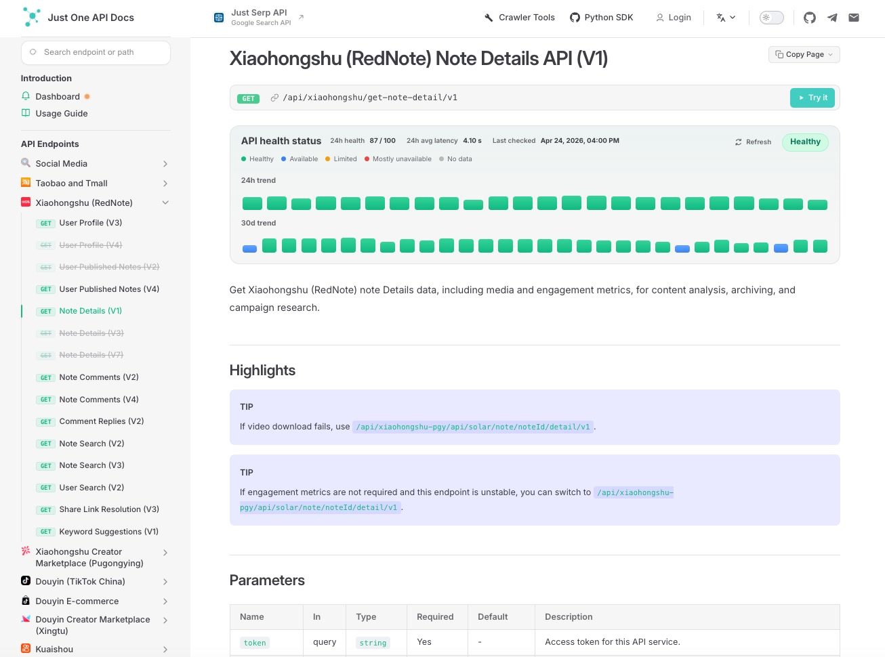

  

[简体中文](README.md) | [English](README.en.md)

# Xiaohongshu discovery: topics, trends and shared links

Discover Xiaohongshu content from topics, trending searches, shared links or Ask Dots AI. This guide distinguishes discovery entry points and explains how to preserve the context in which a note was found.

Maintained by [Just One API](https://justoneapi.com/en/?utm_source=github.com&utm_medium=referral&utm_campaign=justoneapi_team_justoneapi_xiaohongshu_data_en_02&utm_content=repo_readme), providing endpoint navigation and practical integration guidance.

[Documentation](https://docs.justoneapi.com/en/?utm_source=github.com&utm_medium=referral&utm_campaign=justoneapi_team_justoneapi_xiaohongshu_data_en_02&utm_content=repo_readme) · [Get an API Token](https://dashboard.justoneapi.com/en/login?utm_source=github.com&utm_medium=referral&utm_campaign=justoneapi_team_justoneapi_xiaohongshu_data_en_02&utm_content=repo_readme) · [Contact support](https://justoneapi.com/en/contact?utm_source=github.com&utm_medium=referral&utm_campaign=justoneapi_team_justoneapi_xiaohongshu_data_en_02&utm_content=repo_readme)

## Endpoints for this guide

- [Topic Note List (V1)](https://docs.justoneapi.com/en/api/xiaohongshu-rednote/topic-note-list-v1?utm_source=github.com&utm_medium=referral&utm_campaign=justoneapi_team_justoneapi_xiaohongshu_data_en_02&utm_content=repo_readme_topic_nav)
- [Hot Search (V1)](https://docs.justoneapi.com/en/api/xiaohongshu-rednote/hot-search-v1?utm_source=github.com&utm_medium=referral&utm_campaign=justoneapi_team_justoneapi_xiaohongshu_data_en_02&utm_content=repo_readme_topic_nav)
- [Hot List (V1)](https://docs.justoneapi.com/en/api/xiaohongshu-rednote/hot-list-v1?utm_source=github.com&utm_medium=referral&utm_campaign=justoneapi_team_justoneapi_xiaohongshu_data_en_02&utm_content=repo_readme_topic_nav)
- [Share Link Resolution (V1)](https://docs.justoneapi.com/en/api/xiaohongshu-rednote/share-link-resolution-v1?utm_source=github.com&utm_medium=referral&utm_campaign=justoneapi_team_justoneapi_xiaohongshu_data_en_02&utm_content=repo_readme_topic_nav)
- [Ask Dots AI](https://docs.justoneapi.com/en/api/xiaohongshu-rednote/ask-dots-ai?utm_source=github.com&utm_medium=referral&utm_campaign=justoneapi_team_justoneapi_xiaohongshu_data_en_02&utm_content=repo_readme_topic_nav)
- [Keyword Suggestions (V1)](https://docs.justoneapi.com/en/api/xiaohongshu-rednote/keyword-suggestions-v1?utm_source=github.com&utm_medium=referral&utm_campaign=justoneapi_team_justoneapi_xiaohongshu_data_en_02&utm_content=repo_readme_topic_nav)

## Choose a discovery entry point

| Research starting point | Documentation entry | Context to retain |
| --- | --- | --- |
| Known topic | Topic note list | Topic input and query time |
| Current search trends | Hot search | The returned ranking context |
| Popular content | Hot list | List type and actual query conditions |
| A shared URL | Share link resolution | Original URL and resolved result |
| Question-based exploration | Ask Dots AI | Original question and returned content |
| Additional query ideas | Keyword suggestions | Original term and suggested-term relationships |

Read each endpoint's required parameters before connecting it to note search or detail retrieval. Discovery endpoints should not be assumed to return interchangeable object structures.

## Turn discovery into a traceable collection

For trend research, record results at your chosen observation times, then search for notes using selected terms. For topic research, retain the relationship between each topic and the notes it surfaced. When several entry points return the same note, consolidate the note record while keeping every source.

Inspect a share-link resolution result before selecting a detail endpoint. Preserve the original URL alongside any extracted identifier so that the input remains auditable.

## Interpret the scope carefully

A hot-search list or popular-content list is a discovery result. It does not establish platform-wide search volume or complete historical trends. Repeated observations can form your own time series, provided you record observation intervals and gaps.

Keep Ask Dots AI answers distinct from independently checkable notes, links or other materials. Consult its documentation for the actual response content and whether identifiers suitable for follow-up requests are included.

## Documentation and console

The documentation provides request parameters, response descriptions, endpoint versions and status notices. Check the current page for your selected endpoint before making requests.

The console provides API Token management, balance information and request logs to help you review request outcomes and usage.

## Complete API catalog

The catalog retains all platform groups and deprecation labels. Refer to the [online documentation](https://docs.justoneapi.com/en/?utm_source=github.com&utm_medium=referral&utm_campaign=justoneapi_team_justoneapi_xiaohongshu_data_en_02&utm_content=repo_readme_api_list) for complete parameters, response descriptions and current status.

<!-- API_LIST_START -->

### Social Media

- [Cross-Platform Search (V1)](https://docs.justoneapi.com/en/api/social-media/cross-platform-search-v1?utm_source=github.com&utm_medium=referral&utm_campaign=justoneapi_team_justoneapi_xiaohongshu_data_en_02&utm_content=repo_readme_api_list) <!-- api-operation:GET /api/search/v1 -->

### Taobao and Tmall

- [Product Details (V1)](https://docs.justoneapi.com/en/api/taobao-and-tmall/product-details-v1?utm_source=github.com&utm_medium=referral&utm_campaign=justoneapi_team_justoneapi_xiaohongshu_data_en_02&utm_content=repo_readme_api_list) <!-- api-operation:GET /api/taobao/get-item-detail/v1 -->
- [Product Details (V2)](https://docs.justoneapi.com/en/api/taobao-and-tmall/product-details-v2?utm_source=github.com&utm_medium=referral&utm_campaign=justoneapi_team_justoneapi_xiaohongshu_data_en_02&utm_content=repo_readme_api_list) <!-- api-operation:GET /api/taobao/get-item-detail/v2 -->
- [Product Details (V3)](https://docs.justoneapi.com/en/api/taobao-and-tmall/product-details-v3?utm_source=github.com&utm_medium=referral&utm_campaign=justoneapi_team_justoneapi_xiaohongshu_data_en_02&utm_content=repo_readme_api_list) <!-- api-operation:GET /api/taobao/get-item-detail/v3 -->
- [Product Details (V4)](https://docs.justoneapi.com/en/api/taobao-and-tmall/product-details-v4?utm_source=github.com&utm_medium=referral&utm_campaign=justoneapi_team_justoneapi_xiaohongshu_data_en_02&utm_content=repo_readme_api_list) <!-- api-operation:GET /api/taobao/get-item-detail/v4 -->
- [Product Details (V5)](https://docs.justoneapi.com/en/api/taobao-and-tmall/product-details-v5?utm_source=github.com&utm_medium=referral&utm_campaign=justoneapi_team_justoneapi_xiaohongshu_data_en_02&utm_content=repo_readme_api_list) <!-- api-operation:GET /api/taobao/get-item-detail/v5 -->
- [Product Details (V6)](https://docs.justoneapi.com/en/api/taobao-and-tmall/product-details-v6?utm_source=github.com&utm_medium=referral&utm_campaign=justoneapi_team_justoneapi_xiaohongshu_data_en_02&utm_content=repo_readme_api_list) <!-- api-operation:GET /api/taobao/get-item-detail/v6 -->
- [Product Details (V7)](https://docs.justoneapi.com/en/api/taobao-and-tmall/product-details-v7?utm_source=github.com&utm_medium=referral&utm_campaign=justoneapi_team_justoneapi_xiaohongshu_data_en_02&utm_content=repo_readme_api_list) <!-- api-operation:GET /api/taobao/get-item-detail/v7 -->
- [Product Details (V9)](https://docs.justoneapi.com/en/api/taobao-and-tmall/product-details-v9?utm_source=github.com&utm_medium=referral&utm_campaign=justoneapi_team_justoneapi_xiaohongshu_data_en_02&utm_content=repo_readme_api_list) <!-- api-operation:GET /api/taobao/get-item-detail/v9 -->
- [Product Reviews (V3)](https://docs.justoneapi.com/en/api/taobao-and-tmall/product-reviews-v3?utm_source=github.com&utm_medium=referral&utm_campaign=justoneapi_team_justoneapi_xiaohongshu_data_en_02&utm_content=repo_readme_api_list) <!-- api-operation:GET /api/taobao/get-item-comment/v3 -->
- [Product Questions (V1)](https://docs.justoneapi.com/en/api/taobao-and-tmall/product-questions-v1?utm_source=github.com&utm_medium=referral&utm_campaign=justoneapi_team_justoneapi_xiaohongshu_data_en_02&utm_content=repo_readme_api_list) <!-- api-operation:GET /api/taobao/get-social-feed/v1 -->
- [Shop Product List (V1)](https://docs.justoneapi.com/en/api/taobao-and-tmall/shop-product-list-v1?utm_source=github.com&utm_medium=referral&utm_campaign=justoneapi_team_justoneapi_xiaohongshu_data_en_02&utm_content=repo_readme_api_list) <!-- api-operation:GET /api/taobao/get-shop-item-list/v1 -->
- [Shop Product List (V2)](https://docs.justoneapi.com/en/api/taobao-and-tmall/shop-product-list-v2?utm_source=github.com&utm_medium=referral&utm_campaign=justoneapi_team_justoneapi_xiaohongshu_data_en_02&utm_content=repo_readme_api_list) <!-- api-operation:GET /api/taobao/get-shop-item-list/v2 -->
- [Shop Product List (V3) (Deprecated)](https://docs.justoneapi.com/en/api/taobao-and-tmall/shop-product-list-v3-deprecated?utm_source=github.com&utm_medium=referral&utm_campaign=justoneapi_team_justoneapi_xiaohongshu_data_en_02&utm_content=repo_readme_api_list#deprecated) <!-- api-operation:GET /api/taobao/get-shop-item-list/v3 -->
- [Shop Product List (V4)](https://docs.justoneapi.com/en/api/taobao-and-tmall/shop-product-list-v4?utm_source=github.com&utm_medium=referral&utm_campaign=justoneapi_team_justoneapi_xiaohongshu_data_en_02&utm_content=repo_readme_api_list) <!-- api-operation:GET /api/taobao/get-shop-item-list/v4 -->
- [Product Sales (V1) (Deprecated)](https://docs.justoneapi.com/en/api/taobao-and-tmall/product-sales-v1-deprecated?utm_source=github.com&utm_medium=referral&utm_campaign=justoneapi_team_justoneapi_xiaohongshu_data_en_02&utm_content=repo_readme_api_list#deprecated) <!-- api-operation:GET /api/taobao/get-item-sale/v1 -->
- [Product Search (V1)](https://docs.justoneapi.com/en/api/taobao-and-tmall/product-search-v1?utm_source=github.com&utm_medium=referral&utm_campaign=justoneapi_team_justoneapi_xiaohongshu_data_en_02&utm_content=repo_readme_api_list) <!-- api-operation:GET /api/taobao/search-item-list/v1 -->
- [Product Search (V2)](https://docs.justoneapi.com/en/api/taobao-and-tmall/product-search-v2?utm_source=github.com&utm_medium=referral&utm_campaign=justoneapi_team_justoneapi_xiaohongshu_data_en_02&utm_content=repo_readme_api_list) <!-- api-operation:GET /api/taobao/search-item-list/v2 -->

### Xiaohongshu (RedNote)

- [Ask Dots AI](https://docs.justoneapi.com/en/api/xiaohongshu-rednote/ask-dots-ai?utm_source=github.com&utm_medium=referral&utm_campaign=justoneapi_team_justoneapi_xiaohongshu_data_en_02&utm_content=repo_readme_api_list) <!-- api-operation:GET /api/xiaohongshu/ask-dots -->
- [Hot Search (V1)](https://docs.justoneapi.com/en/api/xiaohongshu-rednote/hot-search-v1?utm_source=github.com&utm_medium=referral&utm_campaign=justoneapi_team_justoneapi_xiaohongshu_data_en_02&utm_content=repo_readme_api_list) <!-- api-operation:GET /api/xiaohongshu/hot-search/v1 -->
- [Hot List (V1)](https://docs.justoneapi.com/en/api/xiaohongshu-rednote/hot-list-v1?utm_source=github.com&utm_medium=referral&utm_campaign=justoneapi_team_justoneapi_xiaohongshu_data_en_02&utm_content=repo_readme_api_list) <!-- api-operation:GET /api/xiaohongshu/hot-list/v1 -->
- [Hot Inspiration Feed (V1)](https://docs.justoneapi.com/en/api/xiaohongshu-rednote/hot-inspiration-feed-v1?utm_source=github.com&utm_medium=referral&utm_campaign=justoneapi_team_justoneapi_xiaohongshu_data_en_02&utm_content=repo_readme_api_list) <!-- api-operation:GET /api/xiaohongshu/get-creator-hot-inspiration-feed/v1 -->
- [Note Search (V1)](https://docs.justoneapi.com/en/api/xiaohongshu-rednote/note-search-v1?utm_source=github.com&utm_medium=referral&utm_campaign=justoneapi_team_justoneapi_xiaohongshu_data_en_02&utm_content=repo_readme_api_list) <!-- api-operation:GET /api/xiaohongshu/search-note/v1 -->
- [Note Search (V2)](https://docs.justoneapi.com/en/api/xiaohongshu-rednote/note-search-v2?utm_source=github.com&utm_medium=referral&utm_campaign=justoneapi_team_justoneapi_xiaohongshu_data_en_02&utm_content=repo_readme_api_list) <!-- api-operation:GET /api/xiaohongshu/search-note/v2 -->
- [Note Search (V3)](https://docs.justoneapi.com/en/api/xiaohongshu-rednote/note-search-v3?utm_source=github.com&utm_medium=referral&utm_campaign=justoneapi_team_justoneapi_xiaohongshu_data_en_02&utm_content=repo_readme_api_list) <!-- api-operation:GET /api/xiaohongshu/search-note/v3 -->
- [Note Search (V4)](https://docs.justoneapi.com/en/api/xiaohongshu-rednote/note-search-v4?utm_source=github.com&utm_medium=referral&utm_campaign=justoneapi_team_justoneapi_xiaohongshu_data_en_02&utm_content=repo_readme_api_list) <!-- api-operation:GET /api/xiaohongshu/search-note/v4 -->
- [User Search (V2)](https://docs.justoneapi.com/en/api/xiaohongshu-rednote/user-search-v2?utm_source=github.com&utm_medium=referral&utm_campaign=justoneapi_team_justoneapi_xiaohongshu_data_en_02&utm_content=repo_readme_api_list) <!-- api-operation:GET /api/xiaohongshu/search-user/v2 -->
- [User Published Notes (V1)](https://docs.justoneapi.com/en/api/xiaohongshu-rednote/user-published-notes-v1?utm_source=github.com&utm_medium=referral&utm_campaign=justoneapi_team_justoneapi_xiaohongshu_data_en_02&utm_content=repo_readme_api_list) <!-- api-operation:GET /api/xiaohongshu/get-user-note-list/v1 -->
- [User Published Notes (V2)](https://docs.justoneapi.com/en/api/xiaohongshu-rednote/user-published-notes-v2?utm_source=github.com&utm_medium=referral&utm_campaign=justoneapi_team_justoneapi_xiaohongshu_data_en_02&utm_content=repo_readme_api_list) <!-- api-operation:GET /api/xiaohongshu/get-user-note-list/v2 -->
- [User Published Notes (V3)](https://docs.justoneapi.com/en/api/xiaohongshu-rednote/user-published-notes-v3?utm_source=github.com&utm_medium=referral&utm_campaign=justoneapi_team_justoneapi_xiaohongshu_data_en_02&utm_content=repo_readme_api_list) <!-- api-operation:GET /api/xiaohongshu/get-user-note-list/v3 -->
- [User Published Notes (V4)](https://docs.justoneapi.com/en/api/xiaohongshu-rednote/user-published-notes-v4?utm_source=github.com&utm_medium=referral&utm_campaign=justoneapi_team_justoneapi_xiaohongshu_data_en_02&utm_content=repo_readme_api_list) <!-- api-operation:GET /api/xiaohongshu/get-user-note-list/v4 -->
- [Note Details (V1)](https://docs.justoneapi.com/en/api/xiaohongshu-rednote/note-details-v1?utm_source=github.com&utm_medium=referral&utm_campaign=justoneapi_team_justoneapi_xiaohongshu_data_en_02&utm_content=repo_readme_api_list) <!-- api-operation:GET /api/xiaohongshu/get-note-detail/v1 -->
- [Note Details (V2)](https://docs.justoneapi.com/en/api/xiaohongshu-rednote/note-details-v2?utm_source=github.com&utm_medium=referral&utm_campaign=justoneapi_team_justoneapi_xiaohongshu_data_en_02&utm_content=repo_readme_api_list) <!-- api-operation:GET /api/xiaohongshu/get-note-detail/v2 -->
- [Note Details (V3)](https://docs.justoneapi.com/en/api/xiaohongshu-rednote/note-details-v3?utm_source=github.com&utm_medium=referral&utm_campaign=justoneapi_team_justoneapi_xiaohongshu_data_en_02&utm_content=repo_readme_api_list) <!-- api-operation:GET /api/xiaohongshu/get-note-detail/v3 -->
- [Note Details (V4)](https://docs.justoneapi.com/en/api/xiaohongshu-rednote/note-details-v4?utm_source=github.com&utm_medium=referral&utm_campaign=justoneapi_team_justoneapi_xiaohongshu_data_en_02&utm_content=repo_readme_api_list) <!-- api-operation:GET /api/xiaohongshu/get-note-detail/v4 -->
- [Note Details (V5)](https://docs.justoneapi.com/en/api/xiaohongshu-rednote/note-details-v5?utm_source=github.com&utm_medium=referral&utm_campaign=justoneapi_team_justoneapi_xiaohongshu_data_en_02&utm_content=repo_readme_api_list) <!-- api-operation:GET /api/xiaohongshu/get-note-detail/v5 -->
- [Note Details (V6)](https://docs.justoneapi.com/en/api/xiaohongshu-rednote/note-details-v6?utm_source=github.com&utm_medium=referral&utm_campaign=justoneapi_team_justoneapi_xiaohongshu_data_en_02&utm_content=repo_readme_api_list) <!-- api-operation:GET /api/xiaohongshu/get-note-detail/v6 -->
- [Note Details (V7) (Deprecated)](https://docs.justoneapi.com/en/api/xiaohongshu-rednote/note-details-v7-deprecated?utm_source=github.com&utm_medium=referral&utm_campaign=justoneapi_team_justoneapi_xiaohongshu_data_en_02&utm_content=repo_readme_api_list#deprecated) <!-- api-operation:GET /api/xiaohongshu/get-note-detail/v7 -->
- [Note Comments (V2)](https://docs.justoneapi.com/en/api/xiaohongshu-rednote/note-comments-v2?utm_source=github.com&utm_medium=referral&utm_campaign=justoneapi_team_justoneapi_xiaohongshu_data_en_02&utm_content=repo_readme_api_list) <!-- api-operation:GET /api/xiaohongshu/get-note-comment/v2 -->
- [Note Comments (V3)](https://docs.justoneapi.com/en/api/xiaohongshu-rednote/note-comments-v3?utm_source=github.com&utm_medium=referral&utm_campaign=justoneapi_team_justoneapi_xiaohongshu_data_en_02&utm_content=repo_readme_api_list) <!-- api-operation:GET /api/xiaohongshu/get-note-comment/v3 -->
- [Note Comments (V4)](https://docs.justoneapi.com/en/api/xiaohongshu-rednote/note-comments-v4?utm_source=github.com&utm_medium=referral&utm_campaign=justoneapi_team_justoneapi_xiaohongshu_data_en_02&utm_content=repo_readme_api_list) <!-- api-operation:GET /api/xiaohongshu/get-note-comment/v4 -->
- [Comment Replies (V2)](https://docs.justoneapi.com/en/api/xiaohongshu-rednote/comment-replies-v2?utm_source=github.com&utm_medium=referral&utm_campaign=justoneapi_team_justoneapi_xiaohongshu_data_en_02&utm_content=repo_readme_api_list) <!-- api-operation:GET /api/xiaohongshu/get-note-sub-comment/v2 -->
- [User Profile (V3)](https://docs.justoneapi.com/en/api/xiaohongshu-rednote/user-profile-v3?utm_source=github.com&utm_medium=referral&utm_campaign=justoneapi_team_justoneapi_xiaohongshu_data_en_02&utm_content=repo_readme_api_list) <!-- api-operation:GET /api/xiaohongshu/get-user/v3 -->
- [User Profile (V4)](https://docs.justoneapi.com/en/api/xiaohongshu-rednote/user-profile-v4?utm_source=github.com&utm_medium=referral&utm_campaign=justoneapi_team_justoneapi_xiaohongshu_data_en_02&utm_content=repo_readme_api_list) <!-- api-operation:GET /api/xiaohongshu/get-user/v4 -->
- [Keyword Suggestions (V1)](https://docs.justoneapi.com/en/api/xiaohongshu-rednote/keyword-suggestions-v1?utm_source=github.com&utm_medium=referral&utm_campaign=justoneapi_team_justoneapi_xiaohongshu_data_en_02&utm_content=repo_readme_api_list) <!-- api-operation:GET /api/xiaohongshu/search-recommend/v1 -->
- [Topic Note List (V1)](https://docs.justoneapi.com/en/api/xiaohongshu-rednote/topic-note-list-v1?utm_source=github.com&utm_medium=referral&utm_campaign=justoneapi_team_justoneapi_xiaohongshu_data_en_02&utm_content=repo_readme_api_list) <!-- api-operation:GET /api/xiaohongshu/get-topic-note-list/v1 -->
- [Share Link Resolution (V1)](https://docs.justoneapi.com/en/api/xiaohongshu-rednote/share-link-resolution-v1?utm_source=github.com&utm_medium=referral&utm_campaign=justoneapi_team_justoneapi_xiaohongshu_data_en_02&utm_content=repo_readme_api_list) <!-- api-operation:GET /api/xiaohongshu/share-url-transfer/v1 -->

### Xiaohongshu E-commerce (RedNote)

- [Product Search (V1)](https://docs.justoneapi.com/en/api/xiaohongshu-e-commerce-rednote/product-search-v1?utm_source=github.com&utm_medium=referral&utm_campaign=justoneapi_team_justoneapi_xiaohongshu_data_en_02&utm_content=repo_readme_api_list) <!-- api-operation:GET /api/xiaohongshu-ec/search-products/v1 -->

### Xiaohongshu Creator Marketplace (Pugongying)

- [Creator Search (V1)](https://docs.justoneapi.com/en/api/xiaohongshu-creator-marketplace-pugongying/creator-search-v1?utm_source=github.com&utm_medium=referral&utm_campaign=justoneapi_team_justoneapi_xiaohongshu_data_en_02&utm_content=repo_readme_api_list) <!-- api-operation:GET /api/xiaohongshu-pgy/api/solar/cooperator/blogger/v2/v1 -->
- [Creator Profile (V1)](https://docs.justoneapi.com/en/api/xiaohongshu-creator-marketplace-pugongying/creator-profile-v1?utm_source=github.com&utm_medium=referral&utm_campaign=justoneapi_team_justoneapi_xiaohongshu_data_en_02&utm_content=repo_readme_api_list) <!-- api-operation:GET /api/xiaohongshu-pgy/api/solar/cooperator/user/blogger/userId/v1 -->
- [Data Summary (V1)](https://docs.justoneapi.com/en/api/xiaohongshu-creator-marketplace-pugongying/data-summary-v1?utm_source=github.com&utm_medium=referral&utm_campaign=justoneapi_team_justoneapi_xiaohongshu_data_en_02&utm_content=repo_readme_api_list) <!-- api-operation:GET /api/xiaohongshu-pgy/api/solar/kol/dataV3/dataSummary/v1 -->
- [Follower Growth History (V1)](https://docs.justoneapi.com/en/api/xiaohongshu-creator-marketplace-pugongying/follower-growth-history-v1?utm_source=github.com&utm_medium=referral&utm_campaign=justoneapi_team_justoneapi_xiaohongshu_data_en_02&utm_content=repo_readme_api_list) <!-- api-operation:GET /api/xiaohongshu-pgy/api/solar/kol/data/userId/fans_overall_new_history/v1 -->
- [Follower Summary (V1)](https://docs.justoneapi.com/en/api/xiaohongshu-creator-marketplace-pugongying/follower-summary-v1?utm_source=github.com&utm_medium=referral&utm_campaign=justoneapi_team_justoneapi_xiaohongshu_data_en_02&utm_content=repo_readme_api_list) <!-- api-operation:GET /api/xiaohongshu-pgy/api/solar/kol/dataV3/fansSummary/v1 -->
- [Similar Creators (V1)](https://docs.justoneapi.com/en/api/xiaohongshu-creator-marketplace-pugongying/similar-creators-v1?utm_source=github.com&utm_medium=referral&utm_campaign=justoneapi_team_justoneapi_xiaohongshu_data_en_02&utm_content=repo_readme_api_list) <!-- api-operation:GET /api/xiaohongshu-pgy/api/solar/kol/get_similar_kol/v1 -->
- [Creator Feature Tags (V1)](https://docs.justoneapi.com/en/api/xiaohongshu-creator-marketplace-pugongying/creator-feature-tags-v1?utm_source=github.com&utm_medium=referral&utm_campaign=justoneapi_team_justoneapi_xiaohongshu_data_en_02&utm_content=repo_readme_api_list) <!-- api-operation:GET /api/xiaohongshu-pgy/api/solar/kol/dataV2/kolFeatureTags/v1 -->
- [Creator Content Tags (V1)](https://docs.justoneapi.com/en/api/xiaohongshu-creator-marketplace-pugongying/creator-content-tags-v1?utm_source=github.com&utm_medium=referral&utm_campaign=justoneapi_team_justoneapi_xiaohongshu_data_en_02&utm_content=repo_readme_api_list) <!-- api-operation:GET /api/xiaohongshu-pgy/api/solar/kol/dataV2/kolContentTags/v1 -->
- [Note Performance Metrics (V1)](https://docs.justoneapi.com/en/api/xiaohongshu-creator-marketplace-pugongying/note-performance-metrics-v1?utm_source=github.com&utm_medium=referral&utm_campaign=justoneapi_team_justoneapi_xiaohongshu_data_en_02&utm_content=repo_readme_api_list) <!-- api-operation:GET /api/xiaohongshu-pgy/api/solar/kol/dataV3/notesRate/v1 -->
- [Follower Distribution (V1)](https://docs.justoneapi.com/en/api/xiaohongshu-creator-marketplace-pugongying/follower-distribution-v1?utm_source=github.com&utm_medium=referral&utm_campaign=justoneapi_team_justoneapi_xiaohongshu_data_en_02&utm_content=repo_readme_api_list) <!-- api-operation:GET /api/xiaohongshu-pgy/api/solar/kol/data/userId/fans_profile/v1 -->
- [Cost Effectiveness Analysis (V1)](https://docs.justoneapi.com/en/api/xiaohongshu-creator-marketplace-pugongying/cost-effectiveness-analysis-v1?utm_source=github.com&utm_medium=referral&utm_campaign=justoneapi_team_justoneapi_xiaohongshu_data_en_02&utm_content=repo_readme_api_list) <!-- api-operation:GET /api/xiaohongshu-pgy/api/solar/kol/dataV2/costEffective/v1 -->
- [Note Details (V1)](https://docs.justoneapi.com/en/api/xiaohongshu-creator-marketplace-pugongying/note-details-v1?utm_source=github.com&utm_medium=referral&utm_campaign=justoneapi_team_justoneapi_xiaohongshu_data_en_02&utm_content=repo_readme_api_list) <!-- api-operation:GET /api/xiaohongshu-pgy/api/solar/note/noteId/detail/v1 -->
- [Creator Core Metrics (V1)](https://docs.justoneapi.com/en/api/xiaohongshu-creator-marketplace-pugongying/creator-core-metrics-v1?utm_source=github.com&utm_medium=referral&utm_campaign=justoneapi_team_justoneapi_xiaohongshu_data_en_02&utm_content=repo_readme_api_list) <!-- api-operation:GET /api/xiaohongshu-pgy/api/pgy/kol/data/core_data/v1 -->
- [Content Square Notes (V1)](https://docs.justoneapi.com/en/api/xiaohongshu-creator-marketplace-pugongying/content-square-notes-v1?utm_source=github.com&utm_medium=referral&utm_campaign=justoneapi_team_justoneapi_xiaohongshu_data_en_02&utm_content=repo_readme_api_list) <!-- api-operation:GET /api/xiaohongshu-pgy/api/pgy/content_square/search_note_v2/v1 -->
- [Creator Profile (V1) (Deprecated)](https://docs.justoneapi.com/en/api/xiaohongshu-creator-marketplace-pugongying/creator-profile-v1-deprecated?utm_source=github.com&utm_medium=referral&utm_campaign=justoneapi_team_justoneapi_xiaohongshu_data_en_02&utm_content=repo_readme_api_list#deprecated) <!-- api-operation:GET /api/xiaohongshu-pgy/get-kol-info/v1 -->
- [Note Performance Metrics (V1) (Deprecated)](https://docs.justoneapi.com/en/api/xiaohongshu-creator-marketplace-pugongying/note-performance-metrics-v1-deprecated?utm_source=github.com&utm_medium=referral&utm_campaign=justoneapi_team_justoneapi_xiaohongshu_data_en_02&utm_content=repo_readme_api_list#deprecated) <!-- api-operation:GET /api/xiaohongshu-pgy/get-kol-note-rate/v1 -->
- [Follower Distribution (V1) (Deprecated)](https://docs.justoneapi.com/en/api/xiaohongshu-creator-marketplace-pugongying/follower-distribution-v1-deprecated?utm_source=github.com&utm_medium=referral&utm_campaign=justoneapi_team_justoneapi_xiaohongshu_data_en_02&utm_content=repo_readme_api_list#deprecated) <!-- api-operation:GET /api/xiaohongshu-pgy/get-kol-fans-portrait/v1 -->
- [Follower Summary (V1) (Deprecated)](https://docs.justoneapi.com/en/api/xiaohongshu-creator-marketplace-pugongying/follower-summary-v1-deprecated?utm_source=github.com&utm_medium=referral&utm_campaign=justoneapi_team_justoneapi_xiaohongshu_data_en_02&utm_content=repo_readme_api_list#deprecated) <!-- api-operation:GET /api/xiaohongshu-pgy/get-kol-fans-summary/v1 -->
- [Follower Growth History (V1) (Deprecated)](https://docs.justoneapi.com/en/api/xiaohongshu-creator-marketplace-pugongying/follower-growth-history-v1-deprecated?utm_source=github.com&utm_medium=referral&utm_campaign=justoneapi_team_justoneapi_xiaohongshu_data_en_02&utm_content=repo_readme_api_list#deprecated) <!-- api-operation:GET /api/xiaohongshu-pgy/get-kol-fans-trend/v1 -->
- [Creator Note List (V1)](https://docs.justoneapi.com/en/api/xiaohongshu-creator-marketplace-pugongying/creator-note-list-v1?utm_source=github.com&utm_medium=referral&utm_campaign=justoneapi_team_justoneapi_xiaohongshu_data_en_02&utm_content=repo_readme_api_list) <!-- api-operation:GET /api/xiaohongshu-pgy/api/solar/kol/dataV2/notesDetail/v1 -->
- [Creator Note List Pro (V1)](https://docs.justoneapi.com/en/api/xiaohongshu-creator-marketplace-pugongying/creator-note-list-pro-v1?utm_source=github.com&utm_medium=referral&utm_campaign=justoneapi_team_justoneapi_xiaohongshu_data_en_02&utm_content=repo_readme_api_list) <!-- api-operation:GET /api/xiaohongshu-pgy/get-kol-note-list/v1 -->
- [Data Summary (V2) (Deprecated)](https://docs.justoneapi.com/en/api/xiaohongshu-creator-marketplace-pugongying/data-summary-v2-deprecated?utm_source=github.com&utm_medium=referral&utm_campaign=justoneapi_team_justoneapi_xiaohongshu_data_en_02&utm_content=repo_readme_api_list#deprecated) <!-- api-operation:GET /api/xiaohongshu-pgy/get-kol-data-summary/v2 -->
- [Cost Effectiveness Analysis (V1) (Deprecated)](https://docs.justoneapi.com/en/api/xiaohongshu-creator-marketplace-pugongying/cost-effectiveness-analysis-v1-deprecated?utm_source=github.com&utm_medium=referral&utm_campaign=justoneapi_team_justoneapi_xiaohongshu_data_en_02&utm_content=repo_readme_api_list#deprecated) <!-- api-operation:GET /api/xiaohongshu-pgy/get-kol-cost-effective/v1 -->
- [Note Details (V1) (Deprecated)](https://docs.justoneapi.com/en/api/xiaohongshu-creator-marketplace-pugongying/note-details-v1-deprecated?utm_source=github.com&utm_medium=referral&utm_campaign=justoneapi_team_justoneapi_xiaohongshu_data_en_02&utm_content=repo_readme_api_list#deprecated) <!-- api-operation:GET /api/xiaohongshu-pgy/get-note-detail/v1 -->
- [Creator Core Metrics (V1) (Deprecated)](https://docs.justoneapi.com/en/api/xiaohongshu-creator-marketplace-pugongying/creator-core-metrics-v1-deprecated?utm_source=github.com&utm_medium=referral&utm_campaign=justoneapi_team_justoneapi_xiaohongshu_data_en_02&utm_content=repo_readme_api_list#deprecated) <!-- api-operation:GET /api/xiaohongshu-pgy/get-kol-core-data/v1 -->

### Douyin (TikTok China)

- [Video Search (V1)](https://docs.justoneapi.com/en/api/douyin-tiktok-china/video-search-v1?utm_source=github.com&utm_medium=referral&utm_campaign=justoneapi_team_justoneapi_xiaohongshu_data_en_02&utm_content=repo_readme_api_list) <!-- api-operation:GET /api/douyin/search-video/v1 -->
- [Video Search (V4)](https://docs.justoneapi.com/en/api/douyin-tiktok-china/video-search-v4?utm_source=github.com&utm_medium=referral&utm_campaign=justoneapi_team_justoneapi_xiaohongshu_data_en_02&utm_content=repo_readme_api_list) <!-- api-operation:GET /api/douyin/search-video/v4 -->
- [Image Post Search (V1)](https://docs.justoneapi.com/en/api/douyin-tiktok-china/image-post-search-v1?utm_source=github.com&utm_medium=referral&utm_campaign=justoneapi_team_justoneapi_xiaohongshu_data_en_02&utm_content=repo_readme_api_list) <!-- api-operation:GET /api/douyin/search-image/v1 -->
- [Hot Search (V1)](https://docs.justoneapi.com/en/api/douyin-tiktok-china/hot-search-v1?utm_source=github.com&utm_medium=referral&utm_campaign=justoneapi_team_justoneapi_xiaohongshu_data_en_02&utm_content=repo_readme_api_list) <!-- api-operation:GET /api/douyin/hot-search/v1 -->
- [User Search (V2)](https://docs.justoneapi.com/en/api/douyin-tiktok-china/user-search-v2?utm_source=github.com&utm_medium=referral&utm_campaign=justoneapi_team_justoneapi_xiaohongshu_data_en_02&utm_content=repo_readme_api_list) <!-- api-operation:GET /api/douyin/search-user/v2 -->
- [User Published Videos (V1)](https://docs.justoneapi.com/en/api/douyin-tiktok-china/user-published-videos-v1?utm_source=github.com&utm_medium=referral&utm_campaign=justoneapi_team_justoneapi_xiaohongshu_data_en_02&utm_content=repo_readme_api_list) <!-- api-operation:GET /api/douyin/get-user-video-list/v1 -->
- [User Published Videos (V3)](https://docs.justoneapi.com/en/api/douyin-tiktok-china/user-published-videos-v3?utm_source=github.com&utm_medium=referral&utm_campaign=justoneapi_team_justoneapi_xiaohongshu_data_en_02&utm_content=repo_readme_api_list) <!-- api-operation:GET /api/douyin/get-user-video-list/v3 -->
- [Video Details (V2)](https://docs.justoneapi.com/en/api/douyin-tiktok-china/video-details-v2?utm_source=github.com&utm_medium=referral&utm_campaign=justoneapi_team_justoneapi_xiaohongshu_data_en_02&utm_content=repo_readme_api_list) <!-- api-operation:GET /api/douyin/get-video-detail/v2 -->
- [Video Comments (V1)](https://docs.justoneapi.com/en/api/douyin-tiktok-china/video-comments-v1?utm_source=github.com&utm_medium=referral&utm_campaign=justoneapi_team_justoneapi_xiaohongshu_data_en_02&utm_content=repo_readme_api_list) <!-- api-operation:GET /api/douyin/get-video-comment/v1 -->
- [Comment Replies (V1)](https://docs.justoneapi.com/en/api/douyin-tiktok-china/comment-replies-v1?utm_source=github.com&utm_medium=referral&utm_campaign=justoneapi_team_justoneapi_xiaohongshu_data_en_02&utm_content=repo_readme_api_list) <!-- api-operation:GET /api/douyin/get-video-sub-comment/v1 -->
- [User Profile (V3)](https://docs.justoneapi.com/en/api/douyin-tiktok-china/user-profile-v3?utm_source=github.com&utm_medium=referral&utm_campaign=justoneapi_team_justoneapi_xiaohongshu_data_en_02&utm_content=repo_readme_api_list) <!-- api-operation:GET /api/douyin/get-user-detail/v3 -->
- [Share Link Resolution (V1)](https://docs.justoneapi.com/en/api/douyin-tiktok-china/share-link-resolution-v1?utm_source=github.com&utm_medium=referral&utm_campaign=justoneapi_team_justoneapi_xiaohongshu_data_en_02&utm_content=repo_readme_api_list) <!-- api-operation:GET /api/douyin/share-url-transfer/v1 -->

### Douyin E-commerce

- [Item Details (V1) (Deprecated)](https://docs.justoneapi.com/en/api/douyin-e-commerce/item-details-v1-deprecated?utm_source=github.com&utm_medium=referral&utm_campaign=justoneapi_team_justoneapi_xiaohongshu_data_en_02&utm_content=repo_readme_api_list#deprecated) <!-- api-operation:GET /api/douyin-ec/get-item-detail/v1 -->
- [Item Details (V2)](https://docs.justoneapi.com/en/api/douyin-e-commerce/item-details-v2?utm_source=github.com&utm_medium=referral&utm_campaign=justoneapi_team_justoneapi_xiaohongshu_data_en_02&utm_content=repo_readme_api_list) <!-- api-operation:GET /api/douyin-ec/get-item-detail/v2 -->
- [Product SKU Info (V1)](https://docs.justoneapi.com/en/api/douyin-e-commerce/product-sku-info-v1?utm_source=github.com&utm_medium=referral&utm_campaign=justoneapi_team_justoneapi_xiaohongshu_data_en_02&utm_content=repo_readme_api_list) <!-- api-operation:GET /api/douyin-ec/get-item-sku-info/v1 -->
- [Product SKU Info (V2)](https://docs.justoneapi.com/en/api/douyin-e-commerce/product-sku-info-v2?utm_source=github.com&utm_medium=referral&utm_campaign=justoneapi_team_justoneapi_xiaohongshu_data_en_02&utm_content=repo_readme_api_list) <!-- api-operation:GET /api/douyin-ec/get-item-sku-info/v2 -->
- [Product Search (V1)](https://docs.justoneapi.com/en/api/douyin-e-commerce/product-search-v1?utm_source=github.com&utm_medium=referral&utm_campaign=justoneapi_team_justoneapi_xiaohongshu_data_en_02&utm_content=repo_readme_api_list) <!-- api-operation:GET /api/douyin-ec/search-item-list/v1 -->
- [Item Comments (V1)](https://docs.justoneapi.com/en/api/douyin-e-commerce/item-comments-v1?utm_source=github.com&utm_medium=referral&utm_campaign=justoneapi_team_justoneapi_xiaohongshu_data_en_02&utm_content=repo_readme_api_list) <!-- api-operation:GET /api/douyin-ec/get-item-comments/v1 -->
- [Shop Product List (V1)](https://docs.justoneapi.com/en/api/douyin-e-commerce/shop-product-list-v1?utm_source=github.com&utm_medium=referral&utm_campaign=justoneapi_team_justoneapi_xiaohongshu_data_en_02&utm_content=repo_readme_api_list) <!-- api-operation:GET /api/douyin-ec/get-shop-item-list/v1 -->

### Douyin Creator Marketplace (Xingtu)

- [Creator Search (V1)](https://docs.justoneapi.com/en/api/douyin-creator-marketplace-xingtu/creator-search-v1?utm_source=github.com&utm_medium=referral&utm_campaign=justoneapi_team_justoneapi_xiaohongshu_data_en_02&utm_content=repo_readme_api_list) <!-- api-operation:GET /api/douyin-xingtu/gw/api/gsearch/search_for_author_square/v1 -->
- [Creator Profile (V1)](https://docs.justoneapi.com/en/api/douyin-creator-marketplace-xingtu/creator-profile-v1?utm_source=github.com&utm_medium=referral&utm_campaign=justoneapi_team_justoneapi_xiaohongshu_data_en_02&utm_content=repo_readme_api_list) <!-- api-operation:GET /api/douyin-xingtu/gw/api/author/get_author_base_info/v1 -->
- [Creator Link Structure (V1)](https://docs.justoneapi.com/en/api/douyin-creator-marketplace-xingtu/creator-link-structure-v1?utm_source=github.com&utm_medium=referral&utm_campaign=justoneapi_team_justoneapi_xiaohongshu_data_en_02&utm_content=repo_readme_api_list) <!-- api-operation:GET /api/douyin-xingtu/gw/api/data_sp/author_link_struct/v1 -->
- [Creator Visibility Status (V1)](https://docs.justoneapi.com/en/api/douyin-creator-marketplace-xingtu/creator-visibility-status-v1?utm_source=github.com&utm_medium=referral&utm_campaign=justoneapi_team_justoneapi_xiaohongshu_data_en_02&utm_content=repo_readme_api_list) <!-- api-operation:GET /api/douyin-xingtu/gw/api/data_sp/check_author_display/v1 -->
- [Creator Channel Metrics (V1)](https://docs.justoneapi.com/en/api/douyin-creator-marketplace-xingtu/creator-channel-metrics-v1?utm_source=github.com&utm_medium=referral&utm_campaign=justoneapi_team_justoneapi_xiaohongshu_data_en_02&utm_content=repo_readme_api_list) <!-- api-operation:GET /api/douyin-xingtu/gw/api/author/get_author_platform_channel_info_v2/v1 -->
- [Creator Order Experience (V1)](https://docs.justoneapi.com/en/api/douyin-creator-marketplace-xingtu/creator-order-experience-v1?utm_source=github.com&utm_medium=referral&utm_campaign=justoneapi_team_justoneapi_xiaohongshu_data_en_02&utm_content=repo_readme_api_list) <!-- api-operation:GET /api/douyin-xingtu/gw/api/aggregator/get_author_order_experience/v1 -->
- [Creator Link Metrics (V1)](https://docs.justoneapi.com/en/api/douyin-creator-marketplace-xingtu/creator-link-metrics-v1?utm_source=github.com&utm_medium=referral&utm_campaign=justoneapi_team_justoneapi_xiaohongshu_data_en_02&utm_content=repo_readme_api_list) <!-- api-operation:GET /api/douyin-xingtu/gw/api/data_sp/get_author_link_info/v1 -->
- [Video Distribution (V1)](https://docs.justoneapi.com/en/api/douyin-creator-marketplace-xingtu/video-distribution-v1?utm_source=github.com&utm_medium=referral&utm_campaign=justoneapi_team_justoneapi_xiaohongshu_data_en_02&utm_content=repo_readme_api_list) <!-- api-operation:GET /api/douyin-xingtu/gw/api/data_sp/author_video_distribution/v1 -->
- [Audience Distribution (V1)](https://docs.justoneapi.com/en/api/douyin-creator-marketplace-xingtu/audience-distribution-v1?utm_source=github.com&utm_medium=referral&utm_campaign=justoneapi_team_justoneapi_xiaohongshu_data_en_02&utm_content=repo_readme_api_list) <!-- api-operation:GET /api/douyin-xingtu/gw/api/data_sp/author_audience_distribution/v1 -->
- [Marketing Metrics (V1)](https://docs.justoneapi.com/en/api/douyin-creator-marketplace-xingtu/marketing-metrics-v1?utm_source=github.com&utm_medium=referral&utm_campaign=justoneapi_team_justoneapi_xiaohongshu_data_en_02&utm_content=repo_readme_api_list) <!-- api-operation:GET /api/douyin-xingtu/gw/api/author/get_author_marketing_info/v1 -->
- [Spread Metrics (V1)](https://docs.justoneapi.com/en/api/douyin-creator-marketplace-xingtu/spread-metrics-v1?utm_source=github.com&utm_medium=referral&utm_campaign=justoneapi_team_justoneapi_xiaohongshu_data_en_02&utm_content=repo_readme_api_list) <!-- api-operation:GET /api/douyin-xingtu/gw/api/data_sp/get_author_spread_info/v1 -->
- [Conversion Analysis (V1)](https://docs.justoneapi.com/en/api/douyin-creator-marketplace-xingtu/conversion-analysis-v1?utm_source=github.com&utm_medium=referral&utm_campaign=justoneapi_team_justoneapi_xiaohongshu_data_en_02&utm_content=repo_readme_api_list) <!-- api-operation:GET /api/douyin-xingtu/gw/api/data_sp/get_author_convert_ability/v1 -->
- [Showcase Items (V1)](https://docs.justoneapi.com/en/api/douyin-creator-marketplace-xingtu/showcase-items-v1?utm_source=github.com&utm_medium=referral&utm_campaign=justoneapi_team_justoneapi_xiaohongshu_data_en_02&utm_content=repo_readme_api_list) <!-- api-operation:GET /api/douyin-xingtu/gw/api/author/get_author_show_items_v2/v1 -->
- [Conversion Resources (V1)](https://docs.justoneapi.com/en/api/douyin-creator-marketplace-xingtu/conversion-resources-v1?utm_source=github.com&utm_medium=referral&utm_campaign=justoneapi_team_justoneapi_xiaohongshu_data_en_02&utm_content=repo_readme_api_list) <!-- api-operation:GET /api/douyin-xingtu/gw/api/data_sp/get_author_convert_videos_or_products/v1 -->
- [Cost Performance Analysis (V1)](https://docs.justoneapi.com/en/api/douyin-creator-marketplace-xingtu/cost-performance-analysis-v1?utm_source=github.com&utm_medium=referral&utm_campaign=justoneapi_team_justoneapi_xiaohongshu_data_en_02&utm_content=repo_readme_api_list) <!-- api-operation:GET /api/douyin-xingtu/gw/api/data_sp/author_cp_info/v1 -->
- [Audience Touchpoint Distribution (V1)](https://docs.justoneapi.com/en/api/douyin-creator-marketplace-xingtu/audience-touchpoint-distribution-v1?utm_source=github.com&utm_medium=referral&utm_campaign=justoneapi_team_justoneapi_xiaohongshu_data_en_02&utm_content=repo_readme_api_list) <!-- api-operation:GET /api/douyin-xingtu/gw/api/data_sp/author_touch_distribution/v1 -->
- [Recommended Videos (V1)](https://docs.justoneapi.com/en/api/douyin-creator-marketplace-xingtu/recommended-videos-v1?utm_source=github.com&utm_medium=referral&utm_campaign=justoneapi_team_justoneapi_xiaohongshu_data_en_02&utm_content=repo_readme_api_list) <!-- api-operation:GET /api/douyin-xingtu/gw/api/data_sp/author_rec_videos_v2/v1 -->
- [Follower Distribution (V1)](https://docs.justoneapi.com/en/api/douyin-creator-marketplace-xingtu/follower-distribution-v1?utm_source=github.com&utm_medium=referral&utm_campaign=justoneapi_team_justoneapi_xiaohongshu_data_en_02&utm_content=repo_readme_api_list) <!-- api-operation:GET /api/douyin-xingtu/gw/api/data_sp/get_author_fans_distribution/v1 -->
- [Creator Search Light (V1) (Deprecated)](https://docs.justoneapi.com/en/api/douyin-creator-marketplace-xingtu/creator-search-light-v1-deprecated?utm_source=github.com&utm_medium=referral&utm_campaign=justoneapi_team_justoneapi_xiaohongshu_data_en_02&utm_content=repo_readme_api_list#deprecated) <!-- api-operation:GET /api/douyin-xingtu/search-kol-simple/v1 -->
- [Item Report Trends (V1)](https://docs.justoneapi.com/en/api/douyin-creator-marketplace-xingtu/item-report-trends-v1?utm_source=github.com&utm_medium=referral&utm_campaign=justoneapi_team_justoneapi_xiaohongshu_data_en_02&utm_content=repo_readme_api_list) <!-- api-operation:GET /api/douyin-xingtu/gw/api/data_sp/item_report_trend/v1 -->
- [Video Details (V1)](https://docs.justoneapi.com/en/api/douyin-creator-marketplace-xingtu/video-details-v1?utm_source=github.com&utm_medium=referral&utm_campaign=justoneapi_team_justoneapi_xiaohongshu_data_en_02&utm_content=repo_readme_api_list) <!-- api-operation:GET /api/douyin-xingtu/gw/api/data_sp/item_report_detail/v1 -->
- [Item Report Analysis (V1)](https://docs.justoneapi.com/en/api/douyin-creator-marketplace-xingtu/item-report-analysis-v1?utm_source=github.com&utm_medium=referral&utm_campaign=justoneapi_team_justoneapi_xiaohongshu_data_en_02&utm_content=repo_readme_api_list) <!-- api-operation:GET /api/douyin-xingtu/gw/api/data_sp/item_report_th_analysis/v1 -->
- [Comment Keyword Analysis (V1)](https://docs.justoneapi.com/en/api/douyin-creator-marketplace-xingtu/comment-keyword-analysis-v1?utm_source=github.com&utm_medium=referral&utm_campaign=justoneapi_team_justoneapi_xiaohongshu_data_en_02&utm_content=repo_readme_api_list) <!-- api-operation:GET /api/douyin-xingtu/gw/api/data/get_author_hot_comment_tokens/v1 -->
- [Follower Growth Trend (V1)](https://docs.justoneapi.com/en/api/douyin-creator-marketplace-xingtu/follower-growth-trend-v1?utm_source=github.com&utm_medium=referral&utm_campaign=justoneapi_team_justoneapi_xiaohongshu_data_en_02&utm_content=repo_readme_api_list) <!-- api-operation:GET /api/douyin-xingtu/gw/api/data_sp/get_author_daily_fans/v1 -->
- [Content Keyword Analysis (V1)](https://docs.justoneapi.com/en/api/douyin-creator-marketplace-xingtu/content-keyword-analysis-v1?utm_source=github.com&utm_medium=referral&utm_campaign=justoneapi_team_justoneapi_xiaohongshu_data_en_02&utm_content=repo_readme_api_list) <!-- api-operation:GET /api/douyin-xingtu/gw/api/gauthor/get_author_content_hot_keywords/v1 -->
- [Creator Business Card (V1)](https://docs.justoneapi.com/en/api/douyin-creator-marketplace-xingtu/creator-business-card-v1?utm_source=github.com&utm_medium=referral&utm_campaign=justoneapi_team_justoneapi_xiaohongshu_data_en_02&utm_content=repo_readme_api_list) <!-- api-operation:GET /api/douyin-xingtu/gw/api/gauthor/author_get_business_card_info/v1 -->
- [Creator Commerce Spread Info (V1)](https://docs.justoneapi.com/en/api/douyin-creator-marketplace-xingtu/creator-commerce-spread-info-v1?utm_source=github.com&utm_medium=referral&utm_campaign=justoneapi_team_justoneapi_xiaohongshu_data_en_02&utm_content=repo_readme_api_list) <!-- api-operation:GET /api/douyin-xingtu/gw/api/aggregator/get_author_commerce_spread_info/v1 -->
- [Creator Homepage Videos (V1)](https://docs.justoneapi.com/en/api/douyin-creator-marketplace-xingtu/creator-homepage-videos-v1?utm_source=github.com&utm_medium=referral&utm_campaign=justoneapi_team_justoneapi_xiaohongshu_data_en_02&utm_content=repo_readme_api_list) <!-- api-operation:GET /api/douyin-xingtu/gw/api/aggregator/get_author_homepage_videos/v1 -->
- [Creator Tags (V1)](https://docs.justoneapi.com/en/api/douyin-creator-marketplace-xingtu/creator-tags-v1?utm_source=github.com&utm_medium=referral&utm_campaign=justoneapi_team_justoneapi_xiaohongshu_data_en_02&utm_content=repo_readme_api_list) <!-- api-operation:GET /api/douyin-xingtu/gw/api/aggregator/get_author_tags/v1 -->
- [Creator Side Base Info (V1)](https://docs.justoneapi.com/en/api/douyin-creator-marketplace-xingtu/creator-side-base-info-v1?utm_source=github.com&utm_medium=referral&utm_campaign=justoneapi_team_justoneapi_xiaohongshu_data_en_02&utm_content=repo_readme_api_list) <!-- api-operation:GET /api/douyin-xingtu/gw/api/aggregator/get_author_side_base_info/v1 -->
- [Live Statistics (V1)](https://docs.justoneapi.com/en/api/douyin-creator-marketplace-xingtu/live-statistics-v1?utm_source=github.com&utm_medium=referral&utm_campaign=justoneapi_team_justoneapi_xiaohongshu_data_en_02&utm_content=repo_readme_api_list) <!-- api-operation:GET /api/douyin-xingtu/gw/api/aggregator/get_author_live_statistics/v1 -->
- [Live Watch Distribution (V1)](https://docs.justoneapi.com/en/api/douyin-creator-marketplace-xingtu/live-watch-distribution-v1?utm_source=github.com&utm_medium=referral&utm_campaign=justoneapi_team_justoneapi_xiaohongshu_data_en_02&utm_content=repo_readme_api_list) <!-- api-operation:GET /api/douyin-xingtu/gw/api/aggregator/get_author_live_watch_distribution/v1 -->
- [Commerce Seeding Base Info (V1)](https://docs.justoneapi.com/en/api/douyin-creator-marketplace-xingtu/commerce-seeding-base-info-v1?utm_source=github.com&utm_medium=referral&utm_campaign=justoneapi_team_justoneapi_xiaohongshu_data_en_02&utm_content=repo_readme_api_list) <!-- api-operation:GET /api/douyin-xingtu/gw/api/aggregator/get_author_commerce_seed_base_info/v1 -->
- [Creator Contract Base Info](https://docs.justoneapi.com/en/api/douyin-creator-marketplace-xingtu/creator-contract-base-info?utm_source=github.com&utm_medium=referral&utm_campaign=justoneapi_team_justoneapi_xiaohongshu_data_en_02&utm_content=repo_readme_api_list) <!-- api-operation:GET /api/douyin-xingtu/gw/api/aggregator/get_author_contract_base_info -->
- [Creator Profile (V1) (Deprecated)](https://docs.justoneapi.com/en/api/douyin-creator-marketplace-xingtu/creator-profile-v1-deprecated?utm_source=github.com&utm_medium=referral&utm_campaign=justoneapi_team_justoneapi_xiaohongshu_data_en_02&utm_content=repo_readme_api_list#deprecated) <!-- api-operation:GET /api/douyin-xingtu/get-kol-info/v1 -->
- [Audience Distribution (V1) (Deprecated)](https://docs.justoneapi.com/en/api/douyin-creator-marketplace-xingtu/audience-distribution-v1-deprecated?utm_source=github.com&utm_medium=referral&utm_campaign=justoneapi_team_justoneapi_xiaohongshu_data_en_02&utm_content=repo_readme_api_list#deprecated) <!-- api-operation:GET /api/douyin-xingtu/get-kol-audience-distribution/v1 -->
- [Follower Distribution (V1) (Deprecated)](https://docs.justoneapi.com/en/api/douyin-creator-marketplace-xingtu/follower-distribution-v1-deprecated?utm_source=github.com&utm_medium=referral&utm_campaign=justoneapi_team_justoneapi_xiaohongshu_data_en_02&utm_content=repo_readme_api_list#deprecated) <!-- api-operation:GET /api/douyin-xingtu/get-kol-fans-distribution/v1 -->
- [Marketing Metrics (V1) (Deprecated)](https://docs.justoneapi.com/en/api/douyin-creator-marketplace-xingtu/marketing-metrics-v1-deprecated?utm_source=github.com&utm_medium=referral&utm_campaign=justoneapi_team_justoneapi_xiaohongshu_data_en_02&utm_content=repo_readme_api_list#deprecated) <!-- api-operation:GET /api/douyin-xingtu/get-kol-marketing-info/v1 -->
- [Spread Metrics (V1) (Deprecated)](https://docs.justoneapi.com/en/api/douyin-creator-marketplace-xingtu/spread-metrics-v1-deprecated?utm_source=github.com&utm_medium=referral&utm_campaign=justoneapi_team_justoneapi_xiaohongshu_data_en_02&utm_content=repo_readme_api_list#deprecated) <!-- api-operation:GET /api/douyin-xingtu/get-kol-spread-info/v1 -->
- [Conversion Analysis (V1) (Deprecated)](https://docs.justoneapi.com/en/api/douyin-creator-marketplace-xingtu/conversion-analysis-v1-deprecated?utm_source=github.com&utm_medium=referral&utm_campaign=justoneapi_team_justoneapi_xiaohongshu_data_en_02&utm_content=repo_readme_api_list#deprecated) <!-- api-operation:GET /api/douyin-xingtu/get-kol-convert-ability/v1 -->
- [Showcase Items (V1) (Deprecated)](https://docs.justoneapi.com/en/api/douyin-creator-marketplace-xingtu/showcase-items-v1-deprecated?utm_source=github.com&utm_medium=referral&utm_campaign=justoneapi_team_justoneapi_xiaohongshu_data_en_02&utm_content=repo_readme_api_list#deprecated) <!-- api-operation:GET /api/douyin-xingtu/get-kol-show-items-v2/v1 -->
- [Creator Link Metrics (V1) (Deprecated)](https://docs.justoneapi.com/en/api/douyin-creator-marketplace-xingtu/creator-link-metrics-v1-deprecated?utm_source=github.com&utm_medium=referral&utm_campaign=justoneapi_team_justoneapi_xiaohongshu_data_en_02&utm_content=repo_readme_api_list#deprecated) <!-- api-operation:GET /api/douyin-xingtu/get-kol-link-info/v1 -->
- [Conversion Resources (V1) (Deprecated)](https://docs.justoneapi.com/en/api/douyin-creator-marketplace-xingtu/conversion-resources-v1-deprecated?utm_source=github.com&utm_medium=referral&utm_campaign=justoneapi_team_justoneapi_xiaohongshu_data_en_02&utm_content=repo_readme_api_list#deprecated) <!-- api-operation:GET /api/douyin-xingtu/get-kol-convert-videos-or-products/v1 -->
- [Creator Link Structure (V1) (Deprecated)](https://docs.justoneapi.com/en/api/douyin-creator-marketplace-xingtu/creator-link-structure-v1-deprecated?utm_source=github.com&utm_medium=referral&utm_campaign=justoneapi_team_justoneapi_xiaohongshu_data_en_02&utm_content=repo_readme_api_list#deprecated) <!-- api-operation:GET /api/douyin-xingtu/get-kol-link-struct/v1 -->
- [Audience Touchpoint Distribution (V1) (Deprecated)](https://docs.justoneapi.com/en/api/douyin-creator-marketplace-xingtu/audience-touchpoint-distribution-v1-deprecated?utm_source=github.com&utm_medium=referral&utm_campaign=justoneapi_team_justoneapi_xiaohongshu_data_en_02&utm_content=repo_readme_api_list#deprecated) <!-- api-operation:GET /api/douyin-xingtu/get-kol-touch-distribution/v1 -->
- [Cost Performance Analysis (V1) (Deprecated)](https://docs.justoneapi.com/en/api/douyin-creator-marketplace-xingtu/cost-performance-analysis-v1-deprecated?utm_source=github.com&utm_medium=referral&utm_campaign=justoneapi_team_justoneapi_xiaohongshu_data_en_02&utm_content=repo_readme_api_list#deprecated) <!-- api-operation:GET /api/douyin-xingtu/get-kol-cp-info/v1 -->
- [Recommended Videos (V1) (Deprecated)](https://docs.justoneapi.com/en/api/douyin-creator-marketplace-xingtu/recommended-videos-v1-deprecated?utm_source=github.com&utm_medium=referral&utm_campaign=justoneapi_team_justoneapi_xiaohongshu_data_en_02&utm_content=repo_readme_api_list#deprecated) <!-- api-operation:GET /api/douyin-xingtu/get-kol-rec-videos/v1 -->
- [Follower Growth Trend (V1) (Deprecated)](https://docs.justoneapi.com/en/api/douyin-creator-marketplace-xingtu/follower-growth-trend-v1-deprecated?utm_source=github.com&utm_medium=referral&utm_campaign=justoneapi_team_justoneapi_xiaohongshu_data_en_02&utm_content=repo_readme_api_list#deprecated) <!-- api-operation:GET /api/douyin-xingtu/get-kol-daily-fans/v1 -->
- [Comment Keyword Analysis (V1) (Deprecated)](https://docs.justoneapi.com/en/api/douyin-creator-marketplace-xingtu/comment-keyword-analysis-v1-deprecated?utm_source=github.com&utm_medium=referral&utm_campaign=justoneapi_team_justoneapi_xiaohongshu_data_en_02&utm_content=repo_readme_api_list#deprecated) <!-- api-operation:GET /api/douyin-xingtu/get-author-hot-comment-tokens/v1 -->
- [Content Keyword Analysis (V1) (Deprecated)](https://docs.justoneapi.com/en/api/douyin-creator-marketplace-xingtu/content-keyword-analysis-v1-deprecated?utm_source=github.com&utm_medium=referral&utm_campaign=justoneapi_team_justoneapi_xiaohongshu_data_en_02&utm_content=repo_readme_api_list#deprecated) <!-- api-operation:GET /api/douyin-xingtu/get-author-content-hot-keywords/v1 -->
- [Creator Commerce Spread Info (V1) (Deprecated)](https://docs.justoneapi.com/en/api/douyin-creator-marketplace-xingtu/creator-commerce-spread-info-v1-deprecated?utm_source=github.com&utm_medium=referral&utm_campaign=justoneapi_team_justoneapi_xiaohongshu_data_en_02&utm_content=repo_readme_api_list#deprecated) <!-- api-operation:GET /api/douyin-xingtu/get-author-commerce-spread-info/v1 -->
- [Commerce Seeding Base Info (V1) (Deprecated)](https://docs.justoneapi.com/en/api/douyin-creator-marketplace-xingtu/commerce-seeding-base-info-v1-deprecated?utm_source=github.com&utm_medium=referral&utm_campaign=justoneapi_team_justoneapi_xiaohongshu_data_en_02&utm_content=repo_readme_api_list#deprecated) <!-- api-operation:GET /api/douyin-xingtu/get-author-commerce-seed-base-info/v1 -->
- [Video Details (V1) (Deprecated)](https://docs.justoneapi.com/en/api/douyin-creator-marketplace-xingtu/video-details-v1-deprecated?utm_source=github.com&utm_medium=referral&utm_campaign=justoneapi_team_justoneapi_xiaohongshu_data_en_02&utm_content=repo_readme_api_list#deprecated) <!-- api-operation:GET /api/douyin-xingtu/get-video-detail/v1 -->

### Kuaishou

- [Video Search (V1)](https://docs.justoneapi.com/en/api/kuaishou/video-search-v1?utm_source=github.com&utm_medium=referral&utm_campaign=justoneapi_team_justoneapi_xiaohongshu_data_en_02&utm_content=repo_readme_api_list) <!-- api-operation:GET /api/kuaishou/search-video/v1 -->
- [Video Search (V2)](https://docs.justoneapi.com/en/api/kuaishou/video-search-v2?utm_source=github.com&utm_medium=referral&utm_campaign=justoneapi_team_justoneapi_xiaohongshu_data_en_02&utm_content=repo_readme_api_list) <!-- api-operation:GET /api/kuaishou/search-video/v2 -->
- [User Search (V2)](https://docs.justoneapi.com/en/api/kuaishou/user-search-v2?utm_source=github.com&utm_medium=referral&utm_campaign=justoneapi_team_justoneapi_xiaohongshu_data_en_02&utm_content=repo_readme_api_list) <!-- api-operation:GET /api/kuaishou/search-user/v2 -->
- [User Published Videos (V2)](https://docs.justoneapi.com/en/api/kuaishou/user-published-videos-v2?utm_source=github.com&utm_medium=referral&utm_campaign=justoneapi_team_justoneapi_xiaohongshu_data_en_02&utm_content=repo_readme_api_list) <!-- api-operation:GET /api/kuaishou/get-user-video-list/v2 -->
- [Video Details (V2)](https://docs.justoneapi.com/en/api/kuaishou/video-details-v2?utm_source=github.com&utm_medium=referral&utm_campaign=justoneapi_team_justoneapi_xiaohongshu_data_en_02&utm_content=repo_readme_api_list) <!-- api-operation:GET /api/kuaishou/get-video-detail/v2 -->
- [Video Comments (V1)](https://docs.justoneapi.com/en/api/kuaishou/video-comments-v1?utm_source=github.com&utm_medium=referral&utm_campaign=justoneapi_team_justoneapi_xiaohongshu_data_en_02&utm_content=repo_readme_api_list) <!-- api-operation:GET /api/kuaishou/get-video-comment/v1 -->
- [User Profile (V1)](https://docs.justoneapi.com/en/api/kuaishou/user-profile-v1?utm_source=github.com&utm_medium=referral&utm_campaign=justoneapi_team_justoneapi_xiaohongshu_data_en_02&utm_content=repo_readme_api_list) <!-- api-operation:GET /api/kuaishou/get-user-detail/v1 -->
- [Share Link Resolution (V1)](https://docs.justoneapi.com/en/api/kuaishou/share-link-resolution-v1?utm_source=github.com&utm_medium=referral&utm_campaign=justoneapi_team_justoneapi_xiaohongshu_data_en_02&utm_content=repo_readme_api_list) <!-- api-operation:GET /api/kuaishou/share-url-transfer/v1 -->

### WeChat Official Accounts

- [Account Today Articles (V1) (Deprecated)](https://docs.justoneapi.com/en/api/wechat-official-accounts/account-today-articles-v1-deprecated?utm_source=github.com&utm_medium=referral&utm_campaign=justoneapi_team_justoneapi_xiaohongshu_data_en_02&utm_content=repo_readme_api_list#deprecated) <!-- api-operation:GET /api/weixin/get-account-today-articles/v1 -->
- [Account Historical Articles (V1) (Deprecated)](https://docs.justoneapi.com/en/api/wechat-official-accounts/account-historical-articles-v1-deprecated?utm_source=github.com&utm_medium=referral&utm_campaign=justoneapi_team_justoneapi_xiaohongshu_data_en_02&utm_content=repo_readme_api_list#deprecated) <!-- api-operation:POST /api/weixin/get-account-history-articles/v1 -->
- [Account Historical Articles (V2)](https://docs.justoneapi.com/en/api/wechat-official-accounts/account-historical-articles-v2?utm_source=github.com&utm_medium=referral&utm_campaign=justoneapi_team_justoneapi_xiaohongshu_data_en_02&utm_content=repo_readme_api_list) <!-- api-operation:POST /api/weixin/get-account-history-articles/v2 -->
- [Article Metrics (V1)](https://docs.justoneapi.com/en/api/wechat-official-accounts/article-metrics-v1?utm_source=github.com&utm_medium=referral&utm_campaign=justoneapi_team_justoneapi_xiaohongshu_data_en_02&utm_content=repo_readme_api_list) <!-- api-operation:GET /api/weixin/get-article-metrics/v1 -->
- [Article Metrics (V2)](https://docs.justoneapi.com/en/api/wechat-official-accounts/article-metrics-v2?utm_source=github.com&utm_medium=referral&utm_campaign=justoneapi_team_justoneapi_xiaohongshu_data_en_02&utm_content=repo_readme_api_list) <!-- api-operation:GET /api/weixin/get-article-metrics/v2 -->
- [Article Details (V1)](https://docs.justoneapi.com/en/api/wechat-official-accounts/article-details-v1?utm_source=github.com&utm_medium=referral&utm_campaign=justoneapi_team_justoneapi_xiaohongshu_data_en_02&utm_content=repo_readme_api_list) <!-- api-operation:GET /api/weixin/get-article-detail/v1 -->
- [Article Details (V2)](https://docs.justoneapi.com/en/api/wechat-official-accounts/article-details-v2?utm_source=github.com&utm_medium=referral&utm_campaign=justoneapi_team_justoneapi_xiaohongshu_data_en_02&utm_content=repo_readme_api_list) <!-- api-operation:GET /api/weixin/get-article-detail/v2 -->
- [Article Details (V3)](https://docs.justoneapi.com/en/api/wechat-official-accounts/article-details-v3?utm_source=github.com&utm_medium=referral&utm_campaign=justoneapi_team_justoneapi_xiaohongshu_data_en_02&utm_content=repo_readme_api_list) <!-- api-operation:GET /api/weixin/get-article-detail/v3 -->
- [Article Details (V4)](https://docs.justoneapi.com/en/api/wechat-official-accounts/article-details-v4?utm_source=github.com&utm_medium=referral&utm_campaign=justoneapi_team_justoneapi_xiaohongshu_data_en_02&utm_content=repo_readme_api_list) <!-- api-operation:GET /api/weixin/get-article-detail/v4 -->
- [Article Details (V5)](https://docs.justoneapi.com/en/api/wechat-official-accounts/article-details-v5?utm_source=github.com&utm_medium=referral&utm_campaign=justoneapi_team_justoneapi_xiaohongshu_data_en_02&utm_content=repo_readme_api_list) <!-- api-operation:GET /api/weixin/get-article-detail/v5 -->
- [Article Comments (V1)](https://docs.justoneapi.com/en/api/wechat-official-accounts/article-comments-v1?utm_source=github.com&utm_medium=referral&utm_campaign=justoneapi_team_justoneapi_xiaohongshu_data_en_02&utm_content=repo_readme_api_list) <!-- api-operation:POST /api/weixin/get-article-comment/v1 -->
- [Article Comment Replies (V1)](https://docs.justoneapi.com/en/api/wechat-official-accounts/article-comment-replies-v1?utm_source=github.com&utm_medium=referral&utm_campaign=justoneapi_team_justoneapi_xiaohongshu_data_en_02&utm_content=repo_readme_api_list) <!-- api-operation:GET /api/weixin/get-article-sub-comment/v1 -->
- [Hot Article Search (V1) (Deprecated)](https://docs.justoneapi.com/en/api/wechat-official-accounts/hot-article-search-v1-deprecated?utm_source=github.com&utm_medium=referral&utm_campaign=justoneapi_team_justoneapi_xiaohongshu_data_en_02&utm_content=repo_readme_api_list#deprecated) <!-- api-operation:GET /api/weixin/search-article-hot/v1 -->
- [Article Search (V1)](https://docs.justoneapi.com/en/api/wechat-official-accounts/article-search-v1?utm_source=github.com&utm_medium=referral&utm_campaign=justoneapi_team_justoneapi_xiaohongshu_data_en_02&utm_content=repo_readme_api_list) <!-- api-operation:POST /api/weixin/search-article/v1 -->
- [Article Search (V2)](https://docs.justoneapi.com/en/api/wechat-official-accounts/article-search-v2?utm_source=github.com&utm_medium=referral&utm_campaign=justoneapi_team_justoneapi_xiaohongshu_data_en_02&utm_content=repo_readme_api_list) <!-- api-operation:POST /api/weixin/search-article/v2 -->
- [Mini Program Search (V1)](https://docs.justoneapi.com/en/api/wechat-official-accounts/mini-program-search-v1?utm_source=github.com&utm_medium=referral&utm_campaign=justoneapi_team_justoneapi_xiaohongshu_data_en_02&utm_content=repo_readme_api_list) <!-- api-operation:POST /api/weixin/search-miniprogram/v1 -->
- [WeChat Index Search (V1)](https://docs.justoneapi.com/en/api/wechat-official-accounts/wechat-index-search-v1?utm_source=github.com&utm_medium=referral&utm_campaign=justoneapi_team_justoneapi_xiaohongshu_data_en_02&utm_content=repo_readme_api_list) <!-- api-operation:GET /api/weixin/search-wechat-index/v1 -->
- [Search Suggestions (V1)](https://docs.justoneapi.com/en/api/wechat-official-accounts/search-suggestions-v1?utm_source=github.com&utm_medium=referral&utm_campaign=justoneapi_team_justoneapi_xiaohongshu_data_en_02&utm_content=repo_readme_api_list) <!-- api-operation:GET /api/weixin/search-suggestions/v1 -->
- [Account Search (V1)](https://docs.justoneapi.com/en/api/wechat-official-accounts/account-search-v1?utm_source=github.com&utm_medium=referral&utm_campaign=justoneapi_team_justoneapi_xiaohongshu_data_en_02&utm_content=repo_readme_api_list) <!-- api-operation:POST /api/weixin/search-account/v1 -->
- [Account Search (V2)](https://docs.justoneapi.com/en/api/wechat-official-accounts/account-search-v2?utm_source=github.com&utm_medium=referral&utm_campaign=justoneapi_team_justoneapi_xiaohongshu_data_en_02&utm_content=repo_readme_api_list) <!-- api-operation:POST /api/weixin/search-account/v2 -->
- [Account Original Article Count (V1)](https://docs.justoneapi.com/en/api/wechat-official-accounts/account-original-article-count-v1?utm_source=github.com&utm_medium=referral&utm_campaign=justoneapi_team_justoneapi_xiaohongshu_data_en_02&utm_content=repo_readme_api_list) <!-- api-operation:GET /api/weixin/get-account-original-count/v1 -->
- [Account Principal Info (V1)](https://docs.justoneapi.com/en/api/wechat-official-accounts/account-principal-info-v1?utm_source=github.com&utm_medium=referral&utm_campaign=justoneapi_team_justoneapi_xiaohongshu_data_en_02&utm_content=repo_readme_api_list) <!-- api-operation:GET /api/weixin/get-account-principal-info/v1 -->
- [Account Basic Info (V1)](https://docs.justoneapi.com/en/api/wechat-official-accounts/account-basic-info-v1?utm_source=github.com&utm_medium=referral&utm_campaign=justoneapi_team_justoneapi_xiaohongshu_data_en_02&utm_content=repo_readme_api_list) <!-- api-operation:GET /api/weixin/get-account-basic-info/v1 -->
- [Article Link Conversion (V1)](https://docs.justoneapi.com/en/api/wechat-official-accounts/article-link-conversion-v1?utm_source=github.com&utm_medium=referral&utm_campaign=justoneapi_team_justoneapi_xiaohongshu_data_en_02&utm_content=repo_readme_api_list) <!-- api-operation:GET /api/weixin/convert-article-link/v1 -->

### WeChat Channels

- [Video Search (V1)](https://docs.justoneapi.com/en/api/wechat-channels/video-search-v1?utm_source=github.com&utm_medium=referral&utm_campaign=justoneapi_team_justoneapi_xiaohongshu_data_en_02&utm_content=repo_readme_api_list) <!-- api-operation:POST /api/weixin-channels/search-video/v1 -->
- [Video Search (V2)](https://docs.justoneapi.com/en/api/wechat-channels/video-search-v2?utm_source=github.com&utm_medium=referral&utm_campaign=justoneapi_team_justoneapi_xiaohongshu_data_en_02&utm_content=repo_readme_api_list) <!-- api-operation:POST /api/weixin-channels/search-video/v2 -->
- [Account Search (V1)](https://docs.justoneapi.com/en/api/wechat-channels/account-search-v1?utm_source=github.com&utm_medium=referral&utm_campaign=justoneapi_team_justoneapi_xiaohongshu_data_en_02&utm_content=repo_readme_api_list) <!-- api-operation:POST /api/weixin-channels/search-account/v1 -->
- [Account Search (V2)](https://docs.justoneapi.com/en/api/wechat-channels/account-search-v2?utm_source=github.com&utm_medium=referral&utm_campaign=justoneapi_team_justoneapi_xiaohongshu_data_en_02&utm_content=repo_readme_api_list) <!-- api-operation:POST /api/weixin-channels/search-account/v2 -->
- [Account Search (V3)](https://docs.justoneapi.com/en/api/wechat-channels/account-search-v3?utm_source=github.com&utm_medium=referral&utm_campaign=justoneapi_team_justoneapi_xiaohongshu_data_en_02&utm_content=repo_readme_api_list) <!-- api-operation:POST /api/weixin-channels/search-account/v3 -->
- [Account Videos (V1)](https://docs.justoneapi.com/en/api/wechat-channels/account-videos-v1?utm_source=github.com&utm_medium=referral&utm_campaign=justoneapi_team_justoneapi_xiaohongshu_data_en_02&utm_content=repo_readme_api_list) <!-- api-operation:POST /api/weixin-channels/get-account-videos/v1 -->
- [Get Bound Channel (V1)](https://docs.justoneapi.com/en/api/wechat-channels/get-bound-channel-v1?utm_source=github.com&utm_medium=referral&utm_campaign=justoneapi_team_justoneapi_xiaohongshu_data_en_02&utm_content=repo_readme_api_list) <!-- api-operation:GET /api/weixin-channels/get-bound-channel/v1 -->
- [Video Basic Info (V1)](https://docs.justoneapi.com/en/api/wechat-channels/video-basic-info-v1?utm_source=github.com&utm_medium=referral&utm_campaign=justoneapi_team_justoneapi_xiaohongshu_data_en_02&utm_content=repo_readme_api_list) <!-- api-operation:GET /api/weixin-channels/get-video-basic-info/v1 -->
- [Video Title (V1)](https://docs.justoneapi.com/en/api/wechat-channels/video-title-v1?utm_source=github.com&utm_medium=referral&utm_campaign=justoneapi_team_justoneapi_xiaohongshu_data_en_02&utm_content=repo_readme_api_list) <!-- api-operation:GET /api/weixin-channels/get-video-title/v1 -->
- [Export Id Conversion (V1)](https://docs.justoneapi.com/en/api/wechat-channels/export-id-conversion-v1?utm_source=github.com&utm_medium=referral&utm_campaign=justoneapi_team_justoneapi_xiaohongshu_data_en_02&utm_content=repo_readme_api_list) <!-- api-operation:GET /api/weixin-channels/convert-export-id/v1 -->
- [Video Download URL (V1)](https://docs.justoneapi.com/en/api/wechat-channels/video-download-url-v1?utm_source=github.com&utm_medium=referral&utm_campaign=justoneapi_team_justoneapi_xiaohongshu_data_en_02&utm_content=repo_readme_api_list) <!-- api-operation:GET /api/weixin-channels/get-video-download-url/v1 -->
- [Video Metrics (V1)](https://docs.justoneapi.com/en/api/wechat-channels/video-metrics-v1?utm_source=github.com&utm_medium=referral&utm_campaign=justoneapi_team_justoneapi_xiaohongshu_data_en_02&utm_content=repo_readme_api_list) <!-- api-operation:POST /api/weixin-channels/get-video-metrics/v1 -->
- [Video Comments (V1)](https://docs.justoneapi.com/en/api/wechat-channels/video-comments-v1?utm_source=github.com&utm_medium=referral&utm_campaign=justoneapi_team_justoneapi_xiaohongshu_data_en_02&utm_content=repo_readme_api_list) <!-- api-operation:POST /api/weixin-channels/get-video-comment/v1 -->
- [Video Sub Comments (V1)](https://docs.justoneapi.com/en/api/wechat-channels/video-sub-comments-v1?utm_source=github.com&utm_medium=referral&utm_campaign=justoneapi_team_justoneapi_xiaohongshu_data_en_02&utm_content=repo_readme_api_list) <!-- api-operation:POST /api/weixin-channels/get-video-sub-comment/v1 -->

### QQ Huxuan Creator Marketplace

- [Video Account Creator Search (V1)](https://docs.justoneapi.com/en/api/qq-huxuan-creator-marketplace/video-account-creator-search-v1?utm_source=github.com&utm_medium=referral&utm_campaign=justoneapi_team_justoneapi_xiaohongshu_data_en_02&utm_content=repo_readme_api_list) <!-- api-operation:GET /api/qq-huxuan/cgi-bin/advertiser/finder_publisher/search/v1 -->
- [Official Account Creator Search (V1)](https://docs.justoneapi.com/en/api/qq-huxuan-creator-marketplace/official-account-creator-search-v1?utm_source=github.com&utm_medium=referral&utm_campaign=justoneapi_team_justoneapi_xiaohongshu_data_en_02&utm_content=repo_readme_api_list) <!-- api-operation:GET /api/qq-huxuan/cgi-bin/advertiser/mp_publisher/search/v1 -->
- [Video Account Creator Details (V1)](https://docs.justoneapi.com/en/api/qq-huxuan-creator-marketplace/video-account-creator-details-v1?utm_source=github.com&utm_medium=referral&utm_campaign=justoneapi_team_justoneapi_xiaohongshu_data_en_02&utm_content=repo_readme_api_list) <!-- api-operation:GET /api/qq-huxuan/cgi-bin/advertiser/finder_publisher/detail/v1 -->
- [Video Account Recent Videos (V1)](https://docs.justoneapi.com/en/api/qq-huxuan-creator-marketplace/video-account-recent-videos-v1?utm_source=github.com&utm_medium=referral&utm_campaign=justoneapi_team_justoneapi_xiaohongshu_data_en_02&utm_content=repo_readme_api_list) <!-- api-operation:GET /api/qq-huxuan/cgi-bin/advertiser/finder_publisher/get_finder_video_show/v1 -->
- [Official Account Creator Details (V1)](https://docs.justoneapi.com/en/api/qq-huxuan-creator-marketplace/official-account-creator-details-v1?utm_source=github.com&utm_medium=referral&utm_campaign=justoneapi_team_justoneapi_xiaohongshu_data_en_02&utm_content=repo_readme_api_list) <!-- api-operation:GET /api/qq-huxuan/cgi-bin/advertiser/mp_publisher/detail/v1 -->
- [Official Account Article List (V1)](https://docs.justoneapi.com/en/api/qq-huxuan-creator-marketplace/official-account-article-list-v1?utm_source=github.com&utm_medium=referral&utm_campaign=justoneapi_team_justoneapi_xiaohongshu_data_en_02&utm_content=repo_readme_api_list) <!-- api-operation:GET /api/qq-huxuan/cgi-bin/advertiser/mp_publisher/get_user_articles/v1 -->

### Weibo

- [Keyword Search (V2)](https://docs.justoneapi.com/en/api/weibo/keyword-search-v2?utm_source=github.com&utm_medium=referral&utm_campaign=justoneapi_team_justoneapi_xiaohongshu_data_en_02&utm_content=repo_readme_api_list) <!-- api-operation:GET /api/weibo/search-all/v2 -->
- [Post Details (V1)](https://docs.justoneapi.com/en/api/weibo/post-details-v1?utm_source=github.com&utm_medium=referral&utm_campaign=justoneapi_team_justoneapi_xiaohongshu_data_en_02&utm_content=repo_readme_api_list) <!-- api-operation:GET /api/weibo/get-weibo-detail/v1 -->
- [User Profile (V3)](https://docs.justoneapi.com/en/api/weibo/user-profile-v3?utm_source=github.com&utm_medium=referral&utm_campaign=justoneapi_team_justoneapi_xiaohongshu_data_en_02&utm_content=repo_readme_api_list) <!-- api-operation:GET /api/weibo/get-user-detail/v3 -->
- [User Fans (V1)](https://docs.justoneapi.com/en/api/weibo/user-fans-v1?utm_source=github.com&utm_medium=referral&utm_campaign=justoneapi_team_justoneapi_xiaohongshu_data_en_02&utm_content=repo_readme_api_list) <!-- api-operation:GET /api/weibo/get-fans/v1 -->
- [User Followers (V1)](https://docs.justoneapi.com/en/api/weibo/user-followers-v1?utm_source=github.com&utm_medium=referral&utm_campaign=justoneapi_team_justoneapi_xiaohongshu_data_en_02&utm_content=repo_readme_api_list) <!-- api-operation:GET /api/weibo/get-followers/v1 -->
- [User Published Posts (V1)](https://docs.justoneapi.com/en/api/weibo/user-published-posts-v1?utm_source=github.com&utm_medium=referral&utm_campaign=justoneapi_team_justoneapi_xiaohongshu_data_en_02&utm_content=repo_readme_api_list) <!-- api-operation:GET /api/weibo/get-user-post/v1 -->
- [User Video List (V1)](https://docs.justoneapi.com/en/api/weibo/user-video-list-v1?utm_source=github.com&utm_medium=referral&utm_campaign=justoneapi_team_justoneapi_xiaohongshu_data_en_02&utm_content=repo_readme_api_list) <!-- api-operation:GET /api/weibo/get-user-video-list/v1 -->
- [TV Video Details (V1)](https://docs.justoneapi.com/en/api/weibo/tv-video-details-v1?utm_source=github.com&utm_medium=referral&utm_campaign=justoneapi_team_justoneapi_xiaohongshu_data_en_02&utm_content=repo_readme_api_list) <!-- api-operation:GET /api/weibo/tv-component/v1 -->
- [Hot Search (V1)](https://docs.justoneapi.com/en/api/weibo/hot-search-v1?utm_source=github.com&utm_medium=referral&utm_campaign=justoneapi_team_justoneapi_xiaohongshu_data_en_02&utm_content=repo_readme_api_list) <!-- api-operation:GET /api/weibo/hot-search/v1 -->
- [Post Comments (V1)](https://docs.justoneapi.com/en/api/weibo/post-comments-v1?utm_source=github.com&utm_medium=referral&utm_campaign=justoneapi_team_justoneapi_xiaohongshu_data_en_02&utm_content=repo_readme_api_list) <!-- api-operation:GET /api/weibo/get-post-comments/v1 -->
- [Search User Published Posts (V1)](https://docs.justoneapi.com/en/api/weibo/search-user-published-posts-v1?utm_source=github.com&utm_medium=referral&utm_campaign=justoneapi_team_justoneapi_xiaohongshu_data_en_02&utm_content=repo_readme_api_list) <!-- api-operation:GET /api/weibo/search-profile/v1 -->

### Bilibili

- [Video Details (V2)](https://docs.justoneapi.com/en/api/bilibili/video-details-v2?utm_source=github.com&utm_medium=referral&utm_campaign=justoneapi_team_justoneapi_xiaohongshu_data_en_02&utm_content=repo_readme_api_list) <!-- api-operation:GET /api/bilibili/get-video-detail/v2 -->
- [User Published Videos (V2)](https://docs.justoneapi.com/en/api/bilibili/user-published-videos-v2?utm_source=github.com&utm_medium=referral&utm_campaign=justoneapi_team_justoneapi_xiaohongshu_data_en_02&utm_content=repo_readme_api_list) <!-- api-operation:GET /api/bilibili/get-user-video-list/v2 -->
- [User Profile (V2)](https://docs.justoneapi.com/en/api/bilibili/user-profile-v2?utm_source=github.com&utm_medium=referral&utm_campaign=justoneapi_team_justoneapi_xiaohongshu_data_en_02&utm_content=repo_readme_api_list) <!-- api-operation:GET /api/bilibili/get-user-detail/v2 -->
- [Video Danmaku (V2)](https://docs.justoneapi.com/en/api/bilibili/video-danmaku-v2?utm_source=github.com&utm_medium=referral&utm_campaign=justoneapi_team_justoneapi_xiaohongshu_data_en_02&utm_content=repo_readme_api_list) <!-- api-operation:GET /api/bilibili/get-video-danmu/v2 -->
- [Video Comments (V2)](https://docs.justoneapi.com/en/api/bilibili/video-comments-v2?utm_source=github.com&utm_medium=referral&utm_campaign=justoneapi_team_justoneapi_xiaohongshu_data_en_02&utm_content=repo_readme_api_list) <!-- api-operation:GET /api/bilibili/get-video-comment/v2 -->
- [Video Search (V2)](https://docs.justoneapi.com/en/api/bilibili/video-search-v2?utm_source=github.com&utm_medium=referral&utm_campaign=justoneapi_team_justoneapi_xiaohongshu_data_en_02&utm_content=repo_readme_api_list) <!-- api-operation:GET /api/bilibili/search-video/v2 -->
- [Share Link Resolution (V1)](https://docs.justoneapi.com/en/api/bilibili/share-link-resolution-v1?utm_source=github.com&utm_medium=referral&utm_campaign=justoneapi_team_justoneapi_xiaohongshu_data_en_02&utm_content=repo_readme_api_list) <!-- api-operation:GET /api/bilibili/share-url-transfer/v1 -->
- [User Relation Stats (V1)](https://docs.justoneapi.com/en/api/bilibili/user-relation-stats-v1?utm_source=github.com&utm_medium=referral&utm_campaign=justoneapi_team_justoneapi_xiaohongshu_data_en_02&utm_content=repo_readme_api_list) <!-- api-operation:GET /api/bilibili/get-user-relation-stat/v1 -->
- [Video Captions (V2)](https://docs.justoneapi.com/en/api/bilibili/video-captions-v2?utm_source=github.com&utm_medium=referral&utm_campaign=justoneapi_team_justoneapi_xiaohongshu_data_en_02&utm_content=repo_readme_api_list) <!-- api-operation:GET /api/bilibili/get-video-caption/v2 -->

### Dewu (Poizon)

- [Product Search (V1) (Deprecated)](https://docs.justoneapi.com/en/api/dewu-poizon/product-search-v1-deprecated?utm_source=github.com&utm_medium=referral&utm_campaign=justoneapi_team_justoneapi_xiaohongshu_data_en_02&utm_content=repo_readme_api_list#deprecated) <!-- api-operation:GET /api/dewu/search-item-list/v1 -->

### JD.com

- [Product Details (V1)](https://docs.justoneapi.com/en/api/jdcom/product-details-v1?utm_source=github.com&utm_medium=referral&utm_campaign=justoneapi_team_justoneapi_xiaohongshu_data_en_02&utm_content=repo_readme_api_list) <!-- api-operation:GET /api/jd/get-item-detail/v1 -->
- [Product Details (V2)](https://docs.justoneapi.com/en/api/jdcom/product-details-v2?utm_source=github.com&utm_medium=referral&utm_campaign=justoneapi_team_justoneapi_xiaohongshu_data_en_02&utm_content=repo_readme_api_list) <!-- api-operation:GET /api/jd/get-item-detail/v2 -->
- [Product Details (V3)](https://docs.justoneapi.com/en/api/jdcom/product-details-v3?utm_source=github.com&utm_medium=referral&utm_campaign=justoneapi_team_justoneapi_xiaohongshu_data_en_02&utm_content=repo_readme_api_list) <!-- api-operation:GET /api/jd/get-item-detail/v3 -->
- [Product Details (V4) (Deprecated)](https://docs.justoneapi.com/en/api/jdcom/product-details-v4-deprecated?utm_source=github.com&utm_medium=referral&utm_campaign=justoneapi_team_justoneapi_xiaohongshu_data_en_02&utm_content=repo_readme_api_list#deprecated) <!-- api-operation:GET /api/jd/get-item-detail/v4 -->
- [Product Price (V1)](https://docs.justoneapi.com/en/api/jdcom/product-price-v1?utm_source=github.com&utm_medium=referral&utm_campaign=justoneapi_team_justoneapi_xiaohongshu_data_en_02&utm_content=repo_readme_api_list) <!-- api-operation:GET /api/jd/get-item-price/v1 -->
- [Product Search (V1)](https://docs.justoneapi.com/en/api/jdcom/product-search-v1?utm_source=github.com&utm_medium=referral&utm_campaign=justoneapi_team_justoneapi_xiaohongshu_data_en_02&utm_content=repo_readme_api_list) <!-- api-operation:GET /api/jd/search-item-list/v1 -->
- [Product Search (V2)](https://docs.justoneapi.com/en/api/jdcom/product-search-v2?utm_source=github.com&utm_medium=referral&utm_campaign=justoneapi_team_justoneapi_xiaohongshu_data_en_02&utm_content=repo_readme_api_list) <!-- api-operation:GET /api/jd/search-item-list/v2 -->
- [Product Comments (V1)](https://docs.justoneapi.com/en/api/jdcom/product-comments-v1?utm_source=github.com&utm_medium=referral&utm_campaign=justoneapi_team_justoneapi_xiaohongshu_data_en_02&utm_content=repo_readme_api_list) <!-- api-operation:GET /api/jd/get-item-comments/v1 -->
- [Product Comments (V2)](https://docs.justoneapi.com/en/api/jdcom/product-comments-v2?utm_source=github.com&utm_medium=referral&utm_campaign=justoneapi_team_justoneapi_xiaohongshu_data_en_02&utm_content=repo_readme_api_list) <!-- api-operation:GET /api/jd/get-item-comments/v2 -->
- [Shop Product List (V1)](https://docs.justoneapi.com/en/api/jdcom/shop-product-list-v1?utm_source=github.com&utm_medium=referral&utm_campaign=justoneapi_team_justoneapi_xiaohongshu_data_en_02&utm_content=repo_readme_api_list) <!-- api-operation:GET /api/jd/get-shop-item-list/v1 -->

### Xianyu (GooFish)

- [Product Search (V1)](https://docs.justoneapi.com/en/api/xianyu-goofish/product-search-v1?utm_source=github.com&utm_medium=referral&utm_campaign=justoneapi_team_justoneapi_xiaohongshu_data_en_02&utm_content=repo_readme_api_list) <!-- api-operation:GET /api/xianyu/search-item-list/v1 -->
- [Product Details (V1)](https://docs.justoneapi.com/en/api/xianyu-goofish/product-details-v1?utm_source=github.com&utm_medium=referral&utm_campaign=justoneapi_team_justoneapi_xiaohongshu_data_en_02&utm_content=repo_readme_api_list) <!-- api-operation:GET /api/xianyu/get-item-detail/v1 -->

### 1688

- [Product Details (V1)](https://docs.justoneapi.com/en/api/1688/product-details-v1?utm_source=github.com&utm_medium=referral&utm_campaign=justoneapi_team_justoneapi_xiaohongshu_data_en_02&utm_content=repo_readme_api_list) <!-- api-operation:GET /api/1688/get-item-detail/v1 -->
- [Product Search (V1)](https://docs.justoneapi.com/en/api/1688/product-search-v1?utm_source=github.com&utm_medium=referral&utm_campaign=justoneapi_team_justoneapi_xiaohongshu_data_en_02&utm_content=repo_readme_api_list) <!-- api-operation:GET /api/1688/search-item-list/v1 -->

### AliExpress

- [Product Search (V1)](https://docs.justoneapi.com/en/api/aliexpress/product-search-v1?utm_source=github.com&utm_medium=referral&utm_campaign=justoneapi_team_justoneapi_xiaohongshu_data_en_02&utm_content=repo_readme_api_list) <!-- api-operation:GET /api/aliexpress/search-products/v1 -->
- [Product Details (V1)](https://docs.justoneapi.com/en/api/aliexpress/product-details-v1?utm_source=github.com&utm_medium=referral&utm_campaign=justoneapi_team_justoneapi_xiaohongshu_data_en_02&utm_content=repo_readme_api_list) <!-- api-operation:GET /api/aliexpress/get-product-detail/v1 -->

### Temu

- [Homepage Product Feed (V1)](https://docs.justoneapi.com/en/api/temu/homepage-product-feed-v1?utm_source=github.com&utm_medium=referral&utm_campaign=justoneapi_team_justoneapi_xiaohongshu_data_en_02&utm_content=repo_readme_api_list) <!-- api-operation:GET /api/temu/get-homepage-goods/v1 -->

### Shopee

- [Item Details (V1)](https://docs.justoneapi.com/en/api/shopee/item-details-v1?utm_source=github.com&utm_medium=referral&utm_campaign=justoneapi_team_justoneapi_xiaohongshu_data_en_02&utm_content=repo_readme_api_list) <!-- api-operation:GET /api/shopee/get-item-detail/v1 -->
- [Shop Profile and Rating Summary (V1)](https://docs.justoneapi.com/en/api/shopee/shop-profile-and-rating-summary-v1?utm_source=github.com&utm_medium=referral&utm_campaign=justoneapi_team_justoneapi_xiaohongshu_data_en_02&utm_content=repo_readme_api_list) <!-- api-operation:GET /api/shopee/get-shop-seo/v1 -->
- [Item Details (V2)](https://docs.justoneapi.com/en/api/shopee/item-details-v2?utm_source=github.com&utm_medium=referral&utm_campaign=justoneapi_team_justoneapi_xiaohongshu_data_en_02&utm_content=repo_readme_api_list) <!-- api-operation:GET /api/shopee/get-item-detail/v2 -->
- [Shop Item List (V1)](https://docs.justoneapi.com/en/api/shopee/shop-item-list-v1?utm_source=github.com&utm_medium=referral&utm_campaign=justoneapi_team_justoneapi_xiaohongshu_data_en_02&utm_content=repo_readme_api_list) <!-- api-operation:GET /api/shopee/get-shop-item-list/v1 -->
- [Item SKU Matrix (V1)](https://docs.justoneapi.com/en/api/shopee/item-sku-matrix-v1?utm_source=github.com&utm_medium=referral&utm_campaign=justoneapi_team_justoneapi_xiaohongshu_data_en_02&utm_content=repo_readme_api_list) <!-- api-operation:GET /api/shopee/get-item-sku-matrix/v1 -->
- [Shop Basic Profile (V1)](https://docs.justoneapi.com/en/api/shopee/shop-basic-profile-v1?utm_source=github.com&utm_medium=referral&utm_campaign=justoneapi_team_justoneapi_xiaohongshu_data_en_02&utm_content=repo_readme_api_list) <!-- api-operation:GET /api/shopee/get-shop-base/v1 -->
- [Item Search (V1)](https://docs.justoneapi.com/en/api/shopee/item-search-v1?utm_source=github.com&utm_medium=referral&utm_campaign=justoneapi_team_justoneapi_xiaohongshu_data_en_02&utm_content=repo_readme_api_list) <!-- api-operation:GET /api/shopee/search-item-list/v1 -->
- [Item SKU Models (V1)](https://docs.justoneapi.com/en/api/shopee/item-sku-models-v1?utm_source=github.com&utm_medium=referral&utm_campaign=justoneapi_team_justoneapi_xiaohongshu_data_en_02&utm_content=repo_readme_api_list) <!-- api-operation:GET /api/shopee/get-item-sku-models/v1 -->
- [Shop Details (V1)](https://docs.justoneapi.com/en/api/shopee/shop-details-v1?utm_source=github.com&utm_medium=referral&utm_campaign=justoneapi_team_justoneapi_xiaohongshu_data_en_02&utm_content=repo_readme_api_list) <!-- api-operation:GET /api/shopee/get-shop-detail/v1 -->
- [Rich Shop Reviews (V1)](https://docs.justoneapi.com/en/api/shopee/rich-shop-reviews-v1?utm_source=github.com&utm_medium=referral&utm_campaign=justoneapi_team_justoneapi_xiaohongshu_data_en_02&utm_content=repo_readme_api_list) <!-- api-operation:GET /api/shopee/get-shop-reviews-rich/v1 -->
- [Item Display Snapshot (V1)](https://docs.justoneapi.com/en/api/shopee/item-display-snapshot-v1?utm_source=github.com&utm_medium=referral&utm_campaign=justoneapi_team_justoneapi_xiaohongshu_data_en_02&utm_content=repo_readme_api_list) <!-- api-operation:GET /api/shopee/get-item-snapshot/v1 -->
- [Shop Reviews (V1)](https://docs.justoneapi.com/en/api/shopee/shop-reviews-v1?utm_source=github.com&utm_medium=referral&utm_campaign=justoneapi_team_justoneapi_xiaohongshu_data_en_02&utm_content=repo_readme_api_list) <!-- api-operation:GET /api/shopee/get-shop-reviews/v1 -->
- [Item Reviews (V1)](https://docs.justoneapi.com/en/api/shopee/item-reviews-v1?utm_source=github.com&utm_medium=referral&utm_campaign=justoneapi_team_justoneapi_xiaohongshu_data_en_02&utm_content=repo_readme_api_list) <!-- api-operation:GET /api/shopee/get-item-reviews/v1 -->
- [Shop Categories (V1)](https://docs.justoneapi.com/en/api/shopee/shop-categories-v1?utm_source=github.com&utm_medium=referral&utm_campaign=justoneapi_team_justoneapi_xiaohongshu_data_en_02&utm_content=repo_readme_api_list) <!-- api-operation:GET /api/shopee/get-shop-categories/v1 -->
- [Item Review Model Distribution (V1)](https://docs.justoneapi.com/en/api/shopee/item-review-model-distribution-v1?utm_source=github.com&utm_medium=referral&utm_campaign=justoneapi_team_justoneapi_xiaohongshu_data_en_02&utm_content=repo_readme_api_list) <!-- api-operation:GET /api/shopee/get-item-review-models/v1 -->
- [Item Review Tags (V1)](https://docs.justoneapi.com/en/api/shopee/item-review-tags-v1?utm_source=github.com&utm_medium=referral&utm_campaign=justoneapi_team_justoneapi_xiaohongshu_data_en_02&utm_content=repo_readme_api_list) <!-- api-operation:GET /api/shopee/get-item-review-tags/v1 -->
- [Search Category Facets (V1)](https://docs.justoneapi.com/en/api/shopee/search-category-facets-v1?utm_source=github.com&utm_medium=referral&utm_campaign=justoneapi_team_justoneapi_xiaohongshu_data_en_02&utm_content=repo_readme_api_list) <!-- api-operation:GET /api/shopee/get-search-facets/v1 -->
- [Item Installments and Amounts (V1)](https://docs.justoneapi.com/en/api/shopee/item-installments-and-amounts-v1?utm_source=github.com&utm_medium=referral&utm_campaign=justoneapi_team_justoneapi_xiaohongshu_data_en_02&utm_content=repo_readme_api_list) <!-- api-operation:GET /api/shopee/get-item-installments/v1 -->

### Douban Movie

- [Movie Reviews (V1)](https://docs.justoneapi.com/en/api/douban-movie/movie-reviews-v1?utm_source=github.com&utm_medium=referral&utm_campaign=justoneapi_team_justoneapi_xiaohongshu_data_en_02&utm_content=repo_readme_api_list) <!-- api-operation:GET /api/douban/get-movie-reviews/v1 -->
- [Review Details (V1)](https://docs.justoneapi.com/en/api/douban-movie/review-details-v1?utm_source=github.com&utm_medium=referral&utm_campaign=justoneapi_team_justoneapi_xiaohongshu_data_en_02&utm_content=repo_readme_api_list) <!-- api-operation:GET /api/douban/get-movie-review-detail/v1 -->
- [Subject Details (V1)](https://docs.justoneapi.com/en/api/douban-movie/subject-details-v1?utm_source=github.com&utm_medium=referral&utm_campaign=justoneapi_team_justoneapi_xiaohongshu_data_en_02&utm_content=repo_readme_api_list) <!-- api-operation:GET /api/douban/get-subject-detail/v1 -->
- [Comments (V1)](https://docs.justoneapi.com/en/api/douban-movie/comments-v1?utm_source=github.com&utm_medium=referral&utm_campaign=justoneapi_team_justoneapi_xiaohongshu_data_en_02&utm_content=repo_readme_api_list) <!-- api-operation:GET /api/douban/get-movie-comments/v1 -->
- [Recent Hot Movie (V1)](https://docs.justoneapi.com/en/api/douban-movie/recent-hot-movie-v1?utm_source=github.com&utm_medium=referral&utm_campaign=justoneapi_team_justoneapi_xiaohongshu_data_en_02&utm_content=repo_readme_api_list) <!-- api-operation:GET /api/douban/get-recent-hot-movie/v1 -->
- [Recent Hot Tv (V1)](https://docs.justoneapi.com/en/api/douban-movie/recent-hot-tv-v1?utm_source=github.com&utm_medium=referral&utm_campaign=justoneapi_team_justoneapi_xiaohongshu_data_en_02&utm_content=repo_readme_api_list) <!-- api-operation:GET /api/douban/get-recent-hot-tv/v1 -->

### TikTok

- [User Published Posts (V1)](https://docs.justoneapi.com/en/api/tiktok/user-published-posts-v1?utm_source=github.com&utm_medium=referral&utm_campaign=justoneapi_team_justoneapi_xiaohongshu_data_en_02&utm_content=repo_readme_api_list) <!-- api-operation:GET /api/tiktok/get-user-post/v1 -->
- [Post Details (V1)](https://docs.justoneapi.com/en/api/tiktok/post-details-v1?utm_source=github.com&utm_medium=referral&utm_campaign=justoneapi_team_justoneapi_xiaohongshu_data_en_02&utm_content=repo_readme_api_list) <!-- api-operation:GET /api/tiktok/get-post-detail/v1 -->
- [User Profile (V1)](https://docs.justoneapi.com/en/api/tiktok/user-profile-v1?utm_source=github.com&utm_medium=referral&utm_campaign=justoneapi_team_justoneapi_xiaohongshu_data_en_02&utm_content=repo_readme_api_list) <!-- api-operation:GET /api/tiktok/get-user-detail/v1 -->
- [Post Comments (V1)](https://docs.justoneapi.com/en/api/tiktok/post-comments-v1?utm_source=github.com&utm_medium=referral&utm_campaign=justoneapi_team_justoneapi_xiaohongshu_data_en_02&utm_content=repo_readme_api_list) <!-- api-operation:GET /api/tiktok/get-post-comment/v1 -->
- [Comment Replies (V1)](https://docs.justoneapi.com/en/api/tiktok/comment-replies-v1?utm_source=github.com&utm_medium=referral&utm_campaign=justoneapi_team_justoneapi_xiaohongshu_data_en_02&utm_content=repo_readme_api_list) <!-- api-operation:GET /api/tiktok/get-post-sub-comment/v1 -->
- [User Search (V1)](https://docs.justoneapi.com/en/api/tiktok/user-search-v1?utm_source=github.com&utm_medium=referral&utm_campaign=justoneapi_team_justoneapi_xiaohongshu_data_en_02&utm_content=repo_readme_api_list) <!-- api-operation:GET /api/tiktok/search-user/v1 -->
- [Post Search (V1)](https://docs.justoneapi.com/en/api/tiktok/post-search-v1?utm_source=github.com&utm_medium=referral&utm_campaign=justoneapi_team_justoneapi_xiaohongshu_data_en_02&utm_content=repo_readme_api_list) <!-- api-operation:GET /api/tiktok/search-post/v1 -->

### TikTok Shop

- [Product Search (V1)](https://docs.justoneapi.com/en/api/tiktok-shop/product-search-v1?utm_source=github.com&utm_medium=referral&utm_campaign=justoneapi_team_justoneapi_xiaohongshu_data_en_02&utm_content=repo_readme_api_list) <!-- api-operation:GET /api/tiktok-shop/search-products/v1 -->
- [Product Details (V1)](https://docs.justoneapi.com/en/api/tiktok-shop/product-details-v1?utm_source=github.com&utm_medium=referral&utm_campaign=justoneapi_team_justoneapi_xiaohongshu_data_en_02&utm_content=repo_readme_api_list) <!-- api-operation:GET /api/tiktok-shop/get-product-detail/v1 -->
- [Product Details (V2) (Deprecated)](https://docs.justoneapi.com/en/api/tiktok-shop/product-details-v2-deprecated?utm_source=github.com&utm_medium=referral&utm_campaign=justoneapi_team_justoneapi_xiaohongshu_data_en_02&utm_content=repo_readme_api_list#deprecated) <!-- api-operation:GET /api/tiktok-shop/get-product-detail/v2 -->

### YOUKU

- [Video Search (V1)](https://docs.justoneapi.com/en/api/youku/video-search-v1?utm_source=github.com&utm_medium=referral&utm_campaign=justoneapi_team_justoneapi_xiaohongshu_data_en_02&utm_content=repo_readme_api_list) <!-- api-operation:GET /api/youku/search-video/v1 -->
- [Video Details (V1)](https://docs.justoneapi.com/en/api/youku/video-details-v1?utm_source=github.com&utm_medium=referral&utm_campaign=justoneapi_team_justoneapi_xiaohongshu_data_en_02&utm_content=repo_readme_api_list) <!-- api-operation:GET /api/youku/get-video-detail/v1 -->
- [User Profile (V1)](https://docs.justoneapi.com/en/api/youku/user-profile-v1?utm_source=github.com&utm_medium=referral&utm_campaign=justoneapi_team_justoneapi_xiaohongshu_data_en_02&utm_content=repo_readme_api_list) <!-- api-operation:GET /api/youku/get-user-detail/v1 -->

### Instagram

- [User Profile (V1)](https://docs.justoneapi.com/en/api/instagram/user-profile-v1?utm_source=github.com&utm_medium=referral&utm_campaign=justoneapi_team_justoneapi_xiaohongshu_data_en_02&utm_content=repo_readme_api_list) <!-- api-operation:GET /api/instagram/get-user-detail/v1 -->
- [User Profile (V2)](https://docs.justoneapi.com/en/api/instagram/user-profile-v2?utm_source=github.com&utm_medium=referral&utm_campaign=justoneapi_team_justoneapi_xiaohongshu_data_en_02&utm_content=repo_readme_api_list) <!-- api-operation:GET /api/instagram/get-user-detail/v2 -->
- [Post Details (V1)](https://docs.justoneapi.com/en/api/instagram/post-details-v1?utm_source=github.com&utm_medium=referral&utm_campaign=justoneapi_team_justoneapi_xiaohongshu_data_en_02&utm_content=repo_readme_api_list) <!-- api-operation:GET /api/instagram/get-post-detail/v1 -->
- [User Published Posts (V1)](https://docs.justoneapi.com/en/api/instagram/user-published-posts-v1?utm_source=github.com&utm_medium=referral&utm_campaign=justoneapi_team_justoneapi_xiaohongshu_data_en_02&utm_content=repo_readme_api_list) <!-- api-operation:GET /api/instagram/get-user-posts/v1 -->
- [Reels Search (V1)](https://docs.justoneapi.com/en/api/instagram/reels-search-v1?utm_source=github.com&utm_medium=referral&utm_campaign=justoneapi_team_justoneapi_xiaohongshu_data_en_02&utm_content=repo_readme_api_list) <!-- api-operation:GET /api/instagram/search-reels/v1 -->
- [Hashtag Posts Search (V1)](https://docs.justoneapi.com/en/api/instagram/hashtag-posts-search-v1?utm_source=github.com&utm_medium=referral&utm_campaign=justoneapi_team_justoneapi_xiaohongshu_data_en_02&utm_content=repo_readme_api_list) <!-- api-operation:GET /api/instagram/search-hashtag-posts/v1 -->
- [Post Comment List (V1)](https://docs.justoneapi.com/en/api/instagram/post-comment-list-v1?utm_source=github.com&utm_medium=referral&utm_campaign=justoneapi_team_justoneapi_xiaohongshu_data_en_02&utm_content=repo_readme_api_list) <!-- api-operation:GET /api/instagram/get-post-comments/v1 -->
- [Comment Reply List (V1)](https://docs.justoneapi.com/en/api/instagram/comment-reply-list-v1?utm_source=github.com&utm_medium=referral&utm_campaign=justoneapi_team_justoneapi_xiaohongshu_data_en_02&utm_content=repo_readme_api_list) <!-- api-operation:GET /api/instagram/get-comment-replies/v1 -->

### YouTube

- [General Search (V1)](https://docs.justoneapi.com/en/api/youtube/general-search-v1?utm_source=github.com&utm_medium=referral&utm_campaign=justoneapi_team_justoneapi_xiaohongshu_data_en_02&utm_content=repo_readme_api_list) <!-- api-operation:GET /api/youtube/search/v1 -->
- [Video Details (V1)](https://docs.justoneapi.com/en/api/youtube/video-details-v1?utm_source=github.com&utm_medium=referral&utm_campaign=justoneapi_team_justoneapi_xiaohongshu_data_en_02&utm_content=repo_readme_api_list) <!-- api-operation:GET /api/youtube/get-video-detail/v1 -->
- [Channel Videos (V1)](https://docs.justoneapi.com/en/api/youtube/channel-videos-v1?utm_source=github.com&utm_medium=referral&utm_campaign=justoneapi_team_justoneapi_xiaohongshu_data_en_02&utm_content=repo_readme_api_list) <!-- api-operation:GET /api/youtube/get-channel-videos/v1 -->
- [Video Captions (V1)](https://docs.justoneapi.com/en/api/youtube/video-captions-v1?utm_source=github.com&utm_medium=referral&utm_campaign=justoneapi_team_justoneapi_xiaohongshu_data_en_02&utm_content=repo_readme_api_list) <!-- api-operation:GET /api/youtube/get-video-captions/v1 -->
- [Channel Shorts (V1)](https://docs.justoneapi.com/en/api/youtube/channel-shorts-v1?utm_source=github.com&utm_medium=referral&utm_campaign=justoneapi_team_justoneapi_xiaohongshu_data_en_02&utm_content=repo_readme_api_list) <!-- api-operation:GET /api/youtube/get-channel-shorts/v1 -->
- [Video Comment List (V1)](https://docs.justoneapi.com/en/api/youtube/video-comment-list-v1?utm_source=github.com&utm_medium=referral&utm_campaign=justoneapi_team_justoneapi_xiaohongshu_data_en_02&utm_content=repo_readme_api_list) <!-- api-operation:GET /api/youtube/get-video-comment/v1 -->
- [Video Sub Comment List (V1)](https://docs.justoneapi.com/en/api/youtube/video-sub-comment-list-v1?utm_source=github.com&utm_medium=referral&utm_campaign=justoneapi_team_justoneapi_xiaohongshu_data_en_02&utm_content=repo_readme_api_list) <!-- api-operation:GET /api/youtube/get-video-sub-comment/v1 -->

### Reddit

- [Post Details (V1)](https://docs.justoneapi.com/en/api/reddit/post-details-v1?utm_source=github.com&utm_medium=referral&utm_campaign=justoneapi_team_justoneapi_xiaohongshu_data_en_02&utm_content=repo_readme_api_list) <!-- api-operation:GET /api/reddit/get-post-detail/v1 -->
- [Post Comments (V1)](https://docs.justoneapi.com/en/api/reddit/post-comments-v1?utm_source=github.com&utm_medium=referral&utm_campaign=justoneapi_team_justoneapi_xiaohongshu_data_en_02&utm_content=repo_readme_api_list) <!-- api-operation:GET /api/reddit/get-post-comments/v1 -->
- [Keyword Search (V1)](https://docs.justoneapi.com/en/api/reddit/keyword-search-v1?utm_source=github.com&utm_medium=referral&utm_campaign=justoneapi_team_justoneapi_xiaohongshu_data_en_02&utm_content=repo_readme_api_list) <!-- api-operation:GET /api/reddit/search/v1 -->

### Toutiao

- [Article Details (V1)](https://docs.justoneapi.com/en/api/toutiao/article-details-v1?utm_source=github.com&utm_medium=referral&utm_campaign=justoneapi_team_justoneapi_xiaohongshu_data_en_02&utm_content=repo_readme_api_list) <!-- api-operation:GET /api/toutiao/get-article-detail/v1 -->
- [Video Details (V1)](https://docs.justoneapi.com/en/api/toutiao/video-details-v1?utm_source=github.com&utm_medium=referral&utm_campaign=justoneapi_team_justoneapi_xiaohongshu_data_en_02&utm_content=repo_readme_api_list) <!-- api-operation:GET /api/toutiao/get-video-detail/v1 -->
- [User Profile (V1)](https://docs.justoneapi.com/en/api/toutiao/user-profile-v1?utm_source=github.com&utm_medium=referral&utm_campaign=justoneapi_team_justoneapi_xiaohongshu_data_en_02&utm_content=repo_readme_api_list) <!-- api-operation:GET /api/toutiao/get-user-detail/v1 -->
- [User ID (V1)](https://docs.justoneapi.com/en/api/toutiao/user-id-v1?utm_source=github.com&utm_medium=referral&utm_campaign=justoneapi_team_justoneapi_xiaohongshu_data_en_02&utm_content=repo_readme_api_list) <!-- api-operation:GET /api/toutiao/get-user-id/v1 -->
- [App Keyword Search (V1) (Deprecated)](https://docs.justoneapi.com/en/api/toutiao/app-keyword-search-v1-deprecated?utm_source=github.com&utm_medium=referral&utm_campaign=justoneapi_team_justoneapi_xiaohongshu_data_en_02&utm_content=repo_readme_api_list#deprecated) <!-- api-operation:GET /api/toutiao/search/v1 -->
- [Web Keyword Search (V2)](https://docs.justoneapi.com/en/api/toutiao/web-keyword-search-v2?utm_source=github.com&utm_medium=referral&utm_campaign=justoneapi_team_justoneapi_xiaohongshu_data_en_02&utm_content=repo_readme_api_list) <!-- api-operation:GET /api/toutiao/search/v2 -->

### Zhihu

- [Column Article Details (V1)](https://docs.justoneapi.com/en/api/zhihu/column-article-details-v1?utm_source=github.com&utm_medium=referral&utm_campaign=justoneapi_team_justoneapi_xiaohongshu_data_en_02&utm_content=repo_readme_api_list) <!-- api-operation:GET /api/zhihu/get-column-article-detail/v1 -->
- [Answer List (V1)](https://docs.justoneapi.com/en/api/zhihu/answer-list-v1?utm_source=github.com&utm_medium=referral&utm_campaign=justoneapi_team_justoneapi_xiaohongshu_data_en_02&utm_content=repo_readme_api_list) <!-- api-operation:GET /api/zhihu/get-answer-list/v1 -->
- [Keyword Search (V1)](https://docs.justoneapi.com/en/api/zhihu/keyword-search-v1?utm_source=github.com&utm_medium=referral&utm_campaign=justoneapi_team_justoneapi_xiaohongshu_data_en_02&utm_content=repo_readme_api_list) <!-- api-operation:GET /api/zhihu/search/v1 -->
- [Column Article List (V1)](https://docs.justoneapi.com/en/api/zhihu/column-article-list-v1?utm_source=github.com&utm_medium=referral&utm_campaign=justoneapi_team_justoneapi_xiaohongshu_data_en_02&utm_content=repo_readme_api_list) <!-- api-operation:GET /api/zhihu/get-column-article-list/v1 -->
- [User Info (V1)](https://docs.justoneapi.com/en/api/zhihu/user-info-v1?utm_source=github.com&utm_medium=referral&utm_campaign=justoneapi_team_justoneapi_xiaohongshu_data_en_02&utm_content=repo_readme_api_list) <!-- api-operation:GET /api/zhihu/get-user-info/v1 -->
- [User Followees (V1)](https://docs.justoneapi.com/en/api/zhihu/user-followees-v1?utm_source=github.com&utm_medium=referral&utm_campaign=justoneapi_team_justoneapi_xiaohongshu_data_en_02&utm_content=repo_readme_api_list) <!-- api-operation:GET /api/zhihu/get-user-followees/v1 -->
- [User Followers (V1)](https://docs.justoneapi.com/en/api/zhihu/user-followers-v1?utm_source=github.com&utm_medium=referral&utm_campaign=justoneapi_team_justoneapi_xiaohongshu_data_en_02&utm_content=repo_readme_api_list) <!-- api-operation:GET /api/zhihu/get-user-followers/v1 -->
- [User Articles (V1)](https://docs.justoneapi.com/en/api/zhihu/user-articles-v1?utm_source=github.com&utm_medium=referral&utm_campaign=justoneapi_team_justoneapi_xiaohongshu_data_en_02&utm_content=repo_readme_api_list) <!-- api-operation:GET /api/zhihu/get-user-articles/v1 -->
- [User Included Articles (V1)](https://docs.justoneapi.com/en/api/zhihu/user-included-articles-v1?utm_source=github.com&utm_medium=referral&utm_campaign=justoneapi_team_justoneapi_xiaohongshu_data_en_02&utm_content=repo_readme_api_list) <!-- api-operation:GET /api/zhihu/get-user-included-articles/v1 -->
- [User Follow Columns (V1)](https://docs.justoneapi.com/en/api/zhihu/user-follow-columns-v1?utm_source=github.com&utm_medium=referral&utm_campaign=justoneapi_team_justoneapi_xiaohongshu_data_en_02&utm_content=repo_readme_api_list) <!-- api-operation:GET /api/zhihu/get-user-follow-columns/v1 -->
- [User Follow Questions (V1)](https://docs.justoneapi.com/en/api/zhihu/user-follow-questions-v1?utm_source=github.com&utm_medium=referral&utm_campaign=justoneapi_team_justoneapi_xiaohongshu_data_en_02&utm_content=repo_readme_api_list) <!-- api-operation:GET /api/zhihu/get-user-follow-questions/v1 -->
- [User Follow Collections (V1)](https://docs.justoneapi.com/en/api/zhihu/user-follow-collections-v1?utm_source=github.com&utm_medium=referral&utm_campaign=justoneapi_team_justoneapi_xiaohongshu_data_en_02&utm_content=repo_readme_api_list) <!-- api-operation:GET /api/zhihu/get-user-follow-collections/v1 -->
- [User Follow Topics (V1)](https://docs.justoneapi.com/en/api/zhihu/user-follow-topics-v1?utm_source=github.com&utm_medium=referral&utm_campaign=justoneapi_team_justoneapi_xiaohongshu_data_en_02&utm_content=repo_readme_api_list) <!-- api-operation:GET /api/zhihu/get-user-follow-topics/v1 -->
- [Answer Comments (V1)](https://docs.justoneapi.com/en/api/zhihu/answer-comments-v1?utm_source=github.com&utm_medium=referral&utm_campaign=justoneapi_team_justoneapi_xiaohongshu_data_en_02&utm_content=repo_readme_api_list) <!-- api-operation:GET /api/zhihu/get-answer-comments/v1 -->
- [Comment Replies (V1)](https://docs.justoneapi.com/en/api/zhihu/comment-replies-v1?utm_source=github.com&utm_medium=referral&utm_campaign=justoneapi_team_justoneapi_xiaohongshu_data_en_02&utm_content=repo_readme_api_list) <!-- api-operation:GET /api/zhihu/get-comment-replies/v1 -->

### Amazon

- [Product Search (V1)](https://docs.justoneapi.com/en/api/amazon/product-search-v1?utm_source=github.com&utm_medium=referral&utm_campaign=justoneapi_team_justoneapi_xiaohongshu_data_en_02&utm_content=repo_readme_api_list) <!-- api-operation:GET /api/amazon/search-products/v1 -->
- [Product Details (V1)](https://docs.justoneapi.com/en/api/amazon/product-details-v1?utm_source=github.com&utm_medium=referral&utm_campaign=justoneapi_team_justoneapi_xiaohongshu_data_en_02&utm_content=repo_readme_api_list) <!-- api-operation:GET /api/amazon/get-product-detail/v1 -->
- [Product Top Reviews (V1)](https://docs.justoneapi.com/en/api/amazon/product-top-reviews-v1?utm_source=github.com&utm_medium=referral&utm_campaign=justoneapi_team_justoneapi_xiaohongshu_data_en_02&utm_content=repo_readme_api_list) <!-- api-operation:GET /api/amazon/get-product-top-reviews/v1 -->
- [Best Sellers (V1)](https://docs.justoneapi.com/en/api/amazon/best-sellers-v1?utm_source=github.com&utm_medium=referral&utm_campaign=justoneapi_team_justoneapi_xiaohongshu_data_en_02&utm_content=repo_readme_api_list) <!-- api-operation:GET /api/amazon/get-best-sellers/v1 -->
- [Products By Category (V1)](https://docs.justoneapi.com/en/api/amazon/products-by-category-v1?utm_source=github.com&utm_medium=referral&utm_campaign=justoneapi_team_justoneapi_xiaohongshu_data_en_02&utm_content=repo_readme_api_list) <!-- api-operation:GET /api/amazon/get-category-products/v1 -->

### Facebook

- [Post Search (V1)](https://docs.justoneapi.com/en/api/facebook/post-search-v1?utm_source=github.com&utm_medium=referral&utm_campaign=justoneapi_team_justoneapi_xiaohongshu_data_en_02&utm_content=repo_readme_api_list) <!-- api-operation:GET /api/facebook/search-post/v1 -->
- [Get Profile ID (V1)](https://docs.justoneapi.com/en/api/facebook/get-profile-id-v1?utm_source=github.com&utm_medium=referral&utm_campaign=justoneapi_team_justoneapi_xiaohongshu_data_en_02&utm_content=repo_readme_api_list) <!-- api-operation:GET /api/facebook/get-profile-id/v1 -->
- [Get Profile Posts (V1)](https://docs.justoneapi.com/en/api/facebook/get-profile-posts-v1?utm_source=github.com&utm_medium=referral&utm_campaign=justoneapi_team_justoneapi_xiaohongshu_data_en_02&utm_content=repo_readme_api_list) <!-- api-operation:GET /api/facebook/get-profile-posts/v1 -->
- [Post Comments (V1)](https://docs.justoneapi.com/en/api/facebook/post-comments-v1?utm_source=github.com&utm_medium=referral&utm_campaign=justoneapi_team_justoneapi_xiaohongshu_data_en_02&utm_content=repo_readme_api_list) <!-- api-operation:GET /api/facebook/get-post-comments/v1 -->
- [Comment Replies (V1)](https://docs.justoneapi.com/en/api/facebook/comment-replies-v1?utm_source=github.com&utm_medium=referral&utm_campaign=justoneapi_team_justoneapi_xiaohongshu_data_en_02&utm_content=repo_readme_api_list) <!-- api-operation:GET /api/facebook/get-comment-replies/v1 -->

### Twitter

- [Search Timeline (V1)](https://docs.justoneapi.com/en/api/twitter/search-timeline-v1?utm_source=github.com&utm_medium=referral&utm_campaign=justoneapi_team_justoneapi_xiaohongshu_data_en_02&utm_content=repo_readme_api_list) <!-- api-operation:GET /api/twitter/search/v1 -->
- [User Profile (V1)](https://docs.justoneapi.com/en/api/twitter/user-profile-v1?utm_source=github.com&utm_medium=referral&utm_campaign=justoneapi_team_justoneapi_xiaohongshu_data_en_02&utm_content=repo_readme_api_list) <!-- api-operation:GET /api/twitter/get-user-detail/v1 -->
- [User Published Posts (V1)](https://docs.justoneapi.com/en/api/twitter/user-published-posts-v1?utm_source=github.com&utm_medium=referral&utm_campaign=justoneapi_team_justoneapi_xiaohongshu_data_en_02&utm_content=repo_readme_api_list) <!-- api-operation:GET /api/twitter/get-user-posts/v1 -->
- [Post Comments (V1)](https://docs.justoneapi.com/en/api/twitter/post-comments-v1?utm_source=github.com&utm_medium=referral&utm_campaign=justoneapi_team_justoneapi_xiaohongshu_data_en_02&utm_content=repo_readme_api_list) <!-- api-operation:GET /api/twitter/get-post-comments/v1 -->

### LinkedIn

- [People Search (V1) (Deprecated)](https://docs.justoneapi.com/en/api/linkedin/people-search-v1-deprecated?utm_source=github.com&utm_medium=referral&utm_campaign=justoneapi_team_justoneapi_xiaohongshu_data_en_02&utm_content=repo_readme_api_list#deprecated) <!-- api-operation:GET /api/linkedin/search-user/v1 -->
- [User Profile (V1)](https://docs.justoneapi.com/en/api/linkedin/user-profile-v1?utm_source=github.com&utm_medium=referral&utm_campaign=justoneapi_team_justoneapi_xiaohongshu_data_en_02&utm_content=repo_readme_api_list) <!-- api-operation:GET /api/linkedin/get-user-detail/v1 -->
- [Company Employees (V1) (Deprecated)](https://docs.justoneapi.com/en/api/linkedin/company-employees-v1-deprecated?utm_source=github.com&utm_medium=referral&utm_campaign=justoneapi_team_justoneapi_xiaohongshu_data_en_02&utm_content=repo_readme_api_list#deprecated) <!-- api-operation:GET /api/linkedin/get-company-employees/v1 -->
- [User Published Posts (V1)](https://docs.justoneapi.com/en/api/linkedin/user-published-posts-v1?utm_source=github.com&utm_medium=referral&utm_campaign=justoneapi_team_justoneapi_xiaohongshu_data_en_02&utm_content=repo_readme_api_list) <!-- api-operation:GET /api/linkedin/get-user-posts/v1 -->
- [Post Reactions (V1) (Deprecated)](https://docs.justoneapi.com/en/api/linkedin/post-reactions-v1-deprecated?utm_source=github.com&utm_medium=referral&utm_campaign=justoneapi_team_justoneapi_xiaohongshu_data_en_02&utm_content=repo_readme_api_list#deprecated) <!-- api-operation:GET /api/linkedin/get-post-reactions/v1 -->
- [Post Comments (V1)](https://docs.justoneapi.com/en/api/linkedin/post-comments-v1?utm_source=github.com&utm_medium=referral&utm_campaign=justoneapi_team_justoneapi_xiaohongshu_data_en_02&utm_content=repo_readme_api_list) <!-- api-operation:GET /api/linkedin/get-post-comments/v1 -->

### Beike

- [Resale Housing Details (V1) (Deprecated)](https://docs.justoneapi.com/en/api/beike/resale-housing-details-v1-deprecated?utm_source=github.com&utm_medium=referral&utm_campaign=justoneapi_team_justoneapi_xiaohongshu_data_en_02&utm_content=repo_readme_api_list#deprecated) <!-- api-operation:GET /api/beike/ershoufang/detail/v1 -->
- [Resale Housing List (V1) (Deprecated)](https://docs.justoneapi.com/en/api/beike/resale-housing-list-v1-deprecated?utm_source=github.com&utm_medium=referral&utm_campaign=justoneapi_team_justoneapi_xiaohongshu_data_en_02&utm_content=repo_readme_api_list#deprecated) <!-- api-operation:GET /api/beike/get-ershoufang-list/v1 -->
- [Community List (V1) (Deprecated)](https://docs.justoneapi.com/en/api/beike/community-list-v1-deprecated?utm_source=github.com&utm_medium=referral&utm_campaign=justoneapi_team_justoneapi_xiaohongshu_data_en_02&utm_content=repo_readme_api_list#deprecated) <!-- api-operation:GET /api/beike/community/list/v1 -->

### IMDb

- [Release Expectation (V1)](https://docs.justoneapi.com/en/api/imdb/release-expectation-v1?utm_source=github.com&utm_medium=referral&utm_campaign=justoneapi_team_justoneapi_xiaohongshu_data_en_02&utm_content=repo_readme_api_list) <!-- api-operation:GET /api/imdb/title-release-expectation-query/v1 -->
- [Extended Details (V1)](https://docs.justoneapi.com/en/api/imdb/extended-details-v1?utm_source=github.com&utm_medium=referral&utm_campaign=justoneapi_team_justoneapi_xiaohongshu_data_en_02&utm_content=repo_readme_api_list) <!-- api-operation:GET /api/imdb/title-extended-details-query/v1 -->
- [Top Cast and Crew (V1)](https://docs.justoneapi.com/en/api/imdb/top-cast-and-crew-v1?utm_source=github.com&utm_medium=referral&utm_campaign=justoneapi_team_justoneapi_xiaohongshu_data_en_02&utm_content=repo_readme_api_list) <!-- api-operation:GET /api/imdb/title-top-cast-and-crew/v1 -->
- [Base Info (V1)](https://docs.justoneapi.com/en/api/imdb/base-info-v1?utm_source=github.com&utm_medium=referral&utm_campaign=justoneapi_team_justoneapi_xiaohongshu_data_en_02&utm_content=repo_readme_api_list) <!-- api-operation:GET /api/imdb/title-base-query/v1 -->
- [Redux Overview (V1)](https://docs.justoneapi.com/en/api/imdb/redux-overview-v1?utm_source=github.com&utm_medium=referral&utm_campaign=justoneapi_team_justoneapi_xiaohongshu_data_en_02&utm_content=repo_readme_api_list) <!-- api-operation:GET /api/imdb/title-redux-overview-query/v1 -->
- ['Did You Know' Insights (V1)](https://docs.justoneapi.com/en/api/imdb/did-you-know-insights-v1?utm_source=github.com&utm_medium=referral&utm_campaign=justoneapi_team_justoneapi_xiaohongshu_data_en_02&utm_content=repo_readme_api_list) <!-- api-operation:GET /api/imdb/title-did-you-know-query/v1 -->
- [Critics Review Summary (V1)](https://docs.justoneapi.com/en/api/imdb/critics-review-summary-v1?utm_source=github.com&utm_medium=referral&utm_campaign=justoneapi_team_justoneapi_xiaohongshu_data_en_02&utm_content=repo_readme_api_list) <!-- api-operation:GET /api/imdb/title-critics-review-summary-query/v1 -->
- [Awards Summary (V1)](https://docs.justoneapi.com/en/api/imdb/awards-summary-v1?utm_source=github.com&utm_medium=referral&utm_campaign=justoneapi_team_justoneapi_xiaohongshu_data_en_02&utm_content=repo_readme_api_list) <!-- api-operation:GET /api/imdb/title-awards-summary-query/v1 -->
- [User Reviews Summary (V1)](https://docs.justoneapi.com/en/api/imdb/user-reviews-summary-v1?utm_source=github.com&utm_medium=referral&utm_campaign=justoneapi_team_justoneapi_xiaohongshu_data_en_02&utm_content=repo_readme_api_list) <!-- api-operation:GET /api/imdb/title-user-reviews-summary-query/v1 -->
- [Plot Summary (V1)](https://docs.justoneapi.com/en/api/imdb/plot-summary-v1?utm_source=github.com&utm_medium=referral&utm_campaign=justoneapi_team_justoneapi_xiaohongshu_data_en_02&utm_content=repo_readme_api_list) <!-- api-operation:GET /api/imdb/title-plot-query/v1 -->
- [Contribution Questions (V1)](https://docs.justoneapi.com/en/api/imdb/contribution-questions-v1?utm_source=github.com&utm_medium=referral&utm_campaign=justoneapi_team_justoneapi_xiaohongshu_data_en_02&utm_content=repo_readme_api_list) <!-- api-operation:GET /api/imdb/title-contribution-questions/v1 -->
- [Details (V1)](https://docs.justoneapi.com/en/api/imdb/details-v1?utm_source=github.com&utm_medium=referral&utm_campaign=justoneapi_team_justoneapi_xiaohongshu_data_en_02&utm_content=repo_readme_api_list) <!-- api-operation:GET /api/imdb/title-details-query/v1 -->
- [Box Office Summary (V1)](https://docs.justoneapi.com/en/api/imdb/box-office-summary-v1?utm_source=github.com&utm_medium=referral&utm_campaign=justoneapi_team_justoneapi_xiaohongshu_data_en_02&utm_content=repo_readme_api_list) <!-- api-operation:GET /api/imdb/title-box-office-summary/v1 -->
- [Recommendations (V1)](https://docs.justoneapi.com/en/api/imdb/recommendations-v1?utm_source=github.com&utm_medium=referral&utm_campaign=justoneapi_team_justoneapi_xiaohongshu_data_en_02&utm_content=repo_readme_api_list) <!-- api-operation:GET /api/imdb/title-more-like-this-query/v1 -->
- [Keyword Search (V1)](https://docs.justoneapi.com/en/api/imdb/keyword-search-v1?utm_source=github.com&utm_medium=referral&utm_campaign=justoneapi_team_justoneapi_xiaohongshu_data_en_02&utm_content=repo_readme_api_list) <!-- api-operation:GET /api/imdb/main-search-query/v1 -->
- [Streaming Picks (V1)](https://docs.justoneapi.com/en/api/imdb/streaming-picks-v1?utm_source=github.com&utm_medium=referral&utm_campaign=justoneapi_team_justoneapi_xiaohongshu_data_en_02&utm_content=repo_readme_api_list) <!-- api-operation:GET /api/imdb/streaming-picks-query/v1 -->
- [News by Category (V1)](https://docs.justoneapi.com/en/api/imdb/news-by-category-v1?utm_source=github.com&utm_medium=referral&utm_campaign=justoneapi_team_justoneapi_xiaohongshu_data_en_02&utm_content=repo_readme_api_list) <!-- api-operation:GET /api/imdb/news-by-category-query/v1 -->
- [Chart Rankings (V1)](https://docs.justoneapi.com/en/api/imdb/chart-rankings-v1?utm_source=github.com&utm_medium=referral&utm_campaign=justoneapi_team_justoneapi_xiaohongshu_data_en_02&utm_content=repo_readme_api_list) <!-- api-operation:GET /api/imdb/title-chart-rankings/v1 -->
- [Countries of Origin (V1)](https://docs.justoneapi.com/en/api/imdb/countries-of-origin-v1?utm_source=github.com&utm_medium=referral&utm_campaign=justoneapi_team_justoneapi_xiaohongshu_data_en_02&utm_content=repo_readme_api_list) <!-- api-operation:GET /api/imdb/title-countries-of-origin/v1 -->

### LLM

- [Doubao Answer (V1) (Deprecated)](https://docs.justoneapi.com/en/api/llm/doubao-answer-v1-deprecated?utm_source=github.com&utm_medium=referral&utm_campaign=justoneapi_team_justoneapi_xiaohongshu_data_en_02&utm_content=repo_readme_api_list#deprecated) <!-- api-operation:GET /api/llm/doubao-answer/v1 -->

<!-- API_LIST_END -->

## License

This repository uses the [MIT License](LICENSE). The API catalog and product screenshots are adapted from the [Just One API reference repository](https://github.com/justoneapi-team/justoneapi-python).
