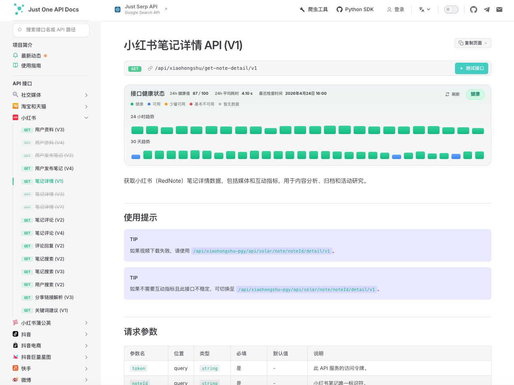
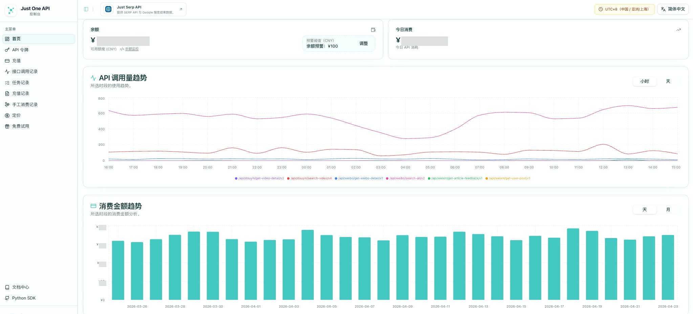

  

[简体中文](README.md) | [English](README.en.md)

# 小红书内容发现：话题、热搜与分享链接

从话题、热搜、分享链接或点点 AI 问答出发，找到适合后续整理的小红书内容。本指南重点区分不同发现入口的用途，以及如何保留每条笔记的来源上下文。

本仓库由 [Just One API](https://justoneapi.com/zh/?utm_source=github.com&utm_medium=referral&utm_campaign=justoneapi_team_justoneapi_xiaohongshu_data_en_02&utm_content=repo_readme) 维护，提供接口导航与使用指南。

[在线文档](https://docs.justoneapi.com/zh/?utm_source=github.com&utm_medium=referral&utm_campaign=justoneapi_team_justoneapi_xiaohongshu_data_en_02&utm_content=repo_readme) · [注册获取 Token](https://dashboard.justoneapi.com/zh/login?utm_source=github.com&utm_medium=referral&utm_campaign=justoneapi_team_justoneapi_xiaohongshu_data_en_02&utm_content=repo_readme) · [联系支持](https://justoneapi.com/zh/contact?utm_source=github.com&utm_medium=referral&utm_campaign=justoneapi_team_justoneapi_xiaohongshu_data_en_02&utm_content=repo_readme)

## 本主题接口导航

- [话题笔记列表 (V1)](https://docs.justoneapi.com/zh/api/xiaohongshu-rednote/topic-note-list-v1?utm_source=github.com&utm_medium=referral&utm_campaign=justoneapi_team_justoneapi_xiaohongshu_data_en_02&utm_content=repo_readme_topic_nav)
- [热搜 (V1)](https://docs.justoneapi.com/zh/api/xiaohongshu-rednote/hot-search-v1?utm_source=github.com&utm_medium=referral&utm_campaign=justoneapi_team_justoneapi_xiaohongshu_data_en_02&utm_content=repo_readme_topic_nav)
- [热门榜单 (V1)](https://docs.justoneapi.com/zh/api/xiaohongshu-rednote/hot-list-v1?utm_source=github.com&utm_medium=referral&utm_campaign=justoneapi_team_justoneapi_xiaohongshu_data_en_02&utm_content=repo_readme_topic_nav)
- [分享链接解析 (V1)](https://docs.justoneapi.com/zh/api/xiaohongshu-rednote/share-link-resolution-v1?utm_source=github.com&utm_medium=referral&utm_campaign=justoneapi_team_justoneapi_xiaohongshu_data_en_02&utm_content=repo_readme_topic_nav)
- [Ask Dots AI](https://docs.justoneapi.com/zh/api/xiaohongshu-rednote/ask-dots-ai?utm_source=github.com&utm_medium=referral&utm_campaign=justoneapi_team_justoneapi_xiaohongshu_data_en_02&utm_content=repo_readme_topic_nav)
- [关键词建议 (V1)](https://docs.justoneapi.com/zh/api/xiaohongshu-rednote/keyword-suggestions-v1?utm_source=github.com&utm_medium=referral&utm_campaign=justoneapi_team_justoneapi_xiaohongshu_data_en_02&utm_content=repo_readme_topic_nav)

## 选择内容发现入口

| 研究起点 | 文档入口 | 建议保存的上下文 |
| --- | --- | --- |
| 已知话题 | 话题笔记列表 | 话题输入与查询时间 |
| 当前热门搜索词 | 热搜 | 返回时的榜单上下文 |
| 热门内容集合 | 热门榜单 | 榜单类型及实际查询条件 |
| 一条分享链接 | 分享链接解析 | 原始链接与解析结果 |
| 问答式探索 | Ask Dots AI | 原始问题与返回内容 |
| 扩展检索表达 | 关键词建议 | 原始词及候选词关系 |

先阅读各接口所需参数，再决定如何连接后续笔记搜索或详情请求。不要假设每种发现接口都返回相同的对象结构。

## 从发现到整理

对于热搜研究，可以按选定时间点记录返回结果，再从感兴趣的词进入笔记搜索。对话题研究，保留话题与笔记之间的来源关系；同一笔记在多个入口出现时，可以合并笔记记录，同时保留全部来源。

处理分享链接时先查看解析结果，确认目标类型，再选择详情接口。原始链接有助于后续核对输入，不应被解析后的标识完全替代。

## 解读结果

热搜或榜单是一类内容发现结果，不等于全站搜索量或完整历史趋势。连续观测可以形成你自己的时间序列，但应标明观测间隔和缺失时段。

Ask Dots AI 的问答结果应与可核对的笔记、链接或其他资料分别记录。具体返回内容以及是否包含可关联的标识，以该接口文档为准。

## 文档与控制台

文档中心提供请求参数、响应说明、接口版本和状态提示。调用前请查看目标接口的最新说明。

控制台提供 API Token 管理、余额与调用记录，便于核对请求结果和消费情况。

## 完整接口目录

以下目录保留全部平台和已弃用接口的标记。完整请求参数、响应说明与当前状态请以[在线接口文档](https://docs.justoneapi.com/zh/?utm_source=github.com&utm_medium=referral&utm_campaign=justoneapi_team_justoneapi_xiaohongshu_data_en_02&utm_content=repo_readme_api_list)为准。

<!-- API_LIST_START -->

### 社交媒体

- [跨平台搜索 (V1)](https://docs.justoneapi.com/zh/api/social-media/cross-platform-search-v1?utm_source=github.com&utm_medium=referral&utm_campaign=justoneapi_team_justoneapi_xiaohongshu_data_en_02&utm_content=repo_readme_api_list) <!-- api-operation:GET /api/search/v1 -->

### 淘宝和天猫

- [商品详情 (V1)](https://docs.justoneapi.com/zh/api/taobao-and-tmall/product-details-v1?utm_source=github.com&utm_medium=referral&utm_campaign=justoneapi_team_justoneapi_xiaohongshu_data_en_02&utm_content=repo_readme_api_list) <!-- api-operation:GET /api/taobao/get-item-detail/v1 -->
- [商品详情 (V2)](https://docs.justoneapi.com/zh/api/taobao-and-tmall/product-details-v2?utm_source=github.com&utm_medium=referral&utm_campaign=justoneapi_team_justoneapi_xiaohongshu_data_en_02&utm_content=repo_readme_api_list) <!-- api-operation:GET /api/taobao/get-item-detail/v2 -->
- [商品详情 (V3)](https://docs.justoneapi.com/zh/api/taobao-and-tmall/product-details-v3?utm_source=github.com&utm_medium=referral&utm_campaign=justoneapi_team_justoneapi_xiaohongshu_data_en_02&utm_content=repo_readme_api_list) <!-- api-operation:GET /api/taobao/get-item-detail/v3 -->
- [商品详情 (V4)](https://docs.justoneapi.com/zh/api/taobao-and-tmall/product-details-v4?utm_source=github.com&utm_medium=referral&utm_campaign=justoneapi_team_justoneapi_xiaohongshu_data_en_02&utm_content=repo_readme_api_list) <!-- api-operation:GET /api/taobao/get-item-detail/v4 -->
- [商品详情 (V5)](https://docs.justoneapi.com/zh/api/taobao-and-tmall/product-details-v5?utm_source=github.com&utm_medium=referral&utm_campaign=justoneapi_team_justoneapi_xiaohongshu_data_en_02&utm_content=repo_readme_api_list) <!-- api-operation:GET /api/taobao/get-item-detail/v5 -->
- [商品详情 (V6)](https://docs.justoneapi.com/zh/api/taobao-and-tmall/product-details-v6?utm_source=github.com&utm_medium=referral&utm_campaign=justoneapi_team_justoneapi_xiaohongshu_data_en_02&utm_content=repo_readme_api_list) <!-- api-operation:GET /api/taobao/get-item-detail/v6 -->
- [商品详情 (V7)](https://docs.justoneapi.com/zh/api/taobao-and-tmall/product-details-v7?utm_source=github.com&utm_medium=referral&utm_campaign=justoneapi_team_justoneapi_xiaohongshu_data_en_02&utm_content=repo_readme_api_list) <!-- api-operation:GET /api/taobao/get-item-detail/v7 -->
- [商品详情 (V9)](https://docs.justoneapi.com/zh/api/taobao-and-tmall/product-details-v9?utm_source=github.com&utm_medium=referral&utm_campaign=justoneapi_team_justoneapi_xiaohongshu_data_en_02&utm_content=repo_readme_api_list) <!-- api-operation:GET /api/taobao/get-item-detail/v9 -->
- [商品评价 (V3)](https://docs.justoneapi.com/zh/api/taobao-and-tmall/product-reviews-v3?utm_source=github.com&utm_medium=referral&utm_campaign=justoneapi_team_justoneapi_xiaohongshu_data_en_02&utm_content=repo_readme_api_list) <!-- api-operation:GET /api/taobao/get-item-comment/v3 -->
- [商品问答 (V1)](https://docs.justoneapi.com/zh/api/taobao-and-tmall/product-questions-v1?utm_source=github.com&utm_medium=referral&utm_campaign=justoneapi_team_justoneapi_xiaohongshu_data_en_02&utm_content=repo_readme_api_list) <!-- api-operation:GET /api/taobao/get-social-feed/v1 -->
- [店铺商品列表 (V1)](https://docs.justoneapi.com/zh/api/taobao-and-tmall/shop-product-list-v1?utm_source=github.com&utm_medium=referral&utm_campaign=justoneapi_team_justoneapi_xiaohongshu_data_en_02&utm_content=repo_readme_api_list) <!-- api-operation:GET /api/taobao/get-shop-item-list/v1 -->
- [店铺商品列表 (V2)](https://docs.justoneapi.com/zh/api/taobao-and-tmall/shop-product-list-v2?utm_source=github.com&utm_medium=referral&utm_campaign=justoneapi_team_justoneapi_xiaohongshu_data_en_02&utm_content=repo_readme_api_list) <!-- api-operation:GET /api/taobao/get-shop-item-list/v2 -->
- [店铺商品列表 (V3)（已弃用）](https://docs.justoneapi.com/zh/api/taobao-and-tmall/shop-product-list-v3-deprecated?utm_source=github.com&utm_medium=referral&utm_campaign=justoneapi_team_justoneapi_xiaohongshu_data_en_02&utm_content=repo_readme_api_list#deprecated) <!-- api-operation:GET /api/taobao/get-shop-item-list/v3 -->
- [店铺商品列表 (V4)](https://docs.justoneapi.com/zh/api/taobao-and-tmall/shop-product-list-v4?utm_source=github.com&utm_medium=referral&utm_campaign=justoneapi_team_justoneapi_xiaohongshu_data_en_02&utm_content=repo_readme_api_list) <!-- api-operation:GET /api/taobao/get-shop-item-list/v4 -->
- [商品销量 (V1)（已弃用）](https://docs.justoneapi.com/zh/api/taobao-and-tmall/product-sales-v1-deprecated?utm_source=github.com&utm_medium=referral&utm_campaign=justoneapi_team_justoneapi_xiaohongshu_data_en_02&utm_content=repo_readme_api_list#deprecated) <!-- api-operation:GET /api/taobao/get-item-sale/v1 -->
- [商品搜索 (V1)](https://docs.justoneapi.com/zh/api/taobao-and-tmall/product-search-v1?utm_source=github.com&utm_medium=referral&utm_campaign=justoneapi_team_justoneapi_xiaohongshu_data_en_02&utm_content=repo_readme_api_list) <!-- api-operation:GET /api/taobao/search-item-list/v1 -->
- [商品搜索 (V2)](https://docs.justoneapi.com/zh/api/taobao-and-tmall/product-search-v2?utm_source=github.com&utm_medium=referral&utm_campaign=justoneapi_team_justoneapi_xiaohongshu_data_en_02&utm_content=repo_readme_api_list) <!-- api-operation:GET /api/taobao/search-item-list/v2 -->

### 小红书

- [Ask Dots AI](https://docs.justoneapi.com/zh/api/xiaohongshu-rednote/ask-dots-ai?utm_source=github.com&utm_medium=referral&utm_campaign=justoneapi_team_justoneapi_xiaohongshu_data_en_02&utm_content=repo_readme_api_list) <!-- api-operation:GET /api/xiaohongshu/ask-dots -->
- [热搜 (V1)](https://docs.justoneapi.com/zh/api/xiaohongshu-rednote/hot-search-v1?utm_source=github.com&utm_medium=referral&utm_campaign=justoneapi_team_justoneapi_xiaohongshu_data_en_02&utm_content=repo_readme_api_list) <!-- api-operation:GET /api/xiaohongshu/hot-search/v1 -->
- [热门榜单 (V1)](https://docs.justoneapi.com/zh/api/xiaohongshu-rednote/hot-list-v1?utm_source=github.com&utm_medium=referral&utm_campaign=justoneapi_team_justoneapi_xiaohongshu_data_en_02&utm_content=repo_readme_api_list) <!-- api-operation:GET /api/xiaohongshu/hot-list/v1 -->
- [热门灵感信息流 (V1)](https://docs.justoneapi.com/zh/api/xiaohongshu-rednote/hot-inspiration-feed-v1?utm_source=github.com&utm_medium=referral&utm_campaign=justoneapi_team_justoneapi_xiaohongshu_data_en_02&utm_content=repo_readme_api_list) <!-- api-operation:GET /api/xiaohongshu/get-creator-hot-inspiration-feed/v1 -->
- [笔记搜索 (V1)](https://docs.justoneapi.com/zh/api/xiaohongshu-rednote/note-search-v1?utm_source=github.com&utm_medium=referral&utm_campaign=justoneapi_team_justoneapi_xiaohongshu_data_en_02&utm_content=repo_readme_api_list) <!-- api-operation:GET /api/xiaohongshu/search-note/v1 -->
- [笔记搜索 (V2)](https://docs.justoneapi.com/zh/api/xiaohongshu-rednote/note-search-v2?utm_source=github.com&utm_medium=referral&utm_campaign=justoneapi_team_justoneapi_xiaohongshu_data_en_02&utm_content=repo_readme_api_list) <!-- api-operation:GET /api/xiaohongshu/search-note/v2 -->
- [笔记搜索 (V3)](https://docs.justoneapi.com/zh/api/xiaohongshu-rednote/note-search-v3?utm_source=github.com&utm_medium=referral&utm_campaign=justoneapi_team_justoneapi_xiaohongshu_data_en_02&utm_content=repo_readme_api_list) <!-- api-operation:GET /api/xiaohongshu/search-note/v3 -->
- [笔记搜索 (V4)](https://docs.justoneapi.com/zh/api/xiaohongshu-rednote/note-search-v4?utm_source=github.com&utm_medium=referral&utm_campaign=justoneapi_team_justoneapi_xiaohongshu_data_en_02&utm_content=repo_readme_api_list) <!-- api-operation:GET /api/xiaohongshu/search-note/v4 -->
- [用户搜索 (V2)](https://docs.justoneapi.com/zh/api/xiaohongshu-rednote/user-search-v2?utm_source=github.com&utm_medium=referral&utm_campaign=justoneapi_team_justoneapi_xiaohongshu_data_en_02&utm_content=repo_readme_api_list) <!-- api-operation:GET /api/xiaohongshu/search-user/v2 -->
- [用户发布笔记 (V1)](https://docs.justoneapi.com/zh/api/xiaohongshu-rednote/user-published-notes-v1?utm_source=github.com&utm_medium=referral&utm_campaign=justoneapi_team_justoneapi_xiaohongshu_data_en_02&utm_content=repo_readme_api_list) <!-- api-operation:GET /api/xiaohongshu/get-user-note-list/v1 -->
- [用户发布笔记 (V2)](https://docs.justoneapi.com/zh/api/xiaohongshu-rednote/user-published-notes-v2?utm_source=github.com&utm_medium=referral&utm_campaign=justoneapi_team_justoneapi_xiaohongshu_data_en_02&utm_content=repo_readme_api_list) <!-- api-operation:GET /api/xiaohongshu/get-user-note-list/v2 -->
- [用户发布笔记 (V3)](https://docs.justoneapi.com/zh/api/xiaohongshu-rednote/user-published-notes-v3?utm_source=github.com&utm_medium=referral&utm_campaign=justoneapi_team_justoneapi_xiaohongshu_data_en_02&utm_content=repo_readme_api_list) <!-- api-operation:GET /api/xiaohongshu/get-user-note-list/v3 -->
- [用户发布笔记 (V4)](https://docs.justoneapi.com/zh/api/xiaohongshu-rednote/user-published-notes-v4?utm_source=github.com&utm_medium=referral&utm_campaign=justoneapi_team_justoneapi_xiaohongshu_data_en_02&utm_content=repo_readme_api_list) <!-- api-operation:GET /api/xiaohongshu/get-user-note-list/v4 -->
- [笔记详情 (V1)](https://docs.justoneapi.com/zh/api/xiaohongshu-rednote/note-details-v1?utm_source=github.com&utm_medium=referral&utm_campaign=justoneapi_team_justoneapi_xiaohongshu_data_en_02&utm_content=repo_readme_api_list) <!-- api-operation:GET /api/xiaohongshu/get-note-detail/v1 -->
- [笔记详情 (V2)](https://docs.justoneapi.com/zh/api/xiaohongshu-rednote/note-details-v2?utm_source=github.com&utm_medium=referral&utm_campaign=justoneapi_team_justoneapi_xiaohongshu_data_en_02&utm_content=repo_readme_api_list) <!-- api-operation:GET /api/xiaohongshu/get-note-detail/v2 -->
- [笔记详情 (V3)](https://docs.justoneapi.com/zh/api/xiaohongshu-rednote/note-details-v3?utm_source=github.com&utm_medium=referral&utm_campaign=justoneapi_team_justoneapi_xiaohongshu_data_en_02&utm_content=repo_readme_api_list) <!-- api-operation:GET /api/xiaohongshu/get-note-detail/v3 -->
- [笔记详情 (V4)](https://docs.justoneapi.com/zh/api/xiaohongshu-rednote/note-details-v4?utm_source=github.com&utm_medium=referral&utm_campaign=justoneapi_team_justoneapi_xiaohongshu_data_en_02&utm_content=repo_readme_api_list) <!-- api-operation:GET /api/xiaohongshu/get-note-detail/v4 -->
- [笔记详情 (V5)](https://docs.justoneapi.com/zh/api/xiaohongshu-rednote/note-details-v5?utm_source=github.com&utm_medium=referral&utm_campaign=justoneapi_team_justoneapi_xiaohongshu_data_en_02&utm_content=repo_readme_api_list) <!-- api-operation:GET /api/xiaohongshu/get-note-detail/v5 -->
- [笔记详情 (V6)](https://docs.justoneapi.com/zh/api/xiaohongshu-rednote/note-details-v6?utm_source=github.com&utm_medium=referral&utm_campaign=justoneapi_team_justoneapi_xiaohongshu_data_en_02&utm_content=repo_readme_api_list) <!-- api-operation:GET /api/xiaohongshu/get-note-detail/v6 -->
- [笔记详情 (V7)（已弃用）](https://docs.justoneapi.com/zh/api/xiaohongshu-rednote/note-details-v7-deprecated?utm_source=github.com&utm_medium=referral&utm_campaign=justoneapi_team_justoneapi_xiaohongshu_data_en_02&utm_content=repo_readme_api_list#deprecated) <!-- api-operation:GET /api/xiaohongshu/get-note-detail/v7 -->
- [笔记评论 (V2)](https://docs.justoneapi.com/zh/api/xiaohongshu-rednote/note-comments-v2?utm_source=github.com&utm_medium=referral&utm_campaign=justoneapi_team_justoneapi_xiaohongshu_data_en_02&utm_content=repo_readme_api_list) <!-- api-operation:GET /api/xiaohongshu/get-note-comment/v2 -->
- [笔记评论 (V3)](https://docs.justoneapi.com/zh/api/xiaohongshu-rednote/note-comments-v3?utm_source=github.com&utm_medium=referral&utm_campaign=justoneapi_team_justoneapi_xiaohongshu_data_en_02&utm_content=repo_readme_api_list) <!-- api-operation:GET /api/xiaohongshu/get-note-comment/v3 -->
- [笔记评论 (V4)](https://docs.justoneapi.com/zh/api/xiaohongshu-rednote/note-comments-v4?utm_source=github.com&utm_medium=referral&utm_campaign=justoneapi_team_justoneapi_xiaohongshu_data_en_02&utm_content=repo_readme_api_list) <!-- api-operation:GET /api/xiaohongshu/get-note-comment/v4 -->
- [评论回复 (V2)](https://docs.justoneapi.com/zh/api/xiaohongshu-rednote/comment-replies-v2?utm_source=github.com&utm_medium=referral&utm_campaign=justoneapi_team_justoneapi_xiaohongshu_data_en_02&utm_content=repo_readme_api_list) <!-- api-operation:GET /api/xiaohongshu/get-note-sub-comment/v2 -->
- [用户资料 (V3)](https://docs.justoneapi.com/zh/api/xiaohongshu-rednote/user-profile-v3?utm_source=github.com&utm_medium=referral&utm_campaign=justoneapi_team_justoneapi_xiaohongshu_data_en_02&utm_content=repo_readme_api_list) <!-- api-operation:GET /api/xiaohongshu/get-user/v3 -->
- [用户资料 (V4)](https://docs.justoneapi.com/zh/api/xiaohongshu-rednote/user-profile-v4?utm_source=github.com&utm_medium=referral&utm_campaign=justoneapi_team_justoneapi_xiaohongshu_data_en_02&utm_content=repo_readme_api_list) <!-- api-operation:GET /api/xiaohongshu/get-user/v4 -->
- [关键词建议 (V1)](https://docs.justoneapi.com/zh/api/xiaohongshu-rednote/keyword-suggestions-v1?utm_source=github.com&utm_medium=referral&utm_campaign=justoneapi_team_justoneapi_xiaohongshu_data_en_02&utm_content=repo_readme_api_list) <!-- api-operation:GET /api/xiaohongshu/search-recommend/v1 -->
- [话题笔记列表 (V1)](https://docs.justoneapi.com/zh/api/xiaohongshu-rednote/topic-note-list-v1?utm_source=github.com&utm_medium=referral&utm_campaign=justoneapi_team_justoneapi_xiaohongshu_data_en_02&utm_content=repo_readme_api_list) <!-- api-operation:GET /api/xiaohongshu/get-topic-note-list/v1 -->
- [分享链接解析 (V1)](https://docs.justoneapi.com/zh/api/xiaohongshu-rednote/share-link-resolution-v1?utm_source=github.com&utm_medium=referral&utm_campaign=justoneapi_team_justoneapi_xiaohongshu_data_en_02&utm_content=repo_readme_api_list) <!-- api-operation:GET /api/xiaohongshu/share-url-transfer/v1 -->

### 小红书电商 (RedNote)

- [商品搜索 (V1)](https://docs.justoneapi.com/zh/api/xiaohongshu-e-commerce-rednote/product-search-v1?utm_source=github.com&utm_medium=referral&utm_campaign=justoneapi_team_justoneapi_xiaohongshu_data_en_02&utm_content=repo_readme_api_list) <!-- api-operation:GET /api/xiaohongshu-ec/search-products/v1 -->

### 小红书蒲公英

- [创作者搜索 (V1)](https://docs.justoneapi.com/zh/api/xiaohongshu-creator-marketplace-pugongying/creator-search-v1?utm_source=github.com&utm_medium=referral&utm_campaign=justoneapi_team_justoneapi_xiaohongshu_data_en_02&utm_content=repo_readme_api_list) <!-- api-operation:GET /api/xiaohongshu-pgy/api/solar/cooperator/blogger/v2/v1 -->
- [创作者资料 (V1)](https://docs.justoneapi.com/zh/api/xiaohongshu-creator-marketplace-pugongying/creator-profile-v1?utm_source=github.com&utm_medium=referral&utm_campaign=justoneapi_team_justoneapi_xiaohongshu_data_en_02&utm_content=repo_readme_api_list) <!-- api-operation:GET /api/xiaohongshu-pgy/api/solar/cooperator/user/blogger/userId/v1 -->
- [数据摘要 (V1)](https://docs.justoneapi.com/zh/api/xiaohongshu-creator-marketplace-pugongying/data-summary-v1?utm_source=github.com&utm_medium=referral&utm_campaign=justoneapi_team_justoneapi_xiaohongshu_data_en_02&utm_content=repo_readme_api_list) <!-- api-operation:GET /api/xiaohongshu-pgy/api/solar/kol/dataV3/dataSummary/v1 -->
- [粉丝增长历史 (V1)](https://docs.justoneapi.com/zh/api/xiaohongshu-creator-marketplace-pugongying/follower-growth-history-v1?utm_source=github.com&utm_medium=referral&utm_campaign=justoneapi_team_justoneapi_xiaohongshu_data_en_02&utm_content=repo_readme_api_list) <!-- api-operation:GET /api/xiaohongshu-pgy/api/solar/kol/data/userId/fans_overall_new_history/v1 -->
- [粉丝摘要 (V1)](https://docs.justoneapi.com/zh/api/xiaohongshu-creator-marketplace-pugongying/follower-summary-v1?utm_source=github.com&utm_medium=referral&utm_campaign=justoneapi_team_justoneapi_xiaohongshu_data_en_02&utm_content=repo_readme_api_list) <!-- api-operation:GET /api/xiaohongshu-pgy/api/solar/kol/dataV3/fansSummary/v1 -->
- [相似创作者 (V1)](https://docs.justoneapi.com/zh/api/xiaohongshu-creator-marketplace-pugongying/similar-creators-v1?utm_source=github.com&utm_medium=referral&utm_campaign=justoneapi_team_justoneapi_xiaohongshu_data_en_02&utm_content=repo_readme_api_list) <!-- api-operation:GET /api/xiaohongshu-pgy/api/solar/kol/get_similar_kol/v1 -->
- [创作者特征标签 (V1)](https://docs.justoneapi.com/zh/api/xiaohongshu-creator-marketplace-pugongying/creator-feature-tags-v1?utm_source=github.com&utm_medium=referral&utm_campaign=justoneapi_team_justoneapi_xiaohongshu_data_en_02&utm_content=repo_readme_api_list) <!-- api-operation:GET /api/xiaohongshu-pgy/api/solar/kol/dataV2/kolFeatureTags/v1 -->
- [创作者内容标签 (V1)](https://docs.justoneapi.com/zh/api/xiaohongshu-creator-marketplace-pugongying/creator-content-tags-v1?utm_source=github.com&utm_medium=referral&utm_campaign=justoneapi_team_justoneapi_xiaohongshu_data_en_02&utm_content=repo_readme_api_list) <!-- api-operation:GET /api/xiaohongshu-pgy/api/solar/kol/dataV2/kolContentTags/v1 -->
- [笔记表现指标 (V1)](https://docs.justoneapi.com/zh/api/xiaohongshu-creator-marketplace-pugongying/note-performance-metrics-v1?utm_source=github.com&utm_medium=referral&utm_campaign=justoneapi_team_justoneapi_xiaohongshu_data_en_02&utm_content=repo_readme_api_list) <!-- api-operation:GET /api/xiaohongshu-pgy/api/solar/kol/dataV3/notesRate/v1 -->
- [粉丝分布 (V1)](https://docs.justoneapi.com/zh/api/xiaohongshu-creator-marketplace-pugongying/follower-distribution-v1?utm_source=github.com&utm_medium=referral&utm_campaign=justoneapi_team_justoneapi_xiaohongshu_data_en_02&utm_content=repo_readme_api_list) <!-- api-operation:GET /api/xiaohongshu-pgy/api/solar/kol/data/userId/fans_profile/v1 -->
- [成本效益分析 (V1)](https://docs.justoneapi.com/zh/api/xiaohongshu-creator-marketplace-pugongying/cost-effectiveness-analysis-v1?utm_source=github.com&utm_medium=referral&utm_campaign=justoneapi_team_justoneapi_xiaohongshu_data_en_02&utm_content=repo_readme_api_list) <!-- api-operation:GET /api/xiaohongshu-pgy/api/solar/kol/dataV2/costEffective/v1 -->
- [笔记详情 (V1)](https://docs.justoneapi.com/zh/api/xiaohongshu-creator-marketplace-pugongying/note-details-v1?utm_source=github.com&utm_medium=referral&utm_campaign=justoneapi_team_justoneapi_xiaohongshu_data_en_02&utm_content=repo_readme_api_list) <!-- api-operation:GET /api/xiaohongshu-pgy/api/solar/note/noteId/detail/v1 -->
- [创作者核心指标 (V1)](https://docs.justoneapi.com/zh/api/xiaohongshu-creator-marketplace-pugongying/creator-core-metrics-v1?utm_source=github.com&utm_medium=referral&utm_campaign=justoneapi_team_justoneapi_xiaohongshu_data_en_02&utm_content=repo_readme_api_list) <!-- api-operation:GET /api/xiaohongshu-pgy/api/pgy/kol/data/core_data/v1 -->
- [内容广场笔记 (V1)](https://docs.justoneapi.com/zh/api/xiaohongshu-creator-marketplace-pugongying/content-square-notes-v1?utm_source=github.com&utm_medium=referral&utm_campaign=justoneapi_team_justoneapi_xiaohongshu_data_en_02&utm_content=repo_readme_api_list) <!-- api-operation:GET /api/xiaohongshu-pgy/api/pgy/content_square/search_note_v2/v1 -->
- [创作者资料 (V1)（已弃用）](https://docs.justoneapi.com/zh/api/xiaohongshu-creator-marketplace-pugongying/creator-profile-v1-deprecated?utm_source=github.com&utm_medium=referral&utm_campaign=justoneapi_team_justoneapi_xiaohongshu_data_en_02&utm_content=repo_readme_api_list#deprecated) <!-- api-operation:GET /api/xiaohongshu-pgy/get-kol-info/v1 -->
- [笔记表现指标 (V1)（已弃用）](https://docs.justoneapi.com/zh/api/xiaohongshu-creator-marketplace-pugongying/note-performance-metrics-v1-deprecated?utm_source=github.com&utm_medium=referral&utm_campaign=justoneapi_team_justoneapi_xiaohongshu_data_en_02&utm_content=repo_readme_api_list#deprecated) <!-- api-operation:GET /api/xiaohongshu-pgy/get-kol-note-rate/v1 -->
- [粉丝分布 (V1)（已弃用）](https://docs.justoneapi.com/zh/api/xiaohongshu-creator-marketplace-pugongying/follower-distribution-v1-deprecated?utm_source=github.com&utm_medium=referral&utm_campaign=justoneapi_team_justoneapi_xiaohongshu_data_en_02&utm_content=repo_readme_api_list#deprecated) <!-- api-operation:GET /api/xiaohongshu-pgy/get-kol-fans-portrait/v1 -->
- [粉丝摘要 (V1)（已弃用）](https://docs.justoneapi.com/zh/api/xiaohongshu-creator-marketplace-pugongying/follower-summary-v1-deprecated?utm_source=github.com&utm_medium=referral&utm_campaign=justoneapi_team_justoneapi_xiaohongshu_data_en_02&utm_content=repo_readme_api_list#deprecated) <!-- api-operation:GET /api/xiaohongshu-pgy/get-kol-fans-summary/v1 -->
- [粉丝增长历史 (V1)（已弃用）](https://docs.justoneapi.com/zh/api/xiaohongshu-creator-marketplace-pugongying/follower-growth-history-v1-deprecated?utm_source=github.com&utm_medium=referral&utm_campaign=justoneapi_team_justoneapi_xiaohongshu_data_en_02&utm_content=repo_readme_api_list#deprecated) <!-- api-operation:GET /api/xiaohongshu-pgy/get-kol-fans-trend/v1 -->
- [创作者笔记列表 (V1)](https://docs.justoneapi.com/zh/api/xiaohongshu-creator-marketplace-pugongying/creator-note-list-v1?utm_source=github.com&utm_medium=referral&utm_campaign=justoneapi_team_justoneapi_xiaohongshu_data_en_02&utm_content=repo_readme_api_list) <!-- api-operation:GET /api/xiaohongshu-pgy/api/solar/kol/dataV2/notesDetail/v1 -->
- [创作者笔记列表 Pro (V1)](https://docs.justoneapi.com/zh/api/xiaohongshu-creator-marketplace-pugongying/creator-note-list-pro-v1?utm_source=github.com&utm_medium=referral&utm_campaign=justoneapi_team_justoneapi_xiaohongshu_data_en_02&utm_content=repo_readme_api_list) <!-- api-operation:GET /api/xiaohongshu-pgy/get-kol-note-list/v1 -->
- [数据摘要 (V2)（已弃用）](https://docs.justoneapi.com/zh/api/xiaohongshu-creator-marketplace-pugongying/data-summary-v2-deprecated?utm_source=github.com&utm_medium=referral&utm_campaign=justoneapi_team_justoneapi_xiaohongshu_data_en_02&utm_content=repo_readme_api_list#deprecated) <!-- api-operation:GET /api/xiaohongshu-pgy/get-kol-data-summary/v2 -->
- [成本效益分析 (V1)（已弃用）](https://docs.justoneapi.com/zh/api/xiaohongshu-creator-marketplace-pugongying/cost-effectiveness-analysis-v1-deprecated?utm_source=github.com&utm_medium=referral&utm_campaign=justoneapi_team_justoneapi_xiaohongshu_data_en_02&utm_content=repo_readme_api_list#deprecated) <!-- api-operation:GET /api/xiaohongshu-pgy/get-kol-cost-effective/v1 -->
- [笔记详情 (V1)（已弃用）](https://docs.justoneapi.com/zh/api/xiaohongshu-creator-marketplace-pugongying/note-details-v1-deprecated?utm_source=github.com&utm_medium=referral&utm_campaign=justoneapi_team_justoneapi_xiaohongshu_data_en_02&utm_content=repo_readme_api_list#deprecated) <!-- api-operation:GET /api/xiaohongshu-pgy/get-note-detail/v1 -->
- [创作者核心指标 (V1)（已弃用）](https://docs.justoneapi.com/zh/api/xiaohongshu-creator-marketplace-pugongying/creator-core-metrics-v1-deprecated?utm_source=github.com&utm_medium=referral&utm_campaign=justoneapi_team_justoneapi_xiaohongshu_data_en_02&utm_content=repo_readme_api_list#deprecated) <!-- api-operation:GET /api/xiaohongshu-pgy/get-kol-core-data/v1 -->

### 抖音

- [视频搜索 (V1)](https://docs.justoneapi.com/zh/api/douyin-tiktok-china/video-search-v1?utm_source=github.com&utm_medium=referral&utm_campaign=justoneapi_team_justoneapi_xiaohongshu_data_en_02&utm_content=repo_readme_api_list) <!-- api-operation:GET /api/douyin/search-video/v1 -->
- [视频搜索 (V4)](https://docs.justoneapi.com/zh/api/douyin-tiktok-china/video-search-v4?utm_source=github.com&utm_medium=referral&utm_campaign=justoneapi_team_justoneapi_xiaohongshu_data_en_02&utm_content=repo_readme_api_list) <!-- api-operation:GET /api/douyin/search-video/v4 -->
- [图片帖子搜索 (V1)](https://docs.justoneapi.com/zh/api/douyin-tiktok-china/image-post-search-v1?utm_source=github.com&utm_medium=referral&utm_campaign=justoneapi_team_justoneapi_xiaohongshu_data_en_02&utm_content=repo_readme_api_list) <!-- api-operation:GET /api/douyin/search-image/v1 -->
- [热搜 (V1)](https://docs.justoneapi.com/zh/api/douyin-tiktok-china/hot-search-v1?utm_source=github.com&utm_medium=referral&utm_campaign=justoneapi_team_justoneapi_xiaohongshu_data_en_02&utm_content=repo_readme_api_list) <!-- api-operation:GET /api/douyin/hot-search/v1 -->
- [用户搜索 (V2)](https://docs.justoneapi.com/zh/api/douyin-tiktok-china/user-search-v2?utm_source=github.com&utm_medium=referral&utm_campaign=justoneapi_team_justoneapi_xiaohongshu_data_en_02&utm_content=repo_readme_api_list) <!-- api-operation:GET /api/douyin/search-user/v2 -->
- [用户发布视频 (V1)](https://docs.justoneapi.com/zh/api/douyin-tiktok-china/user-published-videos-v1?utm_source=github.com&utm_medium=referral&utm_campaign=justoneapi_team_justoneapi_xiaohongshu_data_en_02&utm_content=repo_readme_api_list) <!-- api-operation:GET /api/douyin/get-user-video-list/v1 -->
- [用户发布视频 (V3)](https://docs.justoneapi.com/zh/api/douyin-tiktok-china/user-published-videos-v3?utm_source=github.com&utm_medium=referral&utm_campaign=justoneapi_team_justoneapi_xiaohongshu_data_en_02&utm_content=repo_readme_api_list) <!-- api-operation:GET /api/douyin/get-user-video-list/v3 -->
- [视频详情 (V2)](https://docs.justoneapi.com/zh/api/douyin-tiktok-china/video-details-v2?utm_source=github.com&utm_medium=referral&utm_campaign=justoneapi_team_justoneapi_xiaohongshu_data_en_02&utm_content=repo_readme_api_list) <!-- api-operation:GET /api/douyin/get-video-detail/v2 -->
- [视频评论 (V1)](https://docs.justoneapi.com/zh/api/douyin-tiktok-china/video-comments-v1?utm_source=github.com&utm_medium=referral&utm_campaign=justoneapi_team_justoneapi_xiaohongshu_data_en_02&utm_content=repo_readme_api_list) <!-- api-operation:GET /api/douyin/get-video-comment/v1 -->
- [评论回复 (V1)](https://docs.justoneapi.com/zh/api/douyin-tiktok-china/comment-replies-v1?utm_source=github.com&utm_medium=referral&utm_campaign=justoneapi_team_justoneapi_xiaohongshu_data_en_02&utm_content=repo_readme_api_list) <!-- api-operation:GET /api/douyin/get-video-sub-comment/v1 -->
- [用户资料 (V3)](https://docs.justoneapi.com/zh/api/douyin-tiktok-china/user-profile-v3?utm_source=github.com&utm_medium=referral&utm_campaign=justoneapi_team_justoneapi_xiaohongshu_data_en_02&utm_content=repo_readme_api_list) <!-- api-operation:GET /api/douyin/get-user-detail/v3 -->
- [分享链接解析 (V1)](https://docs.justoneapi.com/zh/api/douyin-tiktok-china/share-link-resolution-v1?utm_source=github.com&utm_medium=referral&utm_campaign=justoneapi_team_justoneapi_xiaohongshu_data_en_02&utm_content=repo_readme_api_list) <!-- api-operation:GET /api/douyin/share-url-transfer/v1 -->

### 抖音电商

- [商品详情 (V1)（已弃用）](https://docs.justoneapi.com/zh/api/douyin-e-commerce/item-details-v1-deprecated?utm_source=github.com&utm_medium=referral&utm_campaign=justoneapi_team_justoneapi_xiaohongshu_data_en_02&utm_content=repo_readme_api_list#deprecated) <!-- api-operation:GET /api/douyin-ec/get-item-detail/v1 -->
- [商品详情 (V2)](https://docs.justoneapi.com/zh/api/douyin-e-commerce/item-details-v2?utm_source=github.com&utm_medium=referral&utm_campaign=justoneapi_team_justoneapi_xiaohongshu_data_en_02&utm_content=repo_readme_api_list) <!-- api-operation:GET /api/douyin-ec/get-item-detail/v2 -->
- [商品SKU信息 (V1)](https://docs.justoneapi.com/zh/api/douyin-e-commerce/product-sku-info-v1?utm_source=github.com&utm_medium=referral&utm_campaign=justoneapi_team_justoneapi_xiaohongshu_data_en_02&utm_content=repo_readme_api_list) <!-- api-operation:GET /api/douyin-ec/get-item-sku-info/v1 -->
- [商品SKU信息 (V2)](https://docs.justoneapi.com/zh/api/douyin-e-commerce/product-sku-info-v2?utm_source=github.com&utm_medium=referral&utm_campaign=justoneapi_team_justoneapi_xiaohongshu_data_en_02&utm_content=repo_readme_api_list) <!-- api-operation:GET /api/douyin-ec/get-item-sku-info/v2 -->
- [商品搜索 (V1)](https://docs.justoneapi.com/zh/api/douyin-e-commerce/product-search-v1?utm_source=github.com&utm_medium=referral&utm_campaign=justoneapi_team_justoneapi_xiaohongshu_data_en_02&utm_content=repo_readme_api_list) <!-- api-operation:GET /api/douyin-ec/search-item-list/v1 -->
- [商品评论 (V1)](https://docs.justoneapi.com/zh/api/douyin-e-commerce/item-comments-v1?utm_source=github.com&utm_medium=referral&utm_campaign=justoneapi_team_justoneapi_xiaohongshu_data_en_02&utm_content=repo_readme_api_list) <!-- api-operation:GET /api/douyin-ec/get-item-comments/v1 -->
- [店铺商品列表 (V1)](https://docs.justoneapi.com/zh/api/douyin-e-commerce/shop-product-list-v1?utm_source=github.com&utm_medium=referral&utm_campaign=justoneapi_team_justoneapi_xiaohongshu_data_en_02&utm_content=repo_readme_api_list) <!-- api-operation:GET /api/douyin-ec/get-shop-item-list/v1 -->

### 抖音巨量星图

- [创作者搜索 (V1)](https://docs.justoneapi.com/zh/api/douyin-creator-marketplace-xingtu/creator-search-v1?utm_source=github.com&utm_medium=referral&utm_campaign=justoneapi_team_justoneapi_xiaohongshu_data_en_02&utm_content=repo_readme_api_list) <!-- api-operation:GET /api/douyin-xingtu/gw/api/gsearch/search_for_author_square/v1 -->
- [创作者资料 (V1)](https://docs.justoneapi.com/zh/api/douyin-creator-marketplace-xingtu/creator-profile-v1?utm_source=github.com&utm_medium=referral&utm_campaign=justoneapi_team_justoneapi_xiaohongshu_data_en_02&utm_content=repo_readme_api_list) <!-- api-operation:GET /api/douyin-xingtu/gw/api/author/get_author_base_info/v1 -->
- [创作者链接结构 (V1)](https://docs.justoneapi.com/zh/api/douyin-creator-marketplace-xingtu/creator-link-structure-v1?utm_source=github.com&utm_medium=referral&utm_campaign=justoneapi_team_justoneapi_xiaohongshu_data_en_02&utm_content=repo_readme_api_list) <!-- api-operation:GET /api/douyin-xingtu/gw/api/data_sp/author_link_struct/v1 -->
- [创作者可见性状态 (V1)](https://docs.justoneapi.com/zh/api/douyin-creator-marketplace-xingtu/creator-visibility-status-v1?utm_source=github.com&utm_medium=referral&utm_campaign=justoneapi_team_justoneapi_xiaohongshu_data_en_02&utm_content=repo_readme_api_list) <!-- api-operation:GET /api/douyin-xingtu/gw/api/data_sp/check_author_display/v1 -->
- [创作者渠道指标 (V1)](https://docs.justoneapi.com/zh/api/douyin-creator-marketplace-xingtu/creator-channel-metrics-v1?utm_source=github.com&utm_medium=referral&utm_campaign=justoneapi_team_justoneapi_xiaohongshu_data_en_02&utm_content=repo_readme_api_list) <!-- api-operation:GET /api/douyin-xingtu/gw/api/author/get_author_platform_channel_info_v2/v1 -->
- [创作者订单经验 (V1)](https://docs.justoneapi.com/zh/api/douyin-creator-marketplace-xingtu/creator-order-experience-v1?utm_source=github.com&utm_medium=referral&utm_campaign=justoneapi_team_justoneapi_xiaohongshu_data_en_02&utm_content=repo_readme_api_list) <!-- api-operation:GET /api/douyin-xingtu/gw/api/aggregator/get_author_order_experience/v1 -->
- [创作者链接指标 (V1)](https://docs.justoneapi.com/zh/api/douyin-creator-marketplace-xingtu/creator-link-metrics-v1?utm_source=github.com&utm_medium=referral&utm_campaign=justoneapi_team_justoneapi_xiaohongshu_data_en_02&utm_content=repo_readme_api_list) <!-- api-operation:GET /api/douyin-xingtu/gw/api/data_sp/get_author_link_info/v1 -->
- [视频分布 (V1)](https://docs.justoneapi.com/zh/api/douyin-creator-marketplace-xingtu/video-distribution-v1?utm_source=github.com&utm_medium=referral&utm_campaign=justoneapi_team_justoneapi_xiaohongshu_data_en_02&utm_content=repo_readme_api_list) <!-- api-operation:GET /api/douyin-xingtu/gw/api/data_sp/author_video_distribution/v1 -->
- [受众分布 (V1)](https://docs.justoneapi.com/zh/api/douyin-creator-marketplace-xingtu/audience-distribution-v1?utm_source=github.com&utm_medium=referral&utm_campaign=justoneapi_team_justoneapi_xiaohongshu_data_en_02&utm_content=repo_readme_api_list) <!-- api-operation:GET /api/douyin-xingtu/gw/api/data_sp/author_audience_distribution/v1 -->
- [营销指标 (V1)](https://docs.justoneapi.com/zh/api/douyin-creator-marketplace-xingtu/marketing-metrics-v1?utm_source=github.com&utm_medium=referral&utm_campaign=justoneapi_team_justoneapi_xiaohongshu_data_en_02&utm_content=repo_readme_api_list) <!-- api-operation:GET /api/douyin-xingtu/gw/api/author/get_author_marketing_info/v1 -->
- [传播指标 (V1)](https://docs.justoneapi.com/zh/api/douyin-creator-marketplace-xingtu/spread-metrics-v1?utm_source=github.com&utm_medium=referral&utm_campaign=justoneapi_team_justoneapi_xiaohongshu_data_en_02&utm_content=repo_readme_api_list) <!-- api-operation:GET /api/douyin-xingtu/gw/api/data_sp/get_author_spread_info/v1 -->
- [转化分析 (V1)](https://docs.justoneapi.com/zh/api/douyin-creator-marketplace-xingtu/conversion-analysis-v1?utm_source=github.com&utm_medium=referral&utm_campaign=justoneapi_team_justoneapi_xiaohongshu_data_en_02&utm_content=repo_readme_api_list) <!-- api-operation:GET /api/douyin-xingtu/gw/api/data_sp/get_author_convert_ability/v1 -->
- [展示商品 (V1)](https://docs.justoneapi.com/zh/api/douyin-creator-marketplace-xingtu/showcase-items-v1?utm_source=github.com&utm_medium=referral&utm_campaign=justoneapi_team_justoneapi_xiaohongshu_data_en_02&utm_content=repo_readme_api_list) <!-- api-operation:GET /api/douyin-xingtu/gw/api/author/get_author_show_items_v2/v1 -->
- [转化资源 (V1)](https://docs.justoneapi.com/zh/api/douyin-creator-marketplace-xingtu/conversion-resources-v1?utm_source=github.com&utm_medium=referral&utm_campaign=justoneapi_team_justoneapi_xiaohongshu_data_en_02&utm_content=repo_readme_api_list) <!-- api-operation:GET /api/douyin-xingtu/gw/api/data_sp/get_author_convert_videos_or_products/v1 -->
- [性价比分析 (V1)](https://docs.justoneapi.com/zh/api/douyin-creator-marketplace-xingtu/cost-performance-analysis-v1?utm_source=github.com&utm_medium=referral&utm_campaign=justoneapi_team_justoneapi_xiaohongshu_data_en_02&utm_content=repo_readme_api_list) <!-- api-operation:GET /api/douyin-xingtu/gw/api/data_sp/author_cp_info/v1 -->
- [受众触点分布 (V1)](https://docs.justoneapi.com/zh/api/douyin-creator-marketplace-xingtu/audience-touchpoint-distribution-v1?utm_source=github.com&utm_medium=referral&utm_campaign=justoneapi_team_justoneapi_xiaohongshu_data_en_02&utm_content=repo_readme_api_list) <!-- api-operation:GET /api/douyin-xingtu/gw/api/data_sp/author_touch_distribution/v1 -->
- [推荐视频 (V1)](https://docs.justoneapi.com/zh/api/douyin-creator-marketplace-xingtu/recommended-videos-v1?utm_source=github.com&utm_medium=referral&utm_campaign=justoneapi_team_justoneapi_xiaohongshu_data_en_02&utm_content=repo_readme_api_list) <!-- api-operation:GET /api/douyin-xingtu/gw/api/data_sp/author_rec_videos_v2/v1 -->
- [粉丝分布 (V1)](https://docs.justoneapi.com/zh/api/douyin-creator-marketplace-xingtu/follower-distribution-v1?utm_source=github.com&utm_medium=referral&utm_campaign=justoneapi_team_justoneapi_xiaohongshu_data_en_02&utm_content=repo_readme_api_list) <!-- api-operation:GET /api/douyin-xingtu/gw/api/data_sp/get_author_fans_distribution/v1 -->
- [创作者搜索轻量版 (V1)（已弃用）](https://docs.justoneapi.com/zh/api/douyin-creator-marketplace-xingtu/creator-search-light-v1-deprecated?utm_source=github.com&utm_medium=referral&utm_campaign=justoneapi_team_justoneapi_xiaohongshu_data_en_02&utm_content=repo_readme_api_list#deprecated) <!-- api-operation:GET /api/douyin-xingtu/search-kol-simple/v1 -->
- [商品报告趋势 (V1)](https://docs.justoneapi.com/zh/api/douyin-creator-marketplace-xingtu/item-report-trends-v1?utm_source=github.com&utm_medium=referral&utm_campaign=justoneapi_team_justoneapi_xiaohongshu_data_en_02&utm_content=repo_readme_api_list) <!-- api-operation:GET /api/douyin-xingtu/gw/api/data_sp/item_report_trend/v1 -->
- [视频详情 (V1)](https://docs.justoneapi.com/zh/api/douyin-creator-marketplace-xingtu/video-details-v1?utm_source=github.com&utm_medium=referral&utm_campaign=justoneapi_team_justoneapi_xiaohongshu_data_en_02&utm_content=repo_readme_api_list) <!-- api-operation:GET /api/douyin-xingtu/gw/api/data_sp/item_report_detail/v1 -->
- [商品报告分析 (V1)](https://docs.justoneapi.com/zh/api/douyin-creator-marketplace-xingtu/item-report-analysis-v1?utm_source=github.com&utm_medium=referral&utm_campaign=justoneapi_team_justoneapi_xiaohongshu_data_en_02&utm_content=repo_readme_api_list) <!-- api-operation:GET /api/douyin-xingtu/gw/api/data_sp/item_report_th_analysis/v1 -->
- [评论关键词分析 (V1)](https://docs.justoneapi.com/zh/api/douyin-creator-marketplace-xingtu/comment-keyword-analysis-v1?utm_source=github.com&utm_medium=referral&utm_campaign=justoneapi_team_justoneapi_xiaohongshu_data_en_02&utm_content=repo_readme_api_list) <!-- api-operation:GET /api/douyin-xingtu/gw/api/data/get_author_hot_comment_tokens/v1 -->
- [粉丝增长趋势 (V1)](https://docs.justoneapi.com/zh/api/douyin-creator-marketplace-xingtu/follower-growth-trend-v1?utm_source=github.com&utm_medium=referral&utm_campaign=justoneapi_team_justoneapi_xiaohongshu_data_en_02&utm_content=repo_readme_api_list) <!-- api-operation:GET /api/douyin-xingtu/gw/api/data_sp/get_author_daily_fans/v1 -->
- [内容关键词分析 (V1)](https://docs.justoneapi.com/zh/api/douyin-creator-marketplace-xingtu/content-keyword-analysis-v1?utm_source=github.com&utm_medium=referral&utm_campaign=justoneapi_team_justoneapi_xiaohongshu_data_en_02&utm_content=repo_readme_api_list) <!-- api-operation:GET /api/douyin-xingtu/gw/api/gauthor/get_author_content_hot_keywords/v1 -->
- [创作者名片 (V1)](https://docs.justoneapi.com/zh/api/douyin-creator-marketplace-xingtu/creator-business-card-v1?utm_source=github.com&utm_medium=referral&utm_campaign=justoneapi_team_justoneapi_xiaohongshu_data_en_02&utm_content=repo_readme_api_list) <!-- api-operation:GET /api/douyin-xingtu/gw/api/gauthor/author_get_business_card_info/v1 -->
- [创作者带货传播信息 (V1)](https://docs.justoneapi.com/zh/api/douyin-creator-marketplace-xingtu/creator-commerce-spread-info-v1?utm_source=github.com&utm_medium=referral&utm_campaign=justoneapi_team_justoneapi_xiaohongshu_data_en_02&utm_content=repo_readme_api_list) <!-- api-operation:GET /api/douyin-xingtu/gw/api/aggregator/get_author_commerce_spread_info/v1 -->
- [创作者主页视频 (V1)](https://docs.justoneapi.com/zh/api/douyin-creator-marketplace-xingtu/creator-homepage-videos-v1?utm_source=github.com&utm_medium=referral&utm_campaign=justoneapi_team_justoneapi_xiaohongshu_data_en_02&utm_content=repo_readme_api_list) <!-- api-operation:GET /api/douyin-xingtu/gw/api/aggregator/get_author_homepage_videos/v1 -->
- [创作者标签 (V1)](https://docs.justoneapi.com/zh/api/douyin-creator-marketplace-xingtu/creator-tags-v1?utm_source=github.com&utm_medium=referral&utm_campaign=justoneapi_team_justoneapi_xiaohongshu_data_en_02&utm_content=repo_readme_api_list) <!-- api-operation:GET /api/douyin-xingtu/gw/api/aggregator/get_author_tags/v1 -->
- [创作者侧基础信息 (V1)](https://docs.justoneapi.com/zh/api/douyin-creator-marketplace-xingtu/creator-side-base-info-v1?utm_source=github.com&utm_medium=referral&utm_campaign=justoneapi_team_justoneapi_xiaohongshu_data_en_02&utm_content=repo_readme_api_list) <!-- api-operation:GET /api/douyin-xingtu/gw/api/aggregator/get_author_side_base_info/v1 -->
- [直播统计 (V1)](https://docs.justoneapi.com/zh/api/douyin-creator-marketplace-xingtu/live-statistics-v1?utm_source=github.com&utm_medium=referral&utm_campaign=justoneapi_team_justoneapi_xiaohongshu_data_en_02&utm_content=repo_readme_api_list) <!-- api-operation:GET /api/douyin-xingtu/gw/api/aggregator/get_author_live_statistics/v1 -->
- [直播观看分布 (V1)](https://docs.justoneapi.com/zh/api/douyin-creator-marketplace-xingtu/live-watch-distribution-v1?utm_source=github.com&utm_medium=referral&utm_campaign=justoneapi_team_justoneapi_xiaohongshu_data_en_02&utm_content=repo_readme_api_list) <!-- api-operation:GET /api/douyin-xingtu/gw/api/aggregator/get_author_live_watch_distribution/v1 -->
- [带货种草基础信息 (V1)](https://docs.justoneapi.com/zh/api/douyin-creator-marketplace-xingtu/commerce-seeding-base-info-v1?utm_source=github.com&utm_medium=referral&utm_campaign=justoneapi_team_justoneapi_xiaohongshu_data_en_02&utm_content=repo_readme_api_list) <!-- api-operation:GET /api/douyin-xingtu/gw/api/aggregator/get_author_commerce_seed_base_info/v1 -->
- [创作者合约基础信息](https://docs.justoneapi.com/zh/api/douyin-creator-marketplace-xingtu/creator-contract-base-info?utm_source=github.com&utm_medium=referral&utm_campaign=justoneapi_team_justoneapi_xiaohongshu_data_en_02&utm_content=repo_readme_api_list) <!-- api-operation:GET /api/douyin-xingtu/gw/api/aggregator/get_author_contract_base_info -->
- [创作者资料 (V1)（已弃用）](https://docs.justoneapi.com/zh/api/douyin-creator-marketplace-xingtu/creator-profile-v1-deprecated?utm_source=github.com&utm_medium=referral&utm_campaign=justoneapi_team_justoneapi_xiaohongshu_data_en_02&utm_content=repo_readme_api_list#deprecated) <!-- api-operation:GET /api/douyin-xingtu/get-kol-info/v1 -->
- [受众分布 (V1)（已弃用）](https://docs.justoneapi.com/zh/api/douyin-creator-marketplace-xingtu/audience-distribution-v1-deprecated?utm_source=github.com&utm_medium=referral&utm_campaign=justoneapi_team_justoneapi_xiaohongshu_data_en_02&utm_content=repo_readme_api_list#deprecated) <!-- api-operation:GET /api/douyin-xingtu/get-kol-audience-distribution/v1 -->
- [粉丝分布 (V1)（已弃用）](https://docs.justoneapi.com/zh/api/douyin-creator-marketplace-xingtu/follower-distribution-v1-deprecated?utm_source=github.com&utm_medium=referral&utm_campaign=justoneapi_team_justoneapi_xiaohongshu_data_en_02&utm_content=repo_readme_api_list#deprecated) <!-- api-operation:GET /api/douyin-xingtu/get-kol-fans-distribution/v1 -->
- [营销指标 (V1)（已弃用）](https://docs.justoneapi.com/zh/api/douyin-creator-marketplace-xingtu/marketing-metrics-v1-deprecated?utm_source=github.com&utm_medium=referral&utm_campaign=justoneapi_team_justoneapi_xiaohongshu_data_en_02&utm_content=repo_readme_api_list#deprecated) <!-- api-operation:GET /api/douyin-xingtu/get-kol-marketing-info/v1 -->
- [传播指标 (V1)（已弃用）](https://docs.justoneapi.com/zh/api/douyin-creator-marketplace-xingtu/spread-metrics-v1-deprecated?utm_source=github.com&utm_medium=referral&utm_campaign=justoneapi_team_justoneapi_xiaohongshu_data_en_02&utm_content=repo_readme_api_list#deprecated) <!-- api-operation:GET /api/douyin-xingtu/get-kol-spread-info/v1 -->
- [转化分析 (V1)（已弃用）](https://docs.justoneapi.com/zh/api/douyin-creator-marketplace-xingtu/conversion-analysis-v1-deprecated?utm_source=github.com&utm_medium=referral&utm_campaign=justoneapi_team_justoneapi_xiaohongshu_data_en_02&utm_content=repo_readme_api_list#deprecated) <!-- api-operation:GET /api/douyin-xingtu/get-kol-convert-ability/v1 -->
- [展示商品 (V1)（已弃用）](https://docs.justoneapi.com/zh/api/douyin-creator-marketplace-xingtu/showcase-items-v1-deprecated?utm_source=github.com&utm_medium=referral&utm_campaign=justoneapi_team_justoneapi_xiaohongshu_data_en_02&utm_content=repo_readme_api_list#deprecated) <!-- api-operation:GET /api/douyin-xingtu/get-kol-show-items-v2/v1 -->
- [创作者链接指标 (V1)（已弃用）](https://docs.justoneapi.com/zh/api/douyin-creator-marketplace-xingtu/creator-link-metrics-v1-deprecated?utm_source=github.com&utm_medium=referral&utm_campaign=justoneapi_team_justoneapi_xiaohongshu_data_en_02&utm_content=repo_readme_api_list#deprecated) <!-- api-operation:GET /api/douyin-xingtu/get-kol-link-info/v1 -->
- [转化资源 (V1)（已弃用）](https://docs.justoneapi.com/zh/api/douyin-creator-marketplace-xingtu/conversion-resources-v1-deprecated?utm_source=github.com&utm_medium=referral&utm_campaign=justoneapi_team_justoneapi_xiaohongshu_data_en_02&utm_content=repo_readme_api_list#deprecated) <!-- api-operation:GET /api/douyin-xingtu/get-kol-convert-videos-or-products/v1 -->
- [创作者链接结构 (V1)（已弃用）](https://docs.justoneapi.com/zh/api/douyin-creator-marketplace-xingtu/creator-link-structure-v1-deprecated?utm_source=github.com&utm_medium=referral&utm_campaign=justoneapi_team_justoneapi_xiaohongshu_data_en_02&utm_content=repo_readme_api_list#deprecated) <!-- api-operation:GET /api/douyin-xingtu/get-kol-link-struct/v1 -->
- [受众触点分布 (V1)（已弃用）](https://docs.justoneapi.com/zh/api/douyin-creator-marketplace-xingtu/audience-touchpoint-distribution-v1-deprecated?utm_source=github.com&utm_medium=referral&utm_campaign=justoneapi_team_justoneapi_xiaohongshu_data_en_02&utm_content=repo_readme_api_list#deprecated) <!-- api-operation:GET /api/douyin-xingtu/get-kol-touch-distribution/v1 -->
- [性价比分析 (V1)（已弃用）](https://docs.justoneapi.com/zh/api/douyin-creator-marketplace-xingtu/cost-performance-analysis-v1-deprecated?utm_source=github.com&utm_medium=referral&utm_campaign=justoneapi_team_justoneapi_xiaohongshu_data_en_02&utm_content=repo_readme_api_list#deprecated) <!-- api-operation:GET /api/douyin-xingtu/get-kol-cp-info/v1 -->
- [推荐视频 (V1)（已弃用）](https://docs.justoneapi.com/zh/api/douyin-creator-marketplace-xingtu/recommended-videos-v1-deprecated?utm_source=github.com&utm_medium=referral&utm_campaign=justoneapi_team_justoneapi_xiaohongshu_data_en_02&utm_content=repo_readme_api_list#deprecated) <!-- api-operation:GET /api/douyin-xingtu/get-kol-rec-videos/v1 -->
- [粉丝增长趋势 (V1)（已弃用）](https://docs.justoneapi.com/zh/api/douyin-creator-marketplace-xingtu/follower-growth-trend-v1-deprecated?utm_source=github.com&utm_medium=referral&utm_campaign=justoneapi_team_justoneapi_xiaohongshu_data_en_02&utm_content=repo_readme_api_list#deprecated) <!-- api-operation:GET /api/douyin-xingtu/get-kol-daily-fans/v1 -->
- [评论关键词分析 (V1)（已弃用）](https://docs.justoneapi.com/zh/api/douyin-creator-marketplace-xingtu/comment-keyword-analysis-v1-deprecated?utm_source=github.com&utm_medium=referral&utm_campaign=justoneapi_team_justoneapi_xiaohongshu_data_en_02&utm_content=repo_readme_api_list#deprecated) <!-- api-operation:GET /api/douyin-xingtu/get-author-hot-comment-tokens/v1 -->
- [内容关键词分析 (V1)（已弃用）](https://docs.justoneapi.com/zh/api/douyin-creator-marketplace-xingtu/content-keyword-analysis-v1-deprecated?utm_source=github.com&utm_medium=referral&utm_campaign=justoneapi_team_justoneapi_xiaohongshu_data_en_02&utm_content=repo_readme_api_list#deprecated) <!-- api-operation:GET /api/douyin-xingtu/get-author-content-hot-keywords/v1 -->
- [创作者带货传播信息 (V1)（已弃用）](https://docs.justoneapi.com/zh/api/douyin-creator-marketplace-xingtu/creator-commerce-spread-info-v1-deprecated?utm_source=github.com&utm_medium=referral&utm_campaign=justoneapi_team_justoneapi_xiaohongshu_data_en_02&utm_content=repo_readme_api_list#deprecated) <!-- api-operation:GET /api/douyin-xingtu/get-author-commerce-spread-info/v1 -->
- [带货种草基础信息 (V1)（已弃用）](https://docs.justoneapi.com/zh/api/douyin-creator-marketplace-xingtu/commerce-seeding-base-info-v1-deprecated?utm_source=github.com&utm_medium=referral&utm_campaign=justoneapi_team_justoneapi_xiaohongshu_data_en_02&utm_content=repo_readme_api_list#deprecated) <!-- api-operation:GET /api/douyin-xingtu/get-author-commerce-seed-base-info/v1 -->
- [视频详情 (V1)（已弃用）](https://docs.justoneapi.com/zh/api/douyin-creator-marketplace-xingtu/video-details-v1-deprecated?utm_source=github.com&utm_medium=referral&utm_campaign=justoneapi_team_justoneapi_xiaohongshu_data_en_02&utm_content=repo_readme_api_list#deprecated) <!-- api-operation:GET /api/douyin-xingtu/get-video-detail/v1 -->

### 快手

- [视频搜索 (V1)](https://docs.justoneapi.com/zh/api/kuaishou/video-search-v1?utm_source=github.com&utm_medium=referral&utm_campaign=justoneapi_team_justoneapi_xiaohongshu_data_en_02&utm_content=repo_readme_api_list) <!-- api-operation:GET /api/kuaishou/search-video/v1 -->
- [视频搜索 (V2)](https://docs.justoneapi.com/zh/api/kuaishou/video-search-v2?utm_source=github.com&utm_medium=referral&utm_campaign=justoneapi_team_justoneapi_xiaohongshu_data_en_02&utm_content=repo_readme_api_list) <!-- api-operation:GET /api/kuaishou/search-video/v2 -->
- [用户搜索 (V2)](https://docs.justoneapi.com/zh/api/kuaishou/user-search-v2?utm_source=github.com&utm_medium=referral&utm_campaign=justoneapi_team_justoneapi_xiaohongshu_data_en_02&utm_content=repo_readme_api_list) <!-- api-operation:GET /api/kuaishou/search-user/v2 -->
- [用户发布视频 (V2)](https://docs.justoneapi.com/zh/api/kuaishou/user-published-videos-v2?utm_source=github.com&utm_medium=referral&utm_campaign=justoneapi_team_justoneapi_xiaohongshu_data_en_02&utm_content=repo_readme_api_list) <!-- api-operation:GET /api/kuaishou/get-user-video-list/v2 -->
- [视频详情 (V2)](https://docs.justoneapi.com/zh/api/kuaishou/video-details-v2?utm_source=github.com&utm_medium=referral&utm_campaign=justoneapi_team_justoneapi_xiaohongshu_data_en_02&utm_content=repo_readme_api_list) <!-- api-operation:GET /api/kuaishou/get-video-detail/v2 -->
- [视频评论 (V1)](https://docs.justoneapi.com/zh/api/kuaishou/video-comments-v1?utm_source=github.com&utm_medium=referral&utm_campaign=justoneapi_team_justoneapi_xiaohongshu_data_en_02&utm_content=repo_readme_api_list) <!-- api-operation:GET /api/kuaishou/get-video-comment/v1 -->
- [用户资料 (V1)](https://docs.justoneapi.com/zh/api/kuaishou/user-profile-v1?utm_source=github.com&utm_medium=referral&utm_campaign=justoneapi_team_justoneapi_xiaohongshu_data_en_02&utm_content=repo_readme_api_list) <!-- api-operation:GET /api/kuaishou/get-user-detail/v1 -->
- [分享链接解析 (V1)](https://docs.justoneapi.com/zh/api/kuaishou/share-link-resolution-v1?utm_source=github.com&utm_medium=referral&utm_campaign=justoneapi_team_justoneapi_xiaohongshu_data_en_02&utm_content=repo_readme_api_list) <!-- api-operation:GET /api/kuaishou/share-url-transfer/v1 -->

### 微信公众号

- [账号今日文章 (V1)（已弃用）](https://docs.justoneapi.com/zh/api/wechat-official-accounts/account-today-articles-v1-deprecated?utm_source=github.com&utm_medium=referral&utm_campaign=justoneapi_team_justoneapi_xiaohongshu_data_en_02&utm_content=repo_readme_api_list#deprecated) <!-- api-operation:GET /api/weixin/get-account-today-articles/v1 -->
- [账号历史文章 (V1)（已弃用）](https://docs.justoneapi.com/zh/api/wechat-official-accounts/account-historical-articles-v1-deprecated?utm_source=github.com&utm_medium=referral&utm_campaign=justoneapi_team_justoneapi_xiaohongshu_data_en_02&utm_content=repo_readme_api_list#deprecated) <!-- api-operation:POST /api/weixin/get-account-history-articles/v1 -->
- [账号历史文章 (V2)](https://docs.justoneapi.com/zh/api/wechat-official-accounts/account-historical-articles-v2?utm_source=github.com&utm_medium=referral&utm_campaign=justoneapi_team_justoneapi_xiaohongshu_data_en_02&utm_content=repo_readme_api_list) <!-- api-operation:POST /api/weixin/get-account-history-articles/v2 -->
- [文章指标 (V1)](https://docs.justoneapi.com/zh/api/wechat-official-accounts/article-metrics-v1?utm_source=github.com&utm_medium=referral&utm_campaign=justoneapi_team_justoneapi_xiaohongshu_data_en_02&utm_content=repo_readme_api_list) <!-- api-operation:GET /api/weixin/get-article-metrics/v1 -->
- [文章指标 (V2)](https://docs.justoneapi.com/zh/api/wechat-official-accounts/article-metrics-v2?utm_source=github.com&utm_medium=referral&utm_campaign=justoneapi_team_justoneapi_xiaohongshu_data_en_02&utm_content=repo_readme_api_list) <!-- api-operation:GET /api/weixin/get-article-metrics/v2 -->
- [文章详情 (V1)](https://docs.justoneapi.com/zh/api/wechat-official-accounts/article-details-v1?utm_source=github.com&utm_medium=referral&utm_campaign=justoneapi_team_justoneapi_xiaohongshu_data_en_02&utm_content=repo_readme_api_list) <!-- api-operation:GET /api/weixin/get-article-detail/v1 -->
- [文章详情 (V2)](https://docs.justoneapi.com/zh/api/wechat-official-accounts/article-details-v2?utm_source=github.com&utm_medium=referral&utm_campaign=justoneapi_team_justoneapi_xiaohongshu_data_en_02&utm_content=repo_readme_api_list) <!-- api-operation:GET /api/weixin/get-article-detail/v2 -->
- [文章详情 (V3)](https://docs.justoneapi.com/zh/api/wechat-official-accounts/article-details-v3?utm_source=github.com&utm_medium=referral&utm_campaign=justoneapi_team_justoneapi_xiaohongshu_data_en_02&utm_content=repo_readme_api_list) <!-- api-operation:GET /api/weixin/get-article-detail/v3 -->
- [文章详情 (V4)](https://docs.justoneapi.com/zh/api/wechat-official-accounts/article-details-v4?utm_source=github.com&utm_medium=referral&utm_campaign=justoneapi_team_justoneapi_xiaohongshu_data_en_02&utm_content=repo_readme_api_list) <!-- api-operation:GET /api/weixin/get-article-detail/v4 -->
- [文章详情 (V5)](https://docs.justoneapi.com/zh/api/wechat-official-accounts/article-details-v5?utm_source=github.com&utm_medium=referral&utm_campaign=justoneapi_team_justoneapi_xiaohongshu_data_en_02&utm_content=repo_readme_api_list) <!-- api-operation:GET /api/weixin/get-article-detail/v5 -->
- [文章评论 (V1)](https://docs.justoneapi.com/zh/api/wechat-official-accounts/article-comments-v1?utm_source=github.com&utm_medium=referral&utm_campaign=justoneapi_team_justoneapi_xiaohongshu_data_en_02&utm_content=repo_readme_api_list) <!-- api-operation:POST /api/weixin/get-article-comment/v1 -->
- [文章评论回复 (V1)](https://docs.justoneapi.com/zh/api/wechat-official-accounts/article-comment-replies-v1?utm_source=github.com&utm_medium=referral&utm_campaign=justoneapi_team_justoneapi_xiaohongshu_data_en_02&utm_content=repo_readme_api_list) <!-- api-operation:GET /api/weixin/get-article-sub-comment/v1 -->
- [热门文章搜索 (V1)（已弃用）](https://docs.justoneapi.com/zh/api/wechat-official-accounts/hot-article-search-v1-deprecated?utm_source=github.com&utm_medium=referral&utm_campaign=justoneapi_team_justoneapi_xiaohongshu_data_en_02&utm_content=repo_readme_api_list#deprecated) <!-- api-operation:GET /api/weixin/search-article-hot/v1 -->
- [文章搜索 (V1)](https://docs.justoneapi.com/zh/api/wechat-official-accounts/article-search-v1?utm_source=github.com&utm_medium=referral&utm_campaign=justoneapi_team_justoneapi_xiaohongshu_data_en_02&utm_content=repo_readme_api_list) <!-- api-operation:POST /api/weixin/search-article/v1 -->
- [文章搜索 (V2)](https://docs.justoneapi.com/zh/api/wechat-official-accounts/article-search-v2?utm_source=github.com&utm_medium=referral&utm_campaign=justoneapi_team_justoneapi_xiaohongshu_data_en_02&utm_content=repo_readme_api_list) <!-- api-operation:POST /api/weixin/search-article/v2 -->
- [小程序搜索 (V1)](https://docs.justoneapi.com/zh/api/wechat-official-accounts/mini-program-search-v1?utm_source=github.com&utm_medium=referral&utm_campaign=justoneapi_team_justoneapi_xiaohongshu_data_en_02&utm_content=repo_readme_api_list) <!-- api-operation:POST /api/weixin/search-miniprogram/v1 -->
- [微信指数搜索 (V1)](https://docs.justoneapi.com/zh/api/wechat-official-accounts/wechat-index-search-v1?utm_source=github.com&utm_medium=referral&utm_campaign=justoneapi_team_justoneapi_xiaohongshu_data_en_02&utm_content=repo_readme_api_list) <!-- api-operation:GET /api/weixin/search-wechat-index/v1 -->
- [搜索建议 (V1)](https://docs.justoneapi.com/zh/api/wechat-official-accounts/search-suggestions-v1?utm_source=github.com&utm_medium=referral&utm_campaign=justoneapi_team_justoneapi_xiaohongshu_data_en_02&utm_content=repo_readme_api_list) <!-- api-operation:GET /api/weixin/search-suggestions/v1 -->
- [账号搜索 (V1)](https://docs.justoneapi.com/zh/api/wechat-official-accounts/account-search-v1?utm_source=github.com&utm_medium=referral&utm_campaign=justoneapi_team_justoneapi_xiaohongshu_data_en_02&utm_content=repo_readme_api_list) <!-- api-operation:POST /api/weixin/search-account/v1 -->
- [账号搜索 (V2)](https://docs.justoneapi.com/zh/api/wechat-official-accounts/account-search-v2?utm_source=github.com&utm_medium=referral&utm_campaign=justoneapi_team_justoneapi_xiaohongshu_data_en_02&utm_content=repo_readme_api_list) <!-- api-operation:POST /api/weixin/search-account/v2 -->
- [账号原创文章数 (V1)](https://docs.justoneapi.com/zh/api/wechat-official-accounts/account-original-article-count-v1?utm_source=github.com&utm_medium=referral&utm_campaign=justoneapi_team_justoneapi_xiaohongshu_data_en_02&utm_content=repo_readme_api_list) <!-- api-operation:GET /api/weixin/get-account-original-count/v1 -->
- [账号主体信息 (V1)](https://docs.justoneapi.com/zh/api/wechat-official-accounts/account-principal-info-v1?utm_source=github.com&utm_medium=referral&utm_campaign=justoneapi_team_justoneapi_xiaohongshu_data_en_02&utm_content=repo_readme_api_list) <!-- api-operation:GET /api/weixin/get-account-principal-info/v1 -->
- [账号基本信息 (V1)](https://docs.justoneapi.com/zh/api/wechat-official-accounts/account-basic-info-v1?utm_source=github.com&utm_medium=referral&utm_campaign=justoneapi_team_justoneapi_xiaohongshu_data_en_02&utm_content=repo_readme_api_list) <!-- api-operation:GET /api/weixin/get-account-basic-info/v1 -->
- [文章链接转换 (V1)](https://docs.justoneapi.com/zh/api/wechat-official-accounts/article-link-conversion-v1?utm_source=github.com&utm_medium=referral&utm_campaign=justoneapi_team_justoneapi_xiaohongshu_data_en_02&utm_content=repo_readme_api_list) <!-- api-operation:GET /api/weixin/convert-article-link/v1 -->

### 微信视频号

- [视频搜索 (V1)](https://docs.justoneapi.com/zh/api/wechat-channels/video-search-v1?utm_source=github.com&utm_medium=referral&utm_campaign=justoneapi_team_justoneapi_xiaohongshu_data_en_02&utm_content=repo_readme_api_list) <!-- api-operation:POST /api/weixin-channels/search-video/v1 -->
- [视频搜索 (V2)](https://docs.justoneapi.com/zh/api/wechat-channels/video-search-v2?utm_source=github.com&utm_medium=referral&utm_campaign=justoneapi_team_justoneapi_xiaohongshu_data_en_02&utm_content=repo_readme_api_list) <!-- api-operation:POST /api/weixin-channels/search-video/v2 -->
- [账号搜索 (V1)](https://docs.justoneapi.com/zh/api/wechat-channels/account-search-v1?utm_source=github.com&utm_medium=referral&utm_campaign=justoneapi_team_justoneapi_xiaohongshu_data_en_02&utm_content=repo_readme_api_list) <!-- api-operation:POST /api/weixin-channels/search-account/v1 -->
- [账号搜索 (V2)](https://docs.justoneapi.com/zh/api/wechat-channels/account-search-v2?utm_source=github.com&utm_medium=referral&utm_campaign=justoneapi_team_justoneapi_xiaohongshu_data_en_02&utm_content=repo_readme_api_list) <!-- api-operation:POST /api/weixin-channels/search-account/v2 -->
- [账号搜索 (V3)](https://docs.justoneapi.com/zh/api/wechat-channels/account-search-v3?utm_source=github.com&utm_medium=referral&utm_campaign=justoneapi_team_justoneapi_xiaohongshu_data_en_02&utm_content=repo_readme_api_list) <!-- api-operation:POST /api/weixin-channels/search-account/v3 -->
- [账号视频 (V1)](https://docs.justoneapi.com/zh/api/wechat-channels/account-videos-v1?utm_source=github.com&utm_medium=referral&utm_campaign=justoneapi_team_justoneapi_xiaohongshu_data_en_02&utm_content=repo_readme_api_list) <!-- api-operation:POST /api/weixin-channels/get-account-videos/v1 -->
- [获取绑定频道 (V1)](https://docs.justoneapi.com/zh/api/wechat-channels/get-bound-channel-v1?utm_source=github.com&utm_medium=referral&utm_campaign=justoneapi_team_justoneapi_xiaohongshu_data_en_02&utm_content=repo_readme_api_list) <!-- api-operation:GET /api/weixin-channels/get-bound-channel/v1 -->
- [视频基本信息 (V1)](https://docs.justoneapi.com/zh/api/wechat-channels/video-basic-info-v1?utm_source=github.com&utm_medium=referral&utm_campaign=justoneapi_team_justoneapi_xiaohongshu_data_en_02&utm_content=repo_readme_api_list) <!-- api-operation:GET /api/weixin-channels/get-video-basic-info/v1 -->
- [视频标题 (V1)](https://docs.justoneapi.com/zh/api/wechat-channels/video-title-v1?utm_source=github.com&utm_medium=referral&utm_campaign=justoneapi_team_justoneapi_xiaohongshu_data_en_02&utm_content=repo_readme_api_list) <!-- api-operation:GET /api/weixin-channels/get-video-title/v1 -->
- [导出ID转换 (V1)](https://docs.justoneapi.com/zh/api/wechat-channels/export-id-conversion-v1?utm_source=github.com&utm_medium=referral&utm_campaign=justoneapi_team_justoneapi_xiaohongshu_data_en_02&utm_content=repo_readme_api_list) <!-- api-operation:GET /api/weixin-channels/convert-export-id/v1 -->
- [视频下载链接 (V1)](https://docs.justoneapi.com/zh/api/wechat-channels/video-download-url-v1?utm_source=github.com&utm_medium=referral&utm_campaign=justoneapi_team_justoneapi_xiaohongshu_data_en_02&utm_content=repo_readme_api_list) <!-- api-operation:GET /api/weixin-channels/get-video-download-url/v1 -->
- [视频指标 (V1)](https://docs.justoneapi.com/zh/api/wechat-channels/video-metrics-v1?utm_source=github.com&utm_medium=referral&utm_campaign=justoneapi_team_justoneapi_xiaohongshu_data_en_02&utm_content=repo_readme_api_list) <!-- api-operation:POST /api/weixin-channels/get-video-metrics/v1 -->
- [视频评论 (V1)](https://docs.justoneapi.com/zh/api/wechat-channels/video-comments-v1?utm_source=github.com&utm_medium=referral&utm_campaign=justoneapi_team_justoneapi_xiaohongshu_data_en_02&utm_content=repo_readme_api_list) <!-- api-operation:POST /api/weixin-channels/get-video-comment/v1 -->
- [视频子评论 (V1)](https://docs.justoneapi.com/zh/api/wechat-channels/video-sub-comments-v1?utm_source=github.com&utm_medium=referral&utm_campaign=justoneapi_team_justoneapi_xiaohongshu_data_en_02&utm_content=repo_readme_api_list) <!-- api-operation:POST /api/weixin-channels/get-video-sub-comment/v1 -->

### QQ互选创作者市场

- [视频号创作者搜索 (V1)](https://docs.justoneapi.com/zh/api/qq-huxuan-creator-marketplace/video-account-creator-search-v1?utm_source=github.com&utm_medium=referral&utm_campaign=justoneapi_team_justoneapi_xiaohongshu_data_en_02&utm_content=repo_readme_api_list) <!-- api-operation:GET /api/qq-huxuan/cgi-bin/advertiser/finder_publisher/search/v1 -->
- [公众号创作者搜索 (V1)](https://docs.justoneapi.com/zh/api/qq-huxuan-creator-marketplace/official-account-creator-search-v1?utm_source=github.com&utm_medium=referral&utm_campaign=justoneapi_team_justoneapi_xiaohongshu_data_en_02&utm_content=repo_readme_api_list) <!-- api-operation:GET /api/qq-huxuan/cgi-bin/advertiser/mp_publisher/search/v1 -->
- [视频号创作者详情 (V1)](https://docs.justoneapi.com/zh/api/qq-huxuan-creator-marketplace/video-account-creator-details-v1?utm_source=github.com&utm_medium=referral&utm_campaign=justoneapi_team_justoneapi_xiaohongshu_data_en_02&utm_content=repo_readme_api_list) <!-- api-operation:GET /api/qq-huxuan/cgi-bin/advertiser/finder_publisher/detail/v1 -->
- [视频号最新视频 (V1)](https://docs.justoneapi.com/zh/api/qq-huxuan-creator-marketplace/video-account-recent-videos-v1?utm_source=github.com&utm_medium=referral&utm_campaign=justoneapi_team_justoneapi_xiaohongshu_data_en_02&utm_content=repo_readme_api_list) <!-- api-operation:GET /api/qq-huxuan/cgi-bin/advertiser/finder_publisher/get_finder_video_show/v1 -->
- [公众号创作者详情 (V1)](https://docs.justoneapi.com/zh/api/qq-huxuan-creator-marketplace/official-account-creator-details-v1?utm_source=github.com&utm_medium=referral&utm_campaign=justoneapi_team_justoneapi_xiaohongshu_data_en_02&utm_content=repo_readme_api_list) <!-- api-operation:GET /api/qq-huxuan/cgi-bin/advertiser/mp_publisher/detail/v1 -->
- [公众号文章列表 (V1)](https://docs.justoneapi.com/zh/api/qq-huxuan-creator-marketplace/official-account-article-list-v1?utm_source=github.com&utm_medium=referral&utm_campaign=justoneapi_team_justoneapi_xiaohongshu_data_en_02&utm_content=repo_readme_api_list) <!-- api-operation:GET /api/qq-huxuan/cgi-bin/advertiser/mp_publisher/get_user_articles/v1 -->

### 微博

- [关键词搜索 (V2)](https://docs.justoneapi.com/zh/api/weibo/keyword-search-v2?utm_source=github.com&utm_medium=referral&utm_campaign=justoneapi_team_justoneapi_xiaohongshu_data_en_02&utm_content=repo_readme_api_list) <!-- api-operation:GET /api/weibo/search-all/v2 -->
- [帖子详情 (V1)](https://docs.justoneapi.com/zh/api/weibo/post-details-v1?utm_source=github.com&utm_medium=referral&utm_campaign=justoneapi_team_justoneapi_xiaohongshu_data_en_02&utm_content=repo_readme_api_list) <!-- api-operation:GET /api/weibo/get-weibo-detail/v1 -->
- [用户资料 (V3)](https://docs.justoneapi.com/zh/api/weibo/user-profile-v3?utm_source=github.com&utm_medium=referral&utm_campaign=justoneapi_team_justoneapi_xiaohongshu_data_en_02&utm_content=repo_readme_api_list) <!-- api-operation:GET /api/weibo/get-user-detail/v3 -->
- [用户粉丝 (V1)](https://docs.justoneapi.com/zh/api/weibo/user-fans-v1?utm_source=github.com&utm_medium=referral&utm_campaign=justoneapi_team_justoneapi_xiaohongshu_data_en_02&utm_content=repo_readme_api_list) <!-- api-operation:GET /api/weibo/get-fans/v1 -->
- [用户关注者 (V1)](https://docs.justoneapi.com/zh/api/weibo/user-followers-v1?utm_source=github.com&utm_medium=referral&utm_campaign=justoneapi_team_justoneapi_xiaohongshu_data_en_02&utm_content=repo_readme_api_list) <!-- api-operation:GET /api/weibo/get-followers/v1 -->
- [用户发布帖子 (V1)](https://docs.justoneapi.com/zh/api/weibo/user-published-posts-v1?utm_source=github.com&utm_medium=referral&utm_campaign=justoneapi_team_justoneapi_xiaohongshu_data_en_02&utm_content=repo_readme_api_list) <!-- api-operation:GET /api/weibo/get-user-post/v1 -->
- [用户视频列表 (V1)](https://docs.justoneapi.com/zh/api/weibo/user-video-list-v1?utm_source=github.com&utm_medium=referral&utm_campaign=justoneapi_team_justoneapi_xiaohongshu_data_en_02&utm_content=repo_readme_api_list) <!-- api-operation:GET /api/weibo/get-user-video-list/v1 -->
- [电视视频详情 (V1)](https://docs.justoneapi.com/zh/api/weibo/tv-video-details-v1?utm_source=github.com&utm_medium=referral&utm_campaign=justoneapi_team_justoneapi_xiaohongshu_data_en_02&utm_content=repo_readme_api_list) <!-- api-operation:GET /api/weibo/tv-component/v1 -->
- [热搜 (V1)](https://docs.justoneapi.com/zh/api/weibo/hot-search-v1?utm_source=github.com&utm_medium=referral&utm_campaign=justoneapi_team_justoneapi_xiaohongshu_data_en_02&utm_content=repo_readme_api_list) <!-- api-operation:GET /api/weibo/hot-search/v1 -->
- [帖子评论 (V1)](https://docs.justoneapi.com/zh/api/weibo/post-comments-v1?utm_source=github.com&utm_medium=referral&utm_campaign=justoneapi_team_justoneapi_xiaohongshu_data_en_02&utm_content=repo_readme_api_list) <!-- api-operation:GET /api/weibo/get-post-comments/v1 -->
- [搜索用户发布帖子 (V1)](https://docs.justoneapi.com/zh/api/weibo/search-user-published-posts-v1?utm_source=github.com&utm_medium=referral&utm_campaign=justoneapi_team_justoneapi_xiaohongshu_data_en_02&utm_content=repo_readme_api_list) <!-- api-operation:GET /api/weibo/search-profile/v1 -->

### 哔哩哔哩

- [视频详情 (V2)](https://docs.justoneapi.com/zh/api/bilibili/video-details-v2?utm_source=github.com&utm_medium=referral&utm_campaign=justoneapi_team_justoneapi_xiaohongshu_data_en_02&utm_content=repo_readme_api_list) <!-- api-operation:GET /api/bilibili/get-video-detail/v2 -->
- [用户发布视频 (V2)](https://docs.justoneapi.com/zh/api/bilibili/user-published-videos-v2?utm_source=github.com&utm_medium=referral&utm_campaign=justoneapi_team_justoneapi_xiaohongshu_data_en_02&utm_content=repo_readme_api_list) <!-- api-operation:GET /api/bilibili/get-user-video-list/v2 -->
- [用户资料 (V2)](https://docs.justoneapi.com/zh/api/bilibili/user-profile-v2?utm_source=github.com&utm_medium=referral&utm_campaign=justoneapi_team_justoneapi_xiaohongshu_data_en_02&utm_content=repo_readme_api_list) <!-- api-operation:GET /api/bilibili/get-user-detail/v2 -->
- [视频弹幕 (V2)](https://docs.justoneapi.com/zh/api/bilibili/video-danmaku-v2?utm_source=github.com&utm_medium=referral&utm_campaign=justoneapi_team_justoneapi_xiaohongshu_data_en_02&utm_content=repo_readme_api_list) <!-- api-operation:GET /api/bilibili/get-video-danmu/v2 -->
- [视频评论 (V2)](https://docs.justoneapi.com/zh/api/bilibili/video-comments-v2?utm_source=github.com&utm_medium=referral&utm_campaign=justoneapi_team_justoneapi_xiaohongshu_data_en_02&utm_content=repo_readme_api_list) <!-- api-operation:GET /api/bilibili/get-video-comment/v2 -->
- [视频搜索 (V2)](https://docs.justoneapi.com/zh/api/bilibili/video-search-v2?utm_source=github.com&utm_medium=referral&utm_campaign=justoneapi_team_justoneapi_xiaohongshu_data_en_02&utm_content=repo_readme_api_list) <!-- api-operation:GET /api/bilibili/search-video/v2 -->
- [分享链接解析 (V1)](https://docs.justoneapi.com/zh/api/bilibili/share-link-resolution-v1?utm_source=github.com&utm_medium=referral&utm_campaign=justoneapi_team_justoneapi_xiaohongshu_data_en_02&utm_content=repo_readme_api_list) <!-- api-operation:GET /api/bilibili/share-url-transfer/v1 -->
- [用户关系统计 (V1)](https://docs.justoneapi.com/zh/api/bilibili/user-relation-stats-v1?utm_source=github.com&utm_medium=referral&utm_campaign=justoneapi_team_justoneapi_xiaohongshu_data_en_02&utm_content=repo_readme_api_list) <!-- api-operation:GET /api/bilibili/get-user-relation-stat/v1 -->
- [视频字幕 (V2)](https://docs.justoneapi.com/zh/api/bilibili/video-captions-v2?utm_source=github.com&utm_medium=referral&utm_campaign=justoneapi_team_justoneapi_xiaohongshu_data_en_02&utm_content=repo_readme_api_list) <!-- api-operation:GET /api/bilibili/get-video-caption/v2 -->

### 得物（毒）

- [商品搜索 (V1)（已弃用）](https://docs.justoneapi.com/zh/api/dewu-poizon/product-search-v1-deprecated?utm_source=github.com&utm_medium=referral&utm_campaign=justoneapi_team_justoneapi_xiaohongshu_data_en_02&utm_content=repo_readme_api_list#deprecated) <!-- api-operation:GET /api/dewu/search-item-list/v1 -->

### 京东

- [商品详情 (V1)](https://docs.justoneapi.com/zh/api/jdcom/product-details-v1?utm_source=github.com&utm_medium=referral&utm_campaign=justoneapi_team_justoneapi_xiaohongshu_data_en_02&utm_content=repo_readme_api_list) <!-- api-operation:GET /api/jd/get-item-detail/v1 -->
- [商品详情 (V2)](https://docs.justoneapi.com/zh/api/jdcom/product-details-v2?utm_source=github.com&utm_medium=referral&utm_campaign=justoneapi_team_justoneapi_xiaohongshu_data_en_02&utm_content=repo_readme_api_list) <!-- api-operation:GET /api/jd/get-item-detail/v2 -->
- [商品详情 (V3)](https://docs.justoneapi.com/zh/api/jdcom/product-details-v3?utm_source=github.com&utm_medium=referral&utm_campaign=justoneapi_team_justoneapi_xiaohongshu_data_en_02&utm_content=repo_readme_api_list) <!-- api-operation:GET /api/jd/get-item-detail/v3 -->
- [商品详情 (V4)（已弃用）](https://docs.justoneapi.com/zh/api/jdcom/product-details-v4-deprecated?utm_source=github.com&utm_medium=referral&utm_campaign=justoneapi_team_justoneapi_xiaohongshu_data_en_02&utm_content=repo_readme_api_list#deprecated) <!-- api-operation:GET /api/jd/get-item-detail/v4 -->
- [商品价格 (V1)](https://docs.justoneapi.com/zh/api/jdcom/product-price-v1?utm_source=github.com&utm_medium=referral&utm_campaign=justoneapi_team_justoneapi_xiaohongshu_data_en_02&utm_content=repo_readme_api_list) <!-- api-operation:GET /api/jd/get-item-price/v1 -->
- [商品搜索 (V1)](https://docs.justoneapi.com/zh/api/jdcom/product-search-v1?utm_source=github.com&utm_medium=referral&utm_campaign=justoneapi_team_justoneapi_xiaohongshu_data_en_02&utm_content=repo_readme_api_list) <!-- api-operation:GET /api/jd/search-item-list/v1 -->
- [商品搜索 (V2)](https://docs.justoneapi.com/zh/api/jdcom/product-search-v2?utm_source=github.com&utm_medium=referral&utm_campaign=justoneapi_team_justoneapi_xiaohongshu_data_en_02&utm_content=repo_readme_api_list) <!-- api-operation:GET /api/jd/search-item-list/v2 -->
- [商品评论 (V1)](https://docs.justoneapi.com/zh/api/jdcom/product-comments-v1?utm_source=github.com&utm_medium=referral&utm_campaign=justoneapi_team_justoneapi_xiaohongshu_data_en_02&utm_content=repo_readme_api_list) <!-- api-operation:GET /api/jd/get-item-comments/v1 -->
- [商品评论 (V2)](https://docs.justoneapi.com/zh/api/jdcom/product-comments-v2?utm_source=github.com&utm_medium=referral&utm_campaign=justoneapi_team_justoneapi_xiaohongshu_data_en_02&utm_content=repo_readme_api_list) <!-- api-operation:GET /api/jd/get-item-comments/v2 -->
- [店铺商品列表 (V1)](https://docs.justoneapi.com/zh/api/jdcom/shop-product-list-v1?utm_source=github.com&utm_medium=referral&utm_campaign=justoneapi_team_justoneapi_xiaohongshu_data_en_02&utm_content=repo_readme_api_list) <!-- api-operation:GET /api/jd/get-shop-item-list/v1 -->

### 闲鱼

- [商品搜索 (V1)](https://docs.justoneapi.com/zh/api/xianyu-goofish/product-search-v1?utm_source=github.com&utm_medium=referral&utm_campaign=justoneapi_team_justoneapi_xiaohongshu_data_en_02&utm_content=repo_readme_api_list) <!-- api-operation:GET /api/xianyu/search-item-list/v1 -->
- [商品详情 (V1)](https://docs.justoneapi.com/zh/api/xianyu-goofish/product-details-v1?utm_source=github.com&utm_medium=referral&utm_campaign=justoneapi_team_justoneapi_xiaohongshu_data_en_02&utm_content=repo_readme_api_list) <!-- api-operation:GET /api/xianyu/get-item-detail/v1 -->

### 1688

- [商品详情 (V1)](https://docs.justoneapi.com/zh/api/1688/product-details-v1?utm_source=github.com&utm_medium=referral&utm_campaign=justoneapi_team_justoneapi_xiaohongshu_data_en_02&utm_content=repo_readme_api_list) <!-- api-operation:GET /api/1688/get-item-detail/v1 -->
- [商品搜索 (V1)](https://docs.justoneapi.com/zh/api/1688/product-search-v1?utm_source=github.com&utm_medium=referral&utm_campaign=justoneapi_team_justoneapi_xiaohongshu_data_en_02&utm_content=repo_readme_api_list) <!-- api-operation:GET /api/1688/search-item-list/v1 -->

### AliExpress

- [商品搜索 (V1)](https://docs.justoneapi.com/zh/api/aliexpress/product-search-v1?utm_source=github.com&utm_medium=referral&utm_campaign=justoneapi_team_justoneapi_xiaohongshu_data_en_02&utm_content=repo_readme_api_list) <!-- api-operation:GET /api/aliexpress/search-products/v1 -->
- [商品详情 (V1)](https://docs.justoneapi.com/zh/api/aliexpress/product-details-v1?utm_source=github.com&utm_medium=referral&utm_campaign=justoneapi_team_justoneapi_xiaohongshu_data_en_02&utm_content=repo_readme_api_list) <!-- api-operation:GET /api/aliexpress/get-product-detail/v1 -->

### Temu

- [首页商品信息流 (V1)](https://docs.justoneapi.com/zh/api/temu/homepage-product-feed-v1?utm_source=github.com&utm_medium=referral&utm_campaign=justoneapi_team_justoneapi_xiaohongshu_data_en_02&utm_content=repo_readme_api_list) <!-- api-operation:GET /api/temu/get-homepage-goods/v1 -->

### Shopee

- [商品详情 (V1)](https://docs.justoneapi.com/zh/api/shopee/item-details-v1?utm_source=github.com&utm_medium=referral&utm_campaign=justoneapi_team_justoneapi_xiaohongshu_data_en_02&utm_content=repo_readme_api_list) <!-- api-operation:GET /api/shopee/get-item-detail/v1 -->
- [店铺资料与评分摘要 (V1)](https://docs.justoneapi.com/zh/api/shopee/shop-profile-and-rating-summary-v1?utm_source=github.com&utm_medium=referral&utm_campaign=justoneapi_team_justoneapi_xiaohongshu_data_en_02&utm_content=repo_readme_api_list) <!-- api-operation:GET /api/shopee/get-shop-seo/v1 -->
- [商品详情 (V2)](https://docs.justoneapi.com/zh/api/shopee/item-details-v2?utm_source=github.com&utm_medium=referral&utm_campaign=justoneapi_team_justoneapi_xiaohongshu_data_en_02&utm_content=repo_readme_api_list) <!-- api-operation:GET /api/shopee/get-item-detail/v2 -->
- [店铺商品列表 (V1)](https://docs.justoneapi.com/zh/api/shopee/shop-item-list-v1?utm_source=github.com&utm_medium=referral&utm_campaign=justoneapi_team_justoneapi_xiaohongshu_data_en_02&utm_content=repo_readme_api_list) <!-- api-operation:GET /api/shopee/get-shop-item-list/v1 -->
- [商品SKU矩阵 (V1)](https://docs.justoneapi.com/zh/api/shopee/item-sku-matrix-v1?utm_source=github.com&utm_medium=referral&utm_campaign=justoneapi_team_justoneapi_xiaohongshu_data_en_02&utm_content=repo_readme_api_list) <!-- api-operation:GET /api/shopee/get-item-sku-matrix/v1 -->
- [店铺基本资料 (V1)](https://docs.justoneapi.com/zh/api/shopee/shop-basic-profile-v1?utm_source=github.com&utm_medium=referral&utm_campaign=justoneapi_team_justoneapi_xiaohongshu_data_en_02&utm_content=repo_readme_api_list) <!-- api-operation:GET /api/shopee/get-shop-base/v1 -->
- [商品搜索 (V1)](https://docs.justoneapi.com/zh/api/shopee/item-search-v1?utm_source=github.com&utm_medium=referral&utm_campaign=justoneapi_team_justoneapi_xiaohongshu_data_en_02&utm_content=repo_readme_api_list) <!-- api-operation:GET /api/shopee/search-item-list/v1 -->
- [商品SKU型号 (V1)](https://docs.justoneapi.com/zh/api/shopee/item-sku-models-v1?utm_source=github.com&utm_medium=referral&utm_campaign=justoneapi_team_justoneapi_xiaohongshu_data_en_02&utm_content=repo_readme_api_list) <!-- api-operation:GET /api/shopee/get-item-sku-models/v1 -->
- [店铺详情 (V1)](https://docs.justoneapi.com/zh/api/shopee/shop-details-v1?utm_source=github.com&utm_medium=referral&utm_campaign=justoneapi_team_justoneapi_xiaohongshu_data_en_02&utm_content=repo_readme_api_list) <!-- api-operation:GET /api/shopee/get-shop-detail/v1 -->
- [丰富店铺评价 (V1)](https://docs.justoneapi.com/zh/api/shopee/rich-shop-reviews-v1?utm_source=github.com&utm_medium=referral&utm_campaign=justoneapi_team_justoneapi_xiaohongshu_data_en_02&utm_content=repo_readme_api_list) <!-- api-operation:GET /api/shopee/get-shop-reviews-rich/v1 -->
- [商品展示快照 (V1)](https://docs.justoneapi.com/zh/api/shopee/item-display-snapshot-v1?utm_source=github.com&utm_medium=referral&utm_campaign=justoneapi_team_justoneapi_xiaohongshu_data_en_02&utm_content=repo_readme_api_list) <!-- api-operation:GET /api/shopee/get-item-snapshot/v1 -->
- [店铺评价 (V1)](https://docs.justoneapi.com/zh/api/shopee/shop-reviews-v1?utm_source=github.com&utm_medium=referral&utm_campaign=justoneapi_team_justoneapi_xiaohongshu_data_en_02&utm_content=repo_readme_api_list) <!-- api-operation:GET /api/shopee/get-shop-reviews/v1 -->
- [商品评价 (V1)](https://docs.justoneapi.com/zh/api/shopee/item-reviews-v1?utm_source=github.com&utm_medium=referral&utm_campaign=justoneapi_team_justoneapi_xiaohongshu_data_en_02&utm_content=repo_readme_api_list) <!-- api-operation:GET /api/shopee/get-item-reviews/v1 -->
- [店铺分类 (V1)](https://docs.justoneapi.com/zh/api/shopee/shop-categories-v1?utm_source=github.com&utm_medium=referral&utm_campaign=justoneapi_team_justoneapi_xiaohongshu_data_en_02&utm_content=repo_readme_api_list) <!-- api-operation:GET /api/shopee/get-shop-categories/v1 -->
- [商品评价模型分布 (V1)](https://docs.justoneapi.com/zh/api/shopee/item-review-model-distribution-v1?utm_source=github.com&utm_medium=referral&utm_campaign=justoneapi_team_justoneapi_xiaohongshu_data_en_02&utm_content=repo_readme_api_list) <!-- api-operation:GET /api/shopee/get-item-review-models/v1 -->
- [商品评价标签 (V1)](https://docs.justoneapi.com/zh/api/shopee/item-review-tags-v1?utm_source=github.com&utm_medium=referral&utm_campaign=justoneapi_team_justoneapi_xiaohongshu_data_en_02&utm_content=repo_readme_api_list) <!-- api-operation:GET /api/shopee/get-item-review-tags/v1 -->
- [搜索分类筛选 (V1)](https://docs.justoneapi.com/zh/api/shopee/search-category-facets-v1?utm_source=github.com&utm_medium=referral&utm_campaign=justoneapi_team_justoneapi_xiaohongshu_data_en_02&utm_content=repo_readme_api_list) <!-- api-operation:GET /api/shopee/get-search-facets/v1 -->
- [商品分期与金额 (V1)](https://docs.justoneapi.com/zh/api/shopee/item-installments-and-amounts-v1?utm_source=github.com&utm_medium=referral&utm_campaign=justoneapi_team_justoneapi_xiaohongshu_data_en_02&utm_content=repo_readme_api_list) <!-- api-operation:GET /api/shopee/get-item-installments/v1 -->

### 豆瓣电影

- [影评 (V1)](https://docs.justoneapi.com/zh/api/douban-movie/movie-reviews-v1?utm_source=github.com&utm_medium=referral&utm_campaign=justoneapi_team_justoneapi_xiaohongshu_data_en_02&utm_content=repo_readme_api_list) <!-- api-operation:GET /api/douban/get-movie-reviews/v1 -->
- [评价详情 (V1)](https://docs.justoneapi.com/zh/api/douban-movie/review-details-v1?utm_source=github.com&utm_medium=referral&utm_campaign=justoneapi_team_justoneapi_xiaohongshu_data_en_02&utm_content=repo_readme_api_list) <!-- api-operation:GET /api/douban/get-movie-review-detail/v1 -->
- [条目详情 (V1)](https://docs.justoneapi.com/zh/api/douban-movie/subject-details-v1?utm_source=github.com&utm_medium=referral&utm_campaign=justoneapi_team_justoneapi_xiaohongshu_data_en_02&utm_content=repo_readme_api_list) <!-- api-operation:GET /api/douban/get-subject-detail/v1 -->
- [评论 (V1)](https://docs.justoneapi.com/zh/api/douban-movie/comments-v1?utm_source=github.com&utm_medium=referral&utm_campaign=justoneapi_team_justoneapi_xiaohongshu_data_en_02&utm_content=repo_readme_api_list) <!-- api-operation:GET /api/douban/get-movie-comments/v1 -->
- [近期热门电影 (V1)](https://docs.justoneapi.com/zh/api/douban-movie/recent-hot-movie-v1?utm_source=github.com&utm_medium=referral&utm_campaign=justoneapi_team_justoneapi_xiaohongshu_data_en_02&utm_content=repo_readme_api_list) <!-- api-operation:GET /api/douban/get-recent-hot-movie/v1 -->
- [近期热门电视剧 (V1)](https://docs.justoneapi.com/zh/api/douban-movie/recent-hot-tv-v1?utm_source=github.com&utm_medium=referral&utm_campaign=justoneapi_team_justoneapi_xiaohongshu_data_en_02&utm_content=repo_readme_api_list) <!-- api-operation:GET /api/douban/get-recent-hot-tv/v1 -->

### TikTok

- [用户发布帖子 (V1)](https://docs.justoneapi.com/zh/api/tiktok/user-published-posts-v1?utm_source=github.com&utm_medium=referral&utm_campaign=justoneapi_team_justoneapi_xiaohongshu_data_en_02&utm_content=repo_readme_api_list) <!-- api-operation:GET /api/tiktok/get-user-post/v1 -->
- [帖子详情 (V1)](https://docs.justoneapi.com/zh/api/tiktok/post-details-v1?utm_source=github.com&utm_medium=referral&utm_campaign=justoneapi_team_justoneapi_xiaohongshu_data_en_02&utm_content=repo_readme_api_list) <!-- api-operation:GET /api/tiktok/get-post-detail/v1 -->
- [用户资料 (V1)](https://docs.justoneapi.com/zh/api/tiktok/user-profile-v1?utm_source=github.com&utm_medium=referral&utm_campaign=justoneapi_team_justoneapi_xiaohongshu_data_en_02&utm_content=repo_readme_api_list) <!-- api-operation:GET /api/tiktok/get-user-detail/v1 -->
- [帖子评论 (V1)](https://docs.justoneapi.com/zh/api/tiktok/post-comments-v1?utm_source=github.com&utm_medium=referral&utm_campaign=justoneapi_team_justoneapi_xiaohongshu_data_en_02&utm_content=repo_readme_api_list) <!-- api-operation:GET /api/tiktok/get-post-comment/v1 -->
- [评论回复 (V1)](https://docs.justoneapi.com/zh/api/tiktok/comment-replies-v1?utm_source=github.com&utm_medium=referral&utm_campaign=justoneapi_team_justoneapi_xiaohongshu_data_en_02&utm_content=repo_readme_api_list) <!-- api-operation:GET /api/tiktok/get-post-sub-comment/v1 -->
- [用户搜索 (V1)](https://docs.justoneapi.com/zh/api/tiktok/user-search-v1?utm_source=github.com&utm_medium=referral&utm_campaign=justoneapi_team_justoneapi_xiaohongshu_data_en_02&utm_content=repo_readme_api_list) <!-- api-operation:GET /api/tiktok/search-user/v1 -->
- [作品搜索 (V1)](https://docs.justoneapi.com/zh/api/tiktok/post-search-v1?utm_source=github.com&utm_medium=referral&utm_campaign=justoneapi_team_justoneapi_xiaohongshu_data_en_02&utm_content=repo_readme_api_list) <!-- api-operation:GET /api/tiktok/search-post/v1 -->

### TikTok Shop

- [商品搜索 (V1)](https://docs.justoneapi.com/zh/api/tiktok-shop/product-search-v1?utm_source=github.com&utm_medium=referral&utm_campaign=justoneapi_team_justoneapi_xiaohongshu_data_en_02&utm_content=repo_readme_api_list) <!-- api-operation:GET /api/tiktok-shop/search-products/v1 -->
- [商品详情 (V1)](https://docs.justoneapi.com/zh/api/tiktok-shop/product-details-v1?utm_source=github.com&utm_medium=referral&utm_campaign=justoneapi_team_justoneapi_xiaohongshu_data_en_02&utm_content=repo_readme_api_list) <!-- api-operation:GET /api/tiktok-shop/get-product-detail/v1 -->
- [商品详情 (V2)（已弃用）](https://docs.justoneapi.com/zh/api/tiktok-shop/product-details-v2-deprecated?utm_source=github.com&utm_medium=referral&utm_campaign=justoneapi_team_justoneapi_xiaohongshu_data_en_02&utm_content=repo_readme_api_list#deprecated) <!-- api-operation:GET /api/tiktok-shop/get-product-detail/v2 -->

### 优酷

- [视频搜索 (V1)](https://docs.justoneapi.com/zh/api/youku/video-search-v1?utm_source=github.com&utm_medium=referral&utm_campaign=justoneapi_team_justoneapi_xiaohongshu_data_en_02&utm_content=repo_readme_api_list) <!-- api-operation:GET /api/youku/search-video/v1 -->
- [视频详情 (V1)](https://docs.justoneapi.com/zh/api/youku/video-details-v1?utm_source=github.com&utm_medium=referral&utm_campaign=justoneapi_team_justoneapi_xiaohongshu_data_en_02&utm_content=repo_readme_api_list) <!-- api-operation:GET /api/youku/get-video-detail/v1 -->
- [用户资料 (V1)](https://docs.justoneapi.com/zh/api/youku/user-profile-v1?utm_source=github.com&utm_medium=referral&utm_campaign=justoneapi_team_justoneapi_xiaohongshu_data_en_02&utm_content=repo_readme_api_list) <!-- api-operation:GET /api/youku/get-user-detail/v1 -->

### Instagram

- [用户资料 (V1)](https://docs.justoneapi.com/zh/api/instagram/user-profile-v1?utm_source=github.com&utm_medium=referral&utm_campaign=justoneapi_team_justoneapi_xiaohongshu_data_en_02&utm_content=repo_readme_api_list) <!-- api-operation:GET /api/instagram/get-user-detail/v1 -->
- [用户资料 (V2)](https://docs.justoneapi.com/zh/api/instagram/user-profile-v2?utm_source=github.com&utm_medium=referral&utm_campaign=justoneapi_team_justoneapi_xiaohongshu_data_en_02&utm_content=repo_readme_api_list) <!-- api-operation:GET /api/instagram/get-user-detail/v2 -->
- [帖子详情 (V1)](https://docs.justoneapi.com/zh/api/instagram/post-details-v1?utm_source=github.com&utm_medium=referral&utm_campaign=justoneapi_team_justoneapi_xiaohongshu_data_en_02&utm_content=repo_readme_api_list) <!-- api-operation:GET /api/instagram/get-post-detail/v1 -->
- [用户发布帖子 (V1)](https://docs.justoneapi.com/zh/api/instagram/user-published-posts-v1?utm_source=github.com&utm_medium=referral&utm_campaign=justoneapi_team_justoneapi_xiaohongshu_data_en_02&utm_content=repo_readme_api_list) <!-- api-operation:GET /api/instagram/get-user-posts/v1 -->
- [Reels 搜索 (V1)](https://docs.justoneapi.com/zh/api/instagram/reels-search-v1?utm_source=github.com&utm_medium=referral&utm_campaign=justoneapi_team_justoneapi_xiaohongshu_data_en_02&utm_content=repo_readme_api_list) <!-- api-operation:GET /api/instagram/search-reels/v1 -->
- [话题标签帖子搜索 (V1)](https://docs.justoneapi.com/zh/api/instagram/hashtag-posts-search-v1?utm_source=github.com&utm_medium=referral&utm_campaign=justoneapi_team_justoneapi_xiaohongshu_data_en_02&utm_content=repo_readme_api_list) <!-- api-operation:GET /api/instagram/search-hashtag-posts/v1 -->
- [帖子评论列表 (V1)](https://docs.justoneapi.com/zh/api/instagram/post-comment-list-v1?utm_source=github.com&utm_medium=referral&utm_campaign=justoneapi_team_justoneapi_xiaohongshu_data_en_02&utm_content=repo_readme_api_list) <!-- api-operation:GET /api/instagram/get-post-comments/v1 -->
- [评论回复列表 (V1)](https://docs.justoneapi.com/zh/api/instagram/comment-reply-list-v1?utm_source=github.com&utm_medium=referral&utm_campaign=justoneapi_team_justoneapi_xiaohongshu_data_en_02&utm_content=repo_readme_api_list) <!-- api-operation:GET /api/instagram/get-comment-replies/v1 -->

### YouTube

- [通用搜索 (V1)](https://docs.justoneapi.com/zh/api/youtube/general-search-v1?utm_source=github.com&utm_medium=referral&utm_campaign=justoneapi_team_justoneapi_xiaohongshu_data_en_02&utm_content=repo_readme_api_list) <!-- api-operation:GET /api/youtube/search/v1 -->
- [视频详情 (V1)](https://docs.justoneapi.com/zh/api/youtube/video-details-v1?utm_source=github.com&utm_medium=referral&utm_campaign=justoneapi_team_justoneapi_xiaohongshu_data_en_02&utm_content=repo_readme_api_list) <!-- api-operation:GET /api/youtube/get-video-detail/v1 -->
- [频道视频 (V1)](https://docs.justoneapi.com/zh/api/youtube/channel-videos-v1?utm_source=github.com&utm_medium=referral&utm_campaign=justoneapi_team_justoneapi_xiaohongshu_data_en_02&utm_content=repo_readme_api_list) <!-- api-operation:GET /api/youtube/get-channel-videos/v1 -->
- [视频字幕 (V1)](https://docs.justoneapi.com/zh/api/youtube/video-captions-v1?utm_source=github.com&utm_medium=referral&utm_campaign=justoneapi_team_justoneapi_xiaohongshu_data_en_02&utm_content=repo_readme_api_list) <!-- api-operation:GET /api/youtube/get-video-captions/v1 -->
- [频道短视频 (V1)](https://docs.justoneapi.com/zh/api/youtube/channel-shorts-v1?utm_source=github.com&utm_medium=referral&utm_campaign=justoneapi_team_justoneapi_xiaohongshu_data_en_02&utm_content=repo_readme_api_list) <!-- api-operation:GET /api/youtube/get-channel-shorts/v1 -->
- [视频评论列表 (V1)](https://docs.justoneapi.com/zh/api/youtube/video-comment-list-v1?utm_source=github.com&utm_medium=referral&utm_campaign=justoneapi_team_justoneapi_xiaohongshu_data_en_02&utm_content=repo_readme_api_list) <!-- api-operation:GET /api/youtube/get-video-comment/v1 -->
- [视频子评论列表 (V1)](https://docs.justoneapi.com/zh/api/youtube/video-sub-comment-list-v1?utm_source=github.com&utm_medium=referral&utm_campaign=justoneapi_team_justoneapi_xiaohongshu_data_en_02&utm_content=repo_readme_api_list) <!-- api-operation:GET /api/youtube/get-video-sub-comment/v1 -->

### Reddit

- [帖子详情 (V1)](https://docs.justoneapi.com/zh/api/reddit/post-details-v1?utm_source=github.com&utm_medium=referral&utm_campaign=justoneapi_team_justoneapi_xiaohongshu_data_en_02&utm_content=repo_readme_api_list) <!-- api-operation:GET /api/reddit/get-post-detail/v1 -->
- [帖子评论 (V1)](https://docs.justoneapi.com/zh/api/reddit/post-comments-v1?utm_source=github.com&utm_medium=referral&utm_campaign=justoneapi_team_justoneapi_xiaohongshu_data_en_02&utm_content=repo_readme_api_list) <!-- api-operation:GET /api/reddit/get-post-comments/v1 -->
- [关键词搜索 (V1)](https://docs.justoneapi.com/zh/api/reddit/keyword-search-v1?utm_source=github.com&utm_medium=referral&utm_campaign=justoneapi_team_justoneapi_xiaohongshu_data_en_02&utm_content=repo_readme_api_list) <!-- api-operation:GET /api/reddit/search/v1 -->

### 今日头条

- [文章详情 (V1)](https://docs.justoneapi.com/zh/api/toutiao/article-details-v1?utm_source=github.com&utm_medium=referral&utm_campaign=justoneapi_team_justoneapi_xiaohongshu_data_en_02&utm_content=repo_readme_api_list) <!-- api-operation:GET /api/toutiao/get-article-detail/v1 -->
- [视频详情 (V1)](https://docs.justoneapi.com/zh/api/toutiao/video-details-v1?utm_source=github.com&utm_medium=referral&utm_campaign=justoneapi_team_justoneapi_xiaohongshu_data_en_02&utm_content=repo_readme_api_list) <!-- api-operation:GET /api/toutiao/get-video-detail/v1 -->
- [用户资料 (V1)](https://docs.justoneapi.com/zh/api/toutiao/user-profile-v1?utm_source=github.com&utm_medium=referral&utm_campaign=justoneapi_team_justoneapi_xiaohongshu_data_en_02&utm_content=repo_readme_api_list) <!-- api-operation:GET /api/toutiao/get-user-detail/v1 -->
- [用户ID (V1)](https://docs.justoneapi.com/zh/api/toutiao/user-id-v1?utm_source=github.com&utm_medium=referral&utm_campaign=justoneapi_team_justoneapi_xiaohongshu_data_en_02&utm_content=repo_readme_api_list) <!-- api-operation:GET /api/toutiao/get-user-id/v1 -->
- [App关键词搜索 (V1)（已弃用）](https://docs.justoneapi.com/zh/api/toutiao/app-keyword-search-v1-deprecated?utm_source=github.com&utm_medium=referral&utm_campaign=justoneapi_team_justoneapi_xiaohongshu_data_en_02&utm_content=repo_readme_api_list#deprecated) <!-- api-operation:GET /api/toutiao/search/v1 -->
- [网页关键词搜索 (V2)](https://docs.justoneapi.com/zh/api/toutiao/web-keyword-search-v2?utm_source=github.com&utm_medium=referral&utm_campaign=justoneapi_team_justoneapi_xiaohongshu_data_en_02&utm_content=repo_readme_api_list) <!-- api-operation:GET /api/toutiao/search/v2 -->

### 知乎

- [专栏文章详情 (V1)](https://docs.justoneapi.com/zh/api/zhihu/column-article-details-v1?utm_source=github.com&utm_medium=referral&utm_campaign=justoneapi_team_justoneapi_xiaohongshu_data_en_02&utm_content=repo_readme_api_list) <!-- api-operation:GET /api/zhihu/get-column-article-detail/v1 -->
- [回答列表 (V1)](https://docs.justoneapi.com/zh/api/zhihu/answer-list-v1?utm_source=github.com&utm_medium=referral&utm_campaign=justoneapi_team_justoneapi_xiaohongshu_data_en_02&utm_content=repo_readme_api_list) <!-- api-operation:GET /api/zhihu/get-answer-list/v1 -->
- [关键词搜索 (V1)](https://docs.justoneapi.com/zh/api/zhihu/keyword-search-v1?utm_source=github.com&utm_medium=referral&utm_campaign=justoneapi_team_justoneapi_xiaohongshu_data_en_02&utm_content=repo_readme_api_list) <!-- api-operation:GET /api/zhihu/search/v1 -->
- [专栏文章列表 (V1)](https://docs.justoneapi.com/zh/api/zhihu/column-article-list-v1?utm_source=github.com&utm_medium=referral&utm_campaign=justoneapi_team_justoneapi_xiaohongshu_data_en_02&utm_content=repo_readme_api_list) <!-- api-operation:GET /api/zhihu/get-column-article-list/v1 -->
- [用户信息 (V1)](https://docs.justoneapi.com/zh/api/zhihu/user-info-v1?utm_source=github.com&utm_medium=referral&utm_campaign=justoneapi_team_justoneapi_xiaohongshu_data_en_02&utm_content=repo_readme_api_list) <!-- api-operation:GET /api/zhihu/get-user-info/v1 -->
- [用户关注 (V1)](https://docs.justoneapi.com/zh/api/zhihu/user-followees-v1?utm_source=github.com&utm_medium=referral&utm_campaign=justoneapi_team_justoneapi_xiaohongshu_data_en_02&utm_content=repo_readme_api_list) <!-- api-operation:GET /api/zhihu/get-user-followees/v1 -->
- [用户关注者 (V1)](https://docs.justoneapi.com/zh/api/zhihu/user-followers-v1?utm_source=github.com&utm_medium=referral&utm_campaign=justoneapi_team_justoneapi_xiaohongshu_data_en_02&utm_content=repo_readme_api_list) <!-- api-operation:GET /api/zhihu/get-user-followers/v1 -->
- [用户文章 (V1)](https://docs.justoneapi.com/zh/api/zhihu/user-articles-v1?utm_source=github.com&utm_medium=referral&utm_campaign=justoneapi_team_justoneapi_xiaohongshu_data_en_02&utm_content=repo_readme_api_list) <!-- api-operation:GET /api/zhihu/get-user-articles/v1 -->
- [用户收录文章 (V1)](https://docs.justoneapi.com/zh/api/zhihu/user-included-articles-v1?utm_source=github.com&utm_medium=referral&utm_campaign=justoneapi_team_justoneapi_xiaohongshu_data_en_02&utm_content=repo_readme_api_list) <!-- api-operation:GET /api/zhihu/get-user-included-articles/v1 -->
- [用户关注专栏 (V1)](https://docs.justoneapi.com/zh/api/zhihu/user-follow-columns-v1?utm_source=github.com&utm_medium=referral&utm_campaign=justoneapi_team_justoneapi_xiaohongshu_data_en_02&utm_content=repo_readme_api_list) <!-- api-operation:GET /api/zhihu/get-user-follow-columns/v1 -->
- [用户关注问题 (V1)](https://docs.justoneapi.com/zh/api/zhihu/user-follow-questions-v1?utm_source=github.com&utm_medium=referral&utm_campaign=justoneapi_team_justoneapi_xiaohongshu_data_en_02&utm_content=repo_readme_api_list) <!-- api-operation:GET /api/zhihu/get-user-follow-questions/v1 -->
- [用户关注收藏夹 (V1)](https://docs.justoneapi.com/zh/api/zhihu/user-follow-collections-v1?utm_source=github.com&utm_medium=referral&utm_campaign=justoneapi_team_justoneapi_xiaohongshu_data_en_02&utm_content=repo_readme_api_list) <!-- api-operation:GET /api/zhihu/get-user-follow-collections/v1 -->
- [用户关注话题 (V1)](https://docs.justoneapi.com/zh/api/zhihu/user-follow-topics-v1?utm_source=github.com&utm_medium=referral&utm_campaign=justoneapi_team_justoneapi_xiaohongshu_data_en_02&utm_content=repo_readme_api_list) <!-- api-operation:GET /api/zhihu/get-user-follow-topics/v1 -->
- [回答评论 (V1)](https://docs.justoneapi.com/zh/api/zhihu/answer-comments-v1?utm_source=github.com&utm_medium=referral&utm_campaign=justoneapi_team_justoneapi_xiaohongshu_data_en_02&utm_content=repo_readme_api_list) <!-- api-operation:GET /api/zhihu/get-answer-comments/v1 -->
- [评论回复 (V1)](https://docs.justoneapi.com/zh/api/zhihu/comment-replies-v1?utm_source=github.com&utm_medium=referral&utm_campaign=justoneapi_team_justoneapi_xiaohongshu_data_en_02&utm_content=repo_readme_api_list) <!-- api-operation:GET /api/zhihu/get-comment-replies/v1 -->

### 亚马逊

- [商品搜索 (V1)](https://docs.justoneapi.com/zh/api/amazon/product-search-v1?utm_source=github.com&utm_medium=referral&utm_campaign=justoneapi_team_justoneapi_xiaohongshu_data_en_02&utm_content=repo_readme_api_list) <!-- api-operation:GET /api/amazon/search-products/v1 -->
- [商品详情 (V1)](https://docs.justoneapi.com/zh/api/amazon/product-details-v1?utm_source=github.com&utm_medium=referral&utm_campaign=justoneapi_team_justoneapi_xiaohongshu_data_en_02&utm_content=repo_readme_api_list) <!-- api-operation:GET /api/amazon/get-product-detail/v1 -->
- [商品热门评论 (V1)](https://docs.justoneapi.com/zh/api/amazon/product-top-reviews-v1?utm_source=github.com&utm_medium=referral&utm_campaign=justoneapi_team_justoneapi_xiaohongshu_data_en_02&utm_content=repo_readme_api_list) <!-- api-operation:GET /api/amazon/get-product-top-reviews/v1 -->
- [热销商品 (V1)](https://docs.justoneapi.com/zh/api/amazon/best-sellers-v1?utm_source=github.com&utm_medium=referral&utm_campaign=justoneapi_team_justoneapi_xiaohongshu_data_en_02&utm_content=repo_readme_api_list) <!-- api-operation:GET /api/amazon/get-best-sellers/v1 -->
- [按类别获取商品 (V1)](https://docs.justoneapi.com/zh/api/amazon/products-by-category-v1?utm_source=github.com&utm_medium=referral&utm_campaign=justoneapi_team_justoneapi_xiaohongshu_data_en_02&utm_content=repo_readme_api_list) <!-- api-operation:GET /api/amazon/get-category-products/v1 -->

### Facebook

- [作品搜索 (V1)](https://docs.justoneapi.com/zh/api/facebook/post-search-v1?utm_source=github.com&utm_medium=referral&utm_campaign=justoneapi_team_justoneapi_xiaohongshu_data_en_02&utm_content=repo_readme_api_list) <!-- api-operation:GET /api/facebook/search-post/v1 -->
- [获取资料ID (V1)](https://docs.justoneapi.com/zh/api/facebook/get-profile-id-v1?utm_source=github.com&utm_medium=referral&utm_campaign=justoneapi_team_justoneapi_xiaohongshu_data_en_02&utm_content=repo_readme_api_list) <!-- api-operation:GET /api/facebook/get-profile-id/v1 -->
- [获取资料帖子 (V1)](https://docs.justoneapi.com/zh/api/facebook/get-profile-posts-v1?utm_source=github.com&utm_medium=referral&utm_campaign=justoneapi_team_justoneapi_xiaohongshu_data_en_02&utm_content=repo_readme_api_list) <!-- api-operation:GET /api/facebook/get-profile-posts/v1 -->
- [帖子评论 (V1)](https://docs.justoneapi.com/zh/api/facebook/post-comments-v1?utm_source=github.com&utm_medium=referral&utm_campaign=justoneapi_team_justoneapi_xiaohongshu_data_en_02&utm_content=repo_readme_api_list) <!-- api-operation:GET /api/facebook/get-post-comments/v1 -->
- [评论回复 (V1)](https://docs.justoneapi.com/zh/api/facebook/comment-replies-v1?utm_source=github.com&utm_medium=referral&utm_campaign=justoneapi_team_justoneapi_xiaohongshu_data_en_02&utm_content=repo_readme_api_list) <!-- api-operation:GET /api/facebook/get-comment-replies/v1 -->

### Twitter

- [搜索时间线 (V1)](https://docs.justoneapi.com/zh/api/twitter/search-timeline-v1?utm_source=github.com&utm_medium=referral&utm_campaign=justoneapi_team_justoneapi_xiaohongshu_data_en_02&utm_content=repo_readme_api_list) <!-- api-operation:GET /api/twitter/search/v1 -->
- [用户资料 (V1)](https://docs.justoneapi.com/zh/api/twitter/user-profile-v1?utm_source=github.com&utm_medium=referral&utm_campaign=justoneapi_team_justoneapi_xiaohongshu_data_en_02&utm_content=repo_readme_api_list) <!-- api-operation:GET /api/twitter/get-user-detail/v1 -->
- [用户发布帖子 (V1)](https://docs.justoneapi.com/zh/api/twitter/user-published-posts-v1?utm_source=github.com&utm_medium=referral&utm_campaign=justoneapi_team_justoneapi_xiaohongshu_data_en_02&utm_content=repo_readme_api_list) <!-- api-operation:GET /api/twitter/get-user-posts/v1 -->
- [帖子评论 (V1)](https://docs.justoneapi.com/zh/api/twitter/post-comments-v1?utm_source=github.com&utm_medium=referral&utm_campaign=justoneapi_team_justoneapi_xiaohongshu_data_en_02&utm_content=repo_readme_api_list) <!-- api-operation:GET /api/twitter/get-post-comments/v1 -->

### 领英

- [人员搜索 (V1)（已弃用）](https://docs.justoneapi.com/zh/api/linkedin/people-search-v1-deprecated?utm_source=github.com&utm_medium=referral&utm_campaign=justoneapi_team_justoneapi_xiaohongshu_data_en_02&utm_content=repo_readme_api_list#deprecated) <!-- api-operation:GET /api/linkedin/search-user/v1 -->
- [用户资料 (V1)](https://docs.justoneapi.com/zh/api/linkedin/user-profile-v1?utm_source=github.com&utm_medium=referral&utm_campaign=justoneapi_team_justoneapi_xiaohongshu_data_en_02&utm_content=repo_readme_api_list) <!-- api-operation:GET /api/linkedin/get-user-detail/v1 -->
- [公司员工 (V1)（已弃用）](https://docs.justoneapi.com/zh/api/linkedin/company-employees-v1-deprecated?utm_source=github.com&utm_medium=referral&utm_campaign=justoneapi_team_justoneapi_xiaohongshu_data_en_02&utm_content=repo_readme_api_list#deprecated) <!-- api-operation:GET /api/linkedin/get-company-employees/v1 -->
- [用户发布帖子 (V1)](https://docs.justoneapi.com/zh/api/linkedin/user-published-posts-v1?utm_source=github.com&utm_medium=referral&utm_campaign=justoneapi_team_justoneapi_xiaohongshu_data_en_02&utm_content=repo_readme_api_list) <!-- api-operation:GET /api/linkedin/get-user-posts/v1 -->
- [帖子反应 (V1)（已弃用）](https://docs.justoneapi.com/zh/api/linkedin/post-reactions-v1-deprecated?utm_source=github.com&utm_medium=referral&utm_campaign=justoneapi_team_justoneapi_xiaohongshu_data_en_02&utm_content=repo_readme_api_list#deprecated) <!-- api-operation:GET /api/linkedin/get-post-reactions/v1 -->
- [帖子评论 (V1)](https://docs.justoneapi.com/zh/api/linkedin/post-comments-v1?utm_source=github.com&utm_medium=referral&utm_campaign=justoneapi_team_justoneapi_xiaohongshu_data_en_02&utm_content=repo_readme_api_list) <!-- api-operation:GET /api/linkedin/get-post-comments/v1 -->

### 贝壳

- [二手房详情 (V1)（已弃用）](https://docs.justoneapi.com/zh/api/beike/resale-housing-details-v1-deprecated?utm_source=github.com&utm_medium=referral&utm_campaign=justoneapi_team_justoneapi_xiaohongshu_data_en_02&utm_content=repo_readme_api_list#deprecated) <!-- api-operation:GET /api/beike/ershoufang/detail/v1 -->
- [二手房列表 (V1)（已弃用）](https://docs.justoneapi.com/zh/api/beike/resale-housing-list-v1-deprecated?utm_source=github.com&utm_medium=referral&utm_campaign=justoneapi_team_justoneapi_xiaohongshu_data_en_02&utm_content=repo_readme_api_list#deprecated) <!-- api-operation:GET /api/beike/get-ershoufang-list/v1 -->
- [小区列表 (V1)（已弃用）](https://docs.justoneapi.com/zh/api/beike/community-list-v1-deprecated?utm_source=github.com&utm_medium=referral&utm_campaign=justoneapi_team_justoneapi_xiaohongshu_data_en_02&utm_content=repo_readme_api_list#deprecated) <!-- api-operation:GET /api/beike/community/list/v1 -->

### IMDb

- [发行预期 (V1)](https://docs.justoneapi.com/zh/api/imdb/release-expectation-v1?utm_source=github.com&utm_medium=referral&utm_campaign=justoneapi_team_justoneapi_xiaohongshu_data_en_02&utm_content=repo_readme_api_list) <!-- api-operation:GET /api/imdb/title-release-expectation-query/v1 -->
- [扩展详情 (V1)](https://docs.justoneapi.com/zh/api/imdb/extended-details-v1?utm_source=github.com&utm_medium=referral&utm_campaign=justoneapi_team_justoneapi_xiaohongshu_data_en_02&utm_content=repo_readme_api_list) <!-- api-operation:GET /api/imdb/title-extended-details-query/v1 -->
- [主要演员和工作人员 (V1)](https://docs.justoneapi.com/zh/api/imdb/top-cast-and-crew-v1?utm_source=github.com&utm_medium=referral&utm_campaign=justoneapi_team_justoneapi_xiaohongshu_data_en_02&utm_content=repo_readme_api_list) <!-- api-operation:GET /api/imdb/title-top-cast-and-crew/v1 -->
- [基本信息 (V1)](https://docs.justoneapi.com/zh/api/imdb/base-info-v1?utm_source=github.com&utm_medium=referral&utm_campaign=justoneapi_team_justoneapi_xiaohongshu_data_en_02&utm_content=repo_readme_api_list) <!-- api-operation:GET /api/imdb/title-base-query/v1 -->
- [Redux概览 (V1)](https://docs.justoneapi.com/zh/api/imdb/redux-overview-v1?utm_source=github.com&utm_medium=referral&utm_campaign=justoneapi_team_justoneapi_xiaohongshu_data_en_02&utm_content=repo_readme_api_list) <!-- api-operation:GET /api/imdb/title-redux-overview-query/v1 -->
- ['你知道吗'洞察 (V1)](https://docs.justoneapi.com/zh/api/imdb/did-you-know-insights-v1?utm_source=github.com&utm_medium=referral&utm_campaign=justoneapi_team_justoneapi_xiaohongshu_data_en_02&utm_content=repo_readme_api_list) <!-- api-operation:GET /api/imdb/title-did-you-know-query/v1 -->
- [影评人评论摘要 (V1)](https://docs.justoneapi.com/zh/api/imdb/critics-review-summary-v1?utm_source=github.com&utm_medium=referral&utm_campaign=justoneapi_team_justoneapi_xiaohongshu_data_en_02&utm_content=repo_readme_api_list) <!-- api-operation:GET /api/imdb/title-critics-review-summary-query/v1 -->
- [奖项摘要 (V1)](https://docs.justoneapi.com/zh/api/imdb/awards-summary-v1?utm_source=github.com&utm_medium=referral&utm_campaign=justoneapi_team_justoneapi_xiaohongshu_data_en_02&utm_content=repo_readme_api_list) <!-- api-operation:GET /api/imdb/title-awards-summary-query/v1 -->
- [用户评价摘要 (V1)](https://docs.justoneapi.com/zh/api/imdb/user-reviews-summary-v1?utm_source=github.com&utm_medium=referral&utm_campaign=justoneapi_team_justoneapi_xiaohongshu_data_en_02&utm_content=repo_readme_api_list) <!-- api-operation:GET /api/imdb/title-user-reviews-summary-query/v1 -->
- [剧情摘要 (V1)](https://docs.justoneapi.com/zh/api/imdb/plot-summary-v1?utm_source=github.com&utm_medium=referral&utm_campaign=justoneapi_team_justoneapi_xiaohongshu_data_en_02&utm_content=repo_readme_api_list) <!-- api-operation:GET /api/imdb/title-plot-query/v1 -->
- [贡献问题 (V1)](https://docs.justoneapi.com/zh/api/imdb/contribution-questions-v1?utm_source=github.com&utm_medium=referral&utm_campaign=justoneapi_team_justoneapi_xiaohongshu_data_en_02&utm_content=repo_readme_api_list) <!-- api-operation:GET /api/imdb/title-contribution-questions/v1 -->
- [详情 (V1)](https://docs.justoneapi.com/zh/api/imdb/details-v1?utm_source=github.com&utm_medium=referral&utm_campaign=justoneapi_team_justoneapi_xiaohongshu_data_en_02&utm_content=repo_readme_api_list) <!-- api-operation:GET /api/imdb/title-details-query/v1 -->
- [票房摘要 (V1)](https://docs.justoneapi.com/zh/api/imdb/box-office-summary-v1?utm_source=github.com&utm_medium=referral&utm_campaign=justoneapi_team_justoneapi_xiaohongshu_data_en_02&utm_content=repo_readme_api_list) <!-- api-operation:GET /api/imdb/title-box-office-summary/v1 -->
- [推荐 (V1)](https://docs.justoneapi.com/zh/api/imdb/recommendations-v1?utm_source=github.com&utm_medium=referral&utm_campaign=justoneapi_team_justoneapi_xiaohongshu_data_en_02&utm_content=repo_readme_api_list) <!-- api-operation:GET /api/imdb/title-more-like-this-query/v1 -->
- [关键词搜索 (V1)](https://docs.justoneapi.com/zh/api/imdb/keyword-search-v1?utm_source=github.com&utm_medium=referral&utm_campaign=justoneapi_team_justoneapi_xiaohongshu_data_en_02&utm_content=repo_readme_api_list) <!-- api-operation:GET /api/imdb/main-search-query/v1 -->
- [流媒体精选 (V1)](https://docs.justoneapi.com/zh/api/imdb/streaming-picks-v1?utm_source=github.com&utm_medium=referral&utm_campaign=justoneapi_team_justoneapi_xiaohongshu_data_en_02&utm_content=repo_readme_api_list) <!-- api-operation:GET /api/imdb/streaming-picks-query/v1 -->
- [分类新闻 (V1)](https://docs.justoneapi.com/zh/api/imdb/news-by-category-v1?utm_source=github.com&utm_medium=referral&utm_campaign=justoneapi_team_justoneapi_xiaohongshu_data_en_02&utm_content=repo_readme_api_list) <!-- api-operation:GET /api/imdb/news-by-category-query/v1 -->
- [榜单排名 (V1)](https://docs.justoneapi.com/zh/api/imdb/chart-rankings-v1?utm_source=github.com&utm_medium=referral&utm_campaign=justoneapi_team_justoneapi_xiaohongshu_data_en_02&utm_content=repo_readme_api_list) <!-- api-operation:GET /api/imdb/title-chart-rankings/v1 -->
- [原产国 (V1)](https://docs.justoneapi.com/zh/api/imdb/countries-of-origin-v1?utm_source=github.com&utm_medium=referral&utm_campaign=justoneapi_team_justoneapi_xiaohongshu_data_en_02&utm_content=repo_readme_api_list) <!-- api-operation:GET /api/imdb/title-countries-of-origin/v1 -->

### LLM

- [豆包回答 (V1)（已弃用）](https://docs.justoneapi.com/zh/api/llm/doubao-answer-v1-deprecated?utm_source=github.com&utm_medium=referral&utm_campaign=justoneapi_team_justoneapi_xiaohongshu_data_en_02&utm_content=repo_readme_api_list#deprecated) <!-- api-operation:GET /api/llm/doubao-answer/v1 -->

<!-- API_LIST_END -->

## 许可证

本仓库采用 [MIT 许可证](LICENSE)。接口目录与产品截图来自 [Just One API 参考仓库](https://github.com/justoneapi-team/justoneapi-python)。
